# Orthodox Routes — Information Architecture V2

- **Статус:** максимально подготовлено к проектированию и разработке; эмпирическая проверка навигации ожидается
- **Первоначальное утверждение:** 2 августа 2026 года
- **Последнее утверждённое изменение:** 13 августа 2026 года
- **Область:** полная первая публичная версия Orthodox Routes
- **Связанный документ:** `docs/ORTHODOX_ROUTES_PRODUCT_SCOPE_V1.md`
- **Заменяет:** `ORTHODOX_ROUTES_INFORMATION_ARCHITECTURE_V1`

---

## 1. Назначение и сила документа

Этот документ определяет:

- структуру Orthodox Routes;
- роли и права доступа;
- состав экранов и глобальную навигацию;
- пользовательские пути пассажира, водителя и администратора страницы храма;
- состояния объявлений, откликов, договорённостей, отмен и жалоб;
- правила показа примерных и точных мест;
- регистрацию, вход, проверку email и телефона;
- уведомления, PWA, переводы, доступность и основные состояния ошибок;
- минимальные требования к приватности, безопасности и запуску.

Документ является главным источником истины для поведения продукта и интерфейса. Product Scope остаётся источником истины для назначения продукта и границ первой версии. Если документы противоречат друг другу, противоречие устраняется до разработки соответствующей части. Разработчик не выбирает трактовку самостоятельно.

Разделы 42–51 являются нормативным IA-приложением: они фиксируют карту приложения, адресную модель, связи сущностей, taxonomy, content model, состояния, переходы между контекстами и способ проверки структуры на пользователях. Приложение уточняет основные разделы, но не может им противоречить. Если между основным текстом и приложением найдено расхождение, документ считается несогласованным до явного устранения противоречия; разработчик не выбирает трактовку самостоятельно.

Порядок работ может быть разбит на этапы, но это не означает выпуск нескольких урезанных версий. Итогом разработки должна стать вся описанная здесь первая версия.

Этот документ не выбирает конкретные:

- backend и базу данных;
- поставщика карт и построения маршрутов;
- поставщиков email, SMS, Web Push и автоматических переводов;
- систему аналитики и мониторинга;
- хостинг и платёжного провайдера.

Выбор этих средств не может менять утверждённые здесь правила без отдельного изменения документа.

---

## 2. Продукт и его границы

Orthodox Routes помогает людям договариваться о совместных поездках к конкретным православным храмам и местам богослужения.

Это:

- бесплатный сервис для взаимопомощи;
- публичное веб-приложение, которым в любой момент может начать пользоваться любой человек;
- единый международный сервис без ограничения списком пилотных стран;
- средство найти поездку, взаимно подтвердить договорённость и получить контакты второй стороны.

Это не:

- такси;
- транспортная компания;
- служба заказа платных перевозок;
- посредник в оплате поездки;
- средство проверки личности, водительских прав, автомобиля, страховки или принадлежности к приходу;
- гарантия поездки, безопасности, расписания или достоверности страницы храма.

Водитель уже собирается ехать к храму и предлагает свободные места. Публично нельзя указывать цену или обязательную оплату. Возможное добровольное разделение расходов на топливо стороны обсуждают лично после договорённости.

### 2.1. Главная единица продукта

Главная единица — страница конкретного храма или иного конкретного места богослужения.

Не создаются отдельные сущности для:

- общины;
- здания;
- организации;
- почтового адреса.

Адрес является свойством страницы, а не её неизменной личностью. Если храм переезжает, администратор меняет адрес существующей страницы. Редкие случаи нескольких храмов по одному адресу решаются вручную владельцем платформы.

Транспортная доска всегда принадлежит странице конкретного храма. Человек, которому подходит любой храм рядом, сначала находит его в каталоге или на карте, затем открывает его транспортную доску.

### 2.2. Роли — это действия

«Пассажир» и «водитель» не являются видами аккаунта. Один человек может быть пассажиром в одной поездке и водителем в другой.

В продукте нет:

- отдельного режима водителя;
- отдельного режима пассажира;
- публичного каталога пользователей;
- публичных профилей водителей;
- рейтингов и отзывов;
- встроенного чата;
- тяжёлого общего личного кабинета.

Основная личная область называется **«Мои поездки»**.

### 2.3. Возраст и дети

- Аккаунтом для поездок может пользоваться только человек от 18 лет.
- Возраст подтверждается заявлением пользователя и принятием Условий; документы не проверяются.
- Ребёнок может быть только пассажиром вместе со взрослым сопровождающим.
- Взрослый указывает общее число пассажиров, число детей и необходимость детского кресла.
- Водитель заранее указывает, может ли он перевозить детей и есть ли у него подходящее кресло.
- По умолчанию подходящее кресло обеспечивает сопровождающий ребёнка, если водитель явно не сообщил, что предоставляет своё.
- Стороны обязаны соблюдать местные правила перевозки детей. Сервис не определяет, какое кресло законно в конкретной стране.

---

## 3. Термины

| Термин | Значение |
| --- | --- |
| Страница храма | Публичная страница конкретного храма или места богослужения |
| Служба | Регулярное или разовое богослужение в расписании страницы |
| Просьба пассажира | Публичное сообщение о том, что человеку нужна поездка |
| Предложение водителя | Публичное сообщение о свободных местах в поездке |
| Отклик | Приватное обращение одной стороны к конкретному объявлению другой |
| Договорённость | Взаимно подтверждённая поездка между конкретным водителем и пассажиром |
| Серия | Регулярное предложение водителя, состоящее из отдельных дат |
| Дата серии | Одна конкретная поездка внутри серии |
| Примерная область | Публичная область радиусом 1 км, содержащая точное место, но не указывающая его центр |
| Примерный маршрут | Публичный коридор движения без точного места отправления и точной линии улиц |
| Точное место | Координата и адрес, доступные только участникам после договорённости |
| Владелец платформы | Человек, который управляет Orthodox Routes и выполняет редкие защищённые операции |
| Администратор страницы | Пользователь, который редактирует страницу храма и расписание, но не управляет поездками других людей |

В пользовательских текстах применяются понятные выражения **«место встречи»** и **«место отправления»**. Формулировка **«точная точка»** не используется.

---

## 4. Основные принципы

1. **Максимум пользы до регистрации.** Каталог, страницы храмов, расписание и примерные сведения о поездках доступны без аккаунта.
2. **Регистрация в момент действия.** Пользователь сначала заполняет полезную форму, затем подтверждает контакты и публикует её.
3. **Точные сведения только после договорённости.** До взаимного подтверждения ни одна сторона не получает точных мест и контактов другой.
4. **Приватность обеспечивается данными, а не только экраном.** Точные координаты, маршруты и контакты не передаются устройству человека без права доступа.
5. **Одна договорённость — одна конкретная дата.** Даже регулярная поездка состоит из самостоятельных дат.
6. **Никаких молчаливых важных изменений.** Изменение даты, времени, места, маршрута, количества людей или мест требует подтверждения другой стороны.
7. **Никаких автоматических публикаций.** Сохранённая форма после восстановления сети не публикуется без действия пользователя.
8. **Доступность с первого экрана.** Требования доступности применяются сразу, а не откладываются до будущей дизайн-системы.
9. **Минимум ручной работы владельца.** Жалобы и редкие споры обрабатываются вручную без отдельного кабинета и штата модераторов.
10. **Публичный пилот считается настоящим публичным запуском.** До появления реальных пользователей должны работать обязательные меры безопасности, юридические страницы и способы обращения.

---

## 5. Роли, проверка и права

### 5.1. Уровни доступа

| Возможность | Без аккаунта | Аккаунт с email | Email и телефон подтверждены | Администратор страницы | Владелец платформы |
| --- | ---: | ---: | ---: | ---: | ---: |
| Смотреть каталог, страницы и расписание | Да | Да | Да | Да | Да |
| Смотреть примерные области и маршруты | Да | Да | Да | Да | Да |
| Начать заполнение формы | Да | Да | Да | Да | Да |
| Публиковать просьбу или предложение | Нет | Нет | Да | Да | Да |
| Откликаться и подтверждать поездку | Нет | Нет | Да | Да | Да |
| Видеть точные данные своей договорённости | Нет | Нет | Да | Да, только своей | При обычной работе — нет |
| Создать страницу храма | Нет | Нет | Да | Да | Да |
| Редактировать страницу и расписание | Нет | Нет | Нет | Да, свою страницу | Только защищённой операцией |
| Получать жалобы и применять меры | Нет | Нет | Нет | Нет | Да |

### 5.2. Посетитель без аккаунта

Может:

- искать храмы по названию и месту;
- просматривать список и карту;
- использовать **«Рядом со мной»**;
- открывать страницы храмов и расписание;
- просматривать активные просьбы и предложения;
- видеть только примерные области и примерные маршруты;
- начать просьбу, предложение, отклик или создание страницы храма;
- открыть «О проекте», помощь, поддержку проекта и юридические документы;
- подать жалобу, указав свой email.

### 5.3. Подтверждённый пользователь

Для участия в поездках и создания страницы храма обязательны:

- подтверждённый email;
- подтверждённый SMS-кодом телефон;
- заявление о возрасте 18+;
- принятие действующей версии Условий использования.

Если SMS-проверка недоступна для номера или страны, человек может продолжать просмотр, но не может публиковать, откликаться, подтверждать поездку или создавать страницу храма. Интерфейс прямо объясняет причину и предлагает повторить попытку или обратиться за помощью.

Один номер телефона может принадлежать только одному аккаунту.

### 5.4. Администратор страницы храма

Может:

- редактировать общие сведения страницы;
- добавлять и менять фотографию;
- управлять регулярными и разовыми службами;
- исправлять автоматические переводы;
- приглашать администраторов в пределах трёх мест;
- добровольно выйти, если останется хотя бы один администратор.

Не может:

- видеть контакты или точные места чужих поездок;
- читать чужую историю;
- блокировать пользователей;
- рассматривать жалобы;
- удалять другого администратора в споре;
- менять данные чужого аккаунта.

### 5.5. Владелец платформы

Отдельный кабинет не создаётся. Редкие операции выполняются через защищённые административные средства и письменную инструкцию:

- скрыть или восстановить пользовательское объявление;
- скрыть, архивировать или восстановить страницу храма;
- заблокировать или восстановить аккаунт;
- исправить состав администраторов;
- передать страницу подтверждённому представителю храма;
- восстановить доступ при исключительной ситуации;
- обработать жалобу или юридический запрос.

Каждая такая операция записывается в журнал: кто, когда, что изменил, по какой причине и какой объект был затронут. Точные сведения поездки не должны открываться владельцу по умолчанию.

---

## 6. Публичные и закрытые сведения

### 6.1. Классификация

| Сведения | До договорённости | После договорённости | После отмены | Через 30 дней после поездки |
| --- | --- | --- | --- | --- |
| Название и адрес храма | Публично | Публично | Публично | Публично |
| Имя пользователя | Только имя, публично в карточке | Имя участнику | По правилам истории | По правилам истории |
| Примерная область радиусом 1 км | Публично, пока объявление активно | Участникам и публично до закрытия объявления | Не показывается по старой ссылке | Может сохраниться только как обезличенная область в истории |
| Примерный маршрут | Публично, пока предложение активно | Участникам и публично до закрытия | Не показывается | Не показывается |
| Точное место и точный маршрут | Никому, кроме самого автора | Только участникам конкретной договорённости | Доступ закрывается сразу | Удаляются или необратимо обезличиваются |
| Телефон и email | Не показываются | Только участникам конкретной договорённости | Доступ закрывается сразу | Не показываются в истории поездки |
| Примечание к объявлению | Публично без контактов и ссылок | Участникам | Не показывается по публичной ссылке | Не показывается публично |

### 6.2. Правило примерной области

- Публично показывается круг радиусом 1 км.
- Точное место находится внутри круга, но не является его центром.
- Центр смещается непредсказуемо и остаётся стабильным на время жизни объявления, чтобы движение круга не позволяло вычислить точку.
- Повторные объявления одного человека из одного места не должны получать множество независимых смещений, пересечение которых постепенно раскрывает адрес. Для одинакового места используется устойчивое защитное преобразование или безопасная сетка, выбранные в технической архитектуре.
- По публичному центру нельзя восстановить исходную координату.
- Точная координата не включается в публичный HTML, метаданные, структурированные данные, клиентский ответ, публичный программный интерфейс, аналитику или общедоступные журналы.
- Округление координаты без смещения недостаточно и не используется как единственная защита.

В очень малонаселённой местности круг радиусом 1 км всё ещё может косвенно указывать на отдельный дом. Перед публикацией человек видит предупреждение и может выбрать общественное место. Увеличение радиуса по типу местности в этой версии не применяется.

### 6.3. Примерный маршрут

Публично показывается не точная линия улиц, а коридор направления:

- без точного места отправления;
- без точных остановок;
- без последовательности улиц, позволяющей восстановить адрес;
- с обозначением допустимого отклонения водителя.

Точная геометрия маршрута хранится закрыто и используется для поиска подходящих поездок. Она не передаётся посетителю до договорённости.

Повторные публикации того же маршрута не должны позволять усреднить несколько публичных вариантов и восстановить точное отправление.

### 6.4. Публичное примечание

В публичном примечании запрещены:

- телефоны;
- email;
- ссылки;
- имена пользователей мессенджеров;
- просьбы связаться вне сервиса до договорённости.

Если система обнаруживает такие сведения, публикация блокируется до их удаления. Рядом с полем есть короткое предупреждение не писать точный домашний адрес и контакты. Автоматическое обнаружение не заменяет жалобы и ручную проверку.

### 6.5. Открытие точных данных

После взаимного подтверждения участникам автоматически открываются:

- выбранное точное место;
- необходимая точная часть маршрута;
- подтверждённый телефон;
- подтверждённый email;
- имя второй стороны.

Отдельный экран согласия или повторный флажок непосредственно перед открытием этих данных не показывается. Правило раскрытия подробно объясняется в Политике конфиденциальности, которую пользователь может открыть до создания аккаунта и из профиля.

---

## 7. Глобальная навигация

### 7.1. Главная страница

Маршрут `/` определяет выбранный или подходящий язык и сразу переводит в локализованный каталог `/{lang}`. Отдельной рекламной страницы перед каталогом нет.

### 7.2. Телефон после входа

Нижняя панель:

- **Храмы**;
- **Поездки**;
- **Уведомления**.

**Уведомления** в нижней панели — это история сообщений и действий, а не настройки.

Меню использует короткие групповые заголовки:

- **Аккаунт:** Профиль, Настройки уведомлений, Язык;
- **Храмы:** Управление храмами — только при наличии доступа;
- **Проект:** О проекте, Поддержать проект, Помощь;
- **Правовая информация:** Документы и приватность;
- **Сеанс:** Выйти на этом устройстве.

Пункт **«Уведомления»** не дублируется в меню. Для настроек всегда используется полное название **«Настройки уведомлений»**.

### 7.3. Телефон без аккаунта

Нижней панели нет. В компактной верхней панели или меню доступны:

- Храмы;
- язык;
- вход;
- О проекте;
- Поддержать проект;
- Помощь;
- Документы и приватность.

### 7.4. Компьютер

Верхняя панель:

- логотип и переход к каталогу;
- **Храмы**;
- **Мои поездки** — после входа;
- **Поддержать**;
- язык;
- уведомления с числом непрочитанных;
- профиль и пользовательское меню.

Компьютерная версия меняет размещение, но не добавляет функций, недоступных на телефоне.

---

## 8. Каталог храмов

### 8.1. Состав

Каталог содержит:

- поиск по названию;
- фильтр по стране;
- фильтр по населённому пункту;
- кнопку **«Рядом со мной»**;
- список страниц;
- карту страниц.

Фильтра **«есть предстоящие поездки»** нет.

### 8.2. Порядок результатов

- Если пользователь разрешил определение местоположения, сначала показываются ближайшие храмы.
- Если местоположение неизвестно, используется алфавитный порядок локализованных названий.
- Наличие поездок, число просмотров и частота обновлений не поднимают страницу выше.

### 8.3. Карточка храма

Содержит:

- локализованное название;
- официальное название, если оно отличается;
- город и страну;
- ближайшую службу;
- число активных предложений водителей;
- число активных просьб пассажиров;
- без фотографии и нейтрального изображения внутри карточки списка; фотография или стандартная заглушка могут использоваться на странице храма и в других контекстах вне каталожной карточки.

### 8.4. «Рядом со мной»

Разрешение геолокации запрашивается только после нажатия **«Рядом со мной»**.

После разрешения:

- карта перемещается к текущему положению;
- список сортируется по расстоянию;
- показывается приблизительное расстояние по прямой.

Местоположение не сохраняется в профиле, не отслеживается в фоне и не используется без явного действия. При отказе предлагается ручной поиск по адресу, городу или стране.

### 8.5. Компоновка

На телефоне по умолчанию одновременно видны карта и список: карта занимает верхнюю полосу высотой 300 px, а список наезжает на неё основным рабочим листом со скруглением верхних углов. Поиск и фильтры плавают над картой и сохраняются при работе со списком. Отдельного переключателя **«Список / Карта»** нет; карта разворачивается на весь экран круглой иконочной кнопкой.

На компьютере список и карта показываются рядом. Выбранный храм синхронно выделяется в обоих представлениях.

---

## 9. Публичная страница храма

Страница остаётся одной цельной страницей и содержит:

- официальное и локализованное название;
- полный адрес храма;
- строку полного адреса с иконкой места, подписью **«Карта и маршрут»** и шевроном; она открывает отдельный экран карты, где доступно построение маршрута;
- необязательные описание, контакты храма и фотографию;
- дату последнего обновления расписания;
- ближайшие службы;
- регулярное расписание;
- транспортную доску;
- блок **«Уже договорились»**;
- маленькую кнопку жалобы;
- ненавязчивый блок поддержки проекта внизу.

Основные действия:

- **Нужна поездка**;
- **Могу подвезти**.

Администратор дополнительно видит **«Управлять»**.

### 9.1. Расписание

Пользовательские названия:

- **Ближайшие службы** — конкретные даты;
- **Регулярное расписание** — недельный шаблон;
- **Регулярная служба**;
- **Разовая служба**.

Рядом показывается ненавязчивое предупреждение, что расписание могло измениться. Если нужной службы нет, человек всё равно может создать поездку на собственные дату и время.

Время службы вводится администратором по местному времени храма и хранится вместе с часовым поясом храма.

### 9.2. Транспортная доска

Активные карточки группируются по службе или собственной дате.

Фильтры:

- **Все**;
- **Есть места**;
- **Ищут место**.

По умолчанию показаны обе категории. Фильтр и метка типа используют одинаковые слова **«Есть места»** и **«Ищут место»**; формулировки **«Предлагают места»** и **«Ищут места»** не используются. Предложения и просьбы различаются текстом, содержанием, формой маркера и основным действием; цвет служит только дополнительным признаком.

На телефоне карточки находятся в одном потоке. На компьютере используются две колонки **«Есть места»** и **«Ищут место»**; заголовок колонки заменяет метку типа на карточке. Порядок чтения и работа с клавиатуры должны оставаться понятными.

### 9.3. «Уже договорились»

Показываются только общие числа:

- будущие подтверждённые договорённости;
- договорённости за последние 30 дней.

Не показываются имена, контакты, адреса, маршруты и состав конкретной группы.

### 9.4. Жалоба на страницу

На странице есть небольшая иконка-флажок с подписью для вспомогательных технологий **«Пожаловаться»**. Визуально она вторична, но область нажатия не меньше 44 × 44 CSS-пикселей.

---

## 10. Создание просьбы пассажира

Используется отдельная пошаговая форма.

### 10.1. Шаги

1. Выбрать службу или собственные дату и время.
2. Указать одно обязательное место встречи.
3. При желании добавить ещё одно или два возможных места.
4. Указать общее число пассажиров.
5. Указать число детей и необходимость детского кресла.
6. Отметить, нужна ли поездка обратно.
7. Добавить короткое примечание.
8. Проверить сведения и публичное представление.
9. Войти или создать аккаунт в контексте формы.
10. Подтвердить email и телефон, если это ещё не сделано.
11. Опубликовать.

### 10.2. Дополнительные места

Один обязательный и до двух дополнительных вариантов — это не последовательные остановки, а максимум три альтернативных места встречи.

Публично каждое показывается отдельной примерной областью. Водитель выбирает один из предложенных вариантов. После принятия пассажиром договорённости обе стороны видят соответствующее точное место.

### 10.3. Правила формы

- Форму можно заполнить до регистрации.
- Место выбирается на полноценном экране карты.
- Перед публикацией обязательно показывается итог.
- Незавершённая форма сохраняется.
- После восстановления сети форма не публикуется автоматически.
- Регулярные просьбы пассажира не создаются.
- Просьбу можно создать максимум на 8 недель вперёд.
- Объявление автоматически закрывается при наступлении указанного времени поездки.

### 10.4. Предупреждение

Предупреждение больше не утверждает, что точный адрес увидят все.

Заголовок:

**Публично будет видна примерная область**

Текст:

> Все посетители увидят область радиусом 1 км, но не точное место. После договорённости выбранное точное место и ваши контакты увидит второй участник. Не пишите домашний адрес и контакты в публичном примечании.

Действия:

- **Опубликовать**;
- **Изменить место**.

Предупреждение повторяется при создании каждого нового объявления и при изменении места.

---

## 11. Создание предложения водителя

Используется отдельная пошаговая форма.

### 11.1. Шаги

1. Выбрать разовую или регулярную поездку.
2. Выбрать службу или собственные дату и время.
3. Для регулярной поездки указать дни недели и период.
4. Указать точное место отправления.
5. Построить точный маршрут до храма.
6. Указать допустимое отклонение от маршрута в километрах.
7. Указать число свободных мест.
8. Указать, может ли водитель перевозить детей и предоставляет ли детское кресло.
9. Отметить возможность поездки обратно.
10. Добавить короткое примечание.
11. Проверить точные данные и их примерное публичное представление.
12. Войти или создать аккаунт.
13. Подтвердить email и телефон, если нужно.
14. Опубликовать.

### 11.2. Разовая поездка

- Создаётся на одну конкретную дату.
- Может быть связана со службой или иметь собственные дату и время.
- Создаётся максимум на 8 недель вперёд.
- Автоматически закрывается при наступлении указанного времени.

### 11.3. Регулярная поездка

- Серия может охватывать не более 8 недель вперёд.
- Каждая дата серии является отдельной поездкой с отдельной вместимостью и отдельными договорённостями.
- Пассажир каждый раз договаривается на конкретную дату.
- Постоянного бронирования места и автоматического постоянного пассажира нет.
- Водитель может отменить одну дату, все будущие даты или завершить серию.
- После восьми недель водитель вручную продлевает или создаёт следующую серию. Автоматически бессрочные предложения не создаются.

### 11.4. Быстрое повторение

После договорённости участнику доступно действие **«Договориться на следующую поездку»**.

Оно:

- выбирает того же человека и тот же храм;
- подставляет прежнее место, число людей и другие подходящие сведения;
- предлагает ближайшую доступную дату регулярной поездки;
- создаёт новое обращение, которое вторая сторона должна подтвердить;
- не занимает место до нового подтверждения.

Это сокращает повторный ввод, но не создаёт скрытого постоянного бронирования.

### 11.5. Поездка обратно

Используется один простой признак:

- пассажир — **«Нужна поездка обратно»**;
- водитель — **«Могу подвезти обратно»**.

Отдельная обратная поездка автоматически не создаётся. Время и детали стороны уточняют после открытия контактов.

### 11.6. Предупреждение водителю

Перед публикацией водитель видит, как публично будут выглядеть примерная область и примерный маршрут. Точный адрес отправления и точная линия маршрута публично не показываются.

---

## 12. Поиск подходящих поездок

### 12.1. Обязательные условия

Система предлагает совпадение только при одновременном выполнении условий:

- одна страница храма;
- одна дата;
- время отличается не более чем на 60 минут;
- у водителя достаточно свободных мест хотя бы для части группы;
- место пассажира укладывается в маршрут и допустимое отклонение водителя;
- требования по перевозке детей совместимы;
- оба объявления активны;
- пользователи не заблокировали друг друга;
- пользователь не сопоставляется с собственным объявлением.

Система использует точные координаты для расчёта совместимости на сервере, но не раскрывает их до договорённости.

В объявлении сравнивается время службы или желаемого прибытия к храму. Если служба не выбрана, пользователь прямо вводит желаемое время прибытия. Точное время посадки стороны уточняют после договорённости; оно не создаёт отдельного публичного поля.

### 12.2. Отображение времени

Время на экране показывается по часовому поясу устройства пользователя. Рядом всегда указана зона или подпись **«по вашему времени»**. Исходное время и часовой пояс храма сохраняются без потери, чтобы переход на летнее время и смена зоны устройства не меняли саму службу или поездку.

Если определить зону устройства нельзя, используется часовой пояс храма или места поездки.

### 12.3. Пассажир обращается к водителю

Пассажир может:

- использовать свою совместимую публичную просьбу;
- заполнить сокращённую приватную просьбу только для выбранного водителя.

Приватная просьба не создаёт вторую публичную карточку.

Пассажир выбирает до трёх альтернативных мест. Водитель видит их примерные области и может:

- предложить группе все нужные места и выбрать один вариант встречи;
- предложить меньше мест и выбрать один вариант встречи;
- отклонить.

Пассажир видит выбранный вариант как примерную область и подтверждает его. Только после этого создаётся договорённость и обе стороны получают точное место. Это подтверждение требуется и при полном, и при частичном предложении водителя.

### 12.4. Водитель отвечает на открытую просьбу

Водитель может:

- использовать своё совместимое предложение;
- отправить короткое приватное предложение.

Водитель выбирает один из предложенных пассажиром вариантов встречи. Пассажир видит условия и примерную область выбранного варианта, затем принимает или отклоняет. Договорённость возникает только после принятия пассажиром.

### 12.5. Частичная группа

Водитель может предложить меньше мест, чем требуется.

Пассажир видит:

- сколько мест предложено;
- скольким людям всё ещё нужна машина;
- что группа может ехать на нескольких автомобилях.

После принятия частичного предложения публичная просьба остаётся активной только для оставшейся части группы. Система не обещает, что все участники группы поедут вместе.

### 12.6. Отклонение и срок ответа

- Причина отклонения не обязательна.
- Встроенного чата нет.
- Отправитель может отозвать ещё не принятый отклик.
- Непринятый отклик истекает при закрытии объявления или наступлении времени поездки.
- Истёкший отклик не раскрывает контакты и точные места.

### 12.7. Проверка перед подтверждением

Перед созданием договорённости система повторно проверяет:

- актуальность обоих объявлений;
- вместимость конкретной даты;
- число пассажиров;
- совместимость по детям;
- отсутствие блокировки;
- отсутствие уже созданной такой же договорённости;
- отсутствие повторной обработки одного действия.

Если условия изменились, пользователь видит, что действие не выполнено, и получает актуальные варианты.

---

## 13. Договорённость и её состояния

### 13.1. Состояния договорённости

Договорённость создаётся только после взаимного подтверждения одинаковых условий. Состояния **«Ожидает ответа»**, **«Встречное предложение»**, **«Отклонено»**, **«Отозвано»**, **«Истекло»** и **«Устарело»** относятся к отклику и определены в разделах 12.6 и 48.4. Они не являются состояниями договорённости.

| Состояние | Что означает | Контакты и точное место |
| --- | --- | --- |
| Подтверждена | Обе стороны согласились с одинаковыми условиями | Открыты участникам |
| Ожидает подтверждения изменений | Одна сторона предложила изменить важные условия | Ранее открытые контакты остаются участникам; новые условия ещё не считаются принятыми |
| Отменена | Подтверждённая поездка отменена | Доступ закрывается сразу |
| Поездка завершена | Наступило время поездки | Доступ сохраняется не более 30 дней |
| Результат записан | Хотя бы один участник ответил на вопрос о результате поездки | Доступ сохраняется не более 30 дней |
| Нет подтверждения результата | За 7 дней никто не сообщил, состоялась ли поездка | Доступ сохраняется не более 30 дней |
| Архив: точные данные удалены | Истёк срок доступа к точным сведениям | Контакты и точные геоданные больше не показываются |

### 13.2. Закрытый экран договорённости

Содержит:

- храм;
- службу или собственную дату;
- дату, время и часовой пояс;
- роль пользователя;
- выбранное точное место;
- необходимую точную часть маршрута;
- число пассажиров и детей;
- сведения о детском кресле;
- состояние поездки обратно;
- имя, подтверждённый телефон и email второй стороны;
- историю ключевых действий;
- действия изменения, отмены, жалобы и блокировки.

Администратор страницы храма не получает доступ к этому экрану, если сам не является участником.

### 13.3. Важные изменения

Повторного подтверждения требуют:

- дата;
- время;
- выбранное место встречи;
- маршрут или изменение, делающее прежнее место несовместимым;
- число пассажиров;
- число предоставленных мест;
- условия перевозки детей;
- состояние поездки обратно, если оно было частью принятого предложения.

Изменение оформляется как предложение второй стороне. До принятия новые условия не вступают в силу. На экране раздельно показаны ранее подтверждённые и предлагаемые условия.

Вместимость остаётся зарезервированной, пока предложение изменения ожидает ответа. При отказе сохраняются прежние условия; если инициатор больше не может их выполнить, он отменяет договорённость.

Исправление орфографии в примечании или другого несущественного текста не требует нового подтверждения и не меняет договорённость.

---

## 14. Отмена и закрытие

### 14.1. Отмена одной договорённости

Любой участник может отменить конкретную договорённость.

После отмены:

- другая сторона получает внутреннее и внешнее уведомление;
- места водителя освобождаются;
- доступ к контактам, точному месту и точному маршруту закрывается сразу;
- отмена остаётся в истории без публичных личных сведений;
- причина не обязательна;
- пользователю предлагается найти другую поездку.

### 14.2. Просьба пассажира после отмены водителем

Если просьба уже была полностью закрыта найденной машиной, она не публикуется заново без ведома пассажира. Пассажир получает действие **«Снова искать поездку»**, которое восстанавливает прежние данные для проверки и публикации.

Если просьба оставалась активной для части группы, отменённые места возвращаются в число людей, которым нужна машина.

### 14.3. Отмена водителем

Водитель различает:

- отмену договорённости с одним пассажиром;
- отмену всей разовой поездки;
- отмену одной даты регулярной серии;
- отмену выбранной даты и всех будущих дат серии.

Перед массовой отменой показываются число затронутых людей и явное подтверждение. Все затронутые участники получают уведомления. Пассажирам предлагается восстановить просьбу одним действием.

### 14.4. Автоматическое закрытие

При наступлении указанного времени:

- публичное объявление закрывается;
- новые отклики не принимаются;
- старая публичная ссылка не показывает место, маршрут и примечание;
- подтверждённая договорённость переходит в завершённые;
- участникам предлагается ответить, состоялась ли поездка.

---

## 15. Жалобы, блокировка и безопасность

### 15.1. Где доступна жалоба

Маленькое действие **«Пожаловаться»** доступно:

- на каждой странице храма;
- в каждой публичной карточке просьбы и предложения;
- на закрытом экране договорённости;
- в истории поездки в течение 30 дней после её времени.

### 15.2. Кто может пожаловаться

Жалобу может отправить любой человек, включая посетителя без аккаунта. Email для обратной связи обязателен и подтверждается ссылкой перед отправкой владельцу, чтобы снизить число ложных обращений.

Форма содержит:

- объект жалобы, подставленный автоматически;
- короткую категорию;
- описание;
- email для ответа;
- предупреждение не отправлять лишние чувствительные сведения.

### 15.3. Обработка

- Жалоба отправляется на служебный email владельца.
- Отправитель получает автоматическое подтверждение получения.
- Контент не скрывается автоматически только из-за жалобы.
- Владелец вручную решает: ничего не делать, запросить уточнение, скрыть материал, заблокировать аккаунт или исправить страницу.
- Решение и причина фиксируются в журнале.
- Срок ответа не обещается, но опасные случаи помечаются как срочные.
- При непосредственной угрозе интерфейс советует обращаться в местные экстренные службы, а не ждать ответа Orthodox Routes.

Для жалоб на поездку обычный срок — 30 дней после её времени. Юридические требования и обращения органов власти принимаются по служебному адресу независимо от этого интерфейсного срока.

### 15.4. Личная блокировка

Пользователь может заблокировать человека, с которым взаимодействовал.

Если между ними есть будущая подтверждённая поездка, сначала необходимо отменить её. После блокировки:

- пользователи не видят объявления друг друга в подборе;
- не могут отправлять друг другу новые отклики;
- не предлагаются друг другу кнопкой повторной поездки;
- блокировка не является публичной;
- владелец платформы не обязан рассматривать её как жалобу.

Публичные страницы храмов остаются доступны обоим.

---

## 16. «Мои поездки»

Один раздел используется для обеих ролей. Переключателя **«водитель / пассажир»** нет.

Карточка явно сообщает:

- роль: **Вы водитель** или **Вы пассажир**;
- что требуется от пользователя или чей ответ ожидается.

Если все строки текущего списка относятся к одному храму, повторяющееся название храма в строках не показывается; остаётся различающий контекст, например город.

Разделы:

1. **Требуют ответа**;
2. **Предстоящие**;
3. **Объявления**;
4. **История**.

Если есть ожидающие решения, первой открывается вкладка **«Требуют ответа»**.

### 16.1. Пустые состояния

- Если во всех четырёх разделах ничего нет, показывается общий экран с действием **«Найти храм»**.
- Если данные есть в других разделах, но выбранный раздел пуст, показывается текст именно для него и подходящее действие.
- Компоновка пустых экранов может быть общей, но текст и действие не должны быть одинаковыми во всех случаях.

### 16.2. Представление водителя

Одна дата поездки объединяет:

- подтверждённых пассажиров;
- ожидающие ответы;
- занятые и свободные места;
- согласованные места встречи;
- сведения о детях;
- необходимые действия.

Даты регулярной серии показываются отдельно, но могут быть визуально сгруппированы.

### 16.3. Представление пассажира

Каждая договорённость показывает:

- водителя;
- состояние;
- время;
- место встречи;
- число подтверждённых мест;
- состояние поездки обратно;
- контакты в разрешённый срок.

При частичной группе показывается, скольким людям всё ещё нужна машина.

### 16.4. Результат поездки

Только после наступления запланированного времени поездки обе стороны получают один короткий вопрос:

**«Поездка состоялась?»**

До наступления этого времени вопрос не показывается, а будущая поездка не может иметь статус **«Завершено»**.

Ответы:

- **Да**;
- **Нет**.

Ответ необязателен. Он используется только для внутренней оценки работы сервиса:

- не создаёт рейтинг;
- не влияет на видимость пользователя;
- не вызывает автоматическое наказание;
- не требует ручной проверки при расхождении ответов.

Если ответы расходятся, сохраняются оба. Если за 7 дней ответа нет, история получает внутренний результат **«Нет подтверждения»**.

### 16.5. Срок доступа после поездки

Контакты, точное место и точный маршрут остаются доступными участникам не более 30 дней после запланированного времени. Затем они скрываются, а точные геоданные удаляются или необратимо обезличиваются. В истории остаются храм, дата, роль, число людей, итог и примерная область без возможности восстановить точку.

---

## 17. Уведомления

### 17.1. Каналы

Используются:

- история внутри приложения;
- email;
- Web Push.

SMS используется только для подтверждения телефона, но не для уведомлений о поездках.

Пока у пользователя есть активное объявление, ожидающий ответ или будущая договорённость, должен оставаться включён хотя бы один внешний канал: email или push.

Системные письма для входа, восстановления, безопасности и обязательных юридических сообщений отключить нельзя.

### 17.2. История внутри приложения

Внутренние уведомления всегда включены. Раздел содержит:

- **Новые**;
- **Ранее**;
- число непрочитанных;
- прямой переход к актуальному объекту.

Уведомление не исчезает после изменения состояния. Оно остаётся в истории и показывает итог: принято, отклонено, отменено, истекло или уже выполнено.

### 17.3. Обязательные события

Уведомления отправляются при:

- новом отклике;
- встречном предложении;
- принятии или отклонении;
- предложении важных изменений;
- подтверждении изменений;
- отмене одной договорённости;
- отмене всей поездки или даты серии;
- изменении или отмене связанной службы;
- напоминании примерно за 24 часа;
- просьбе сообщить результат поездки;
- приглашении администратора и изменении состава администраторов;
- существенном изменении Условий или Политики.

### 17.4. Приватность push

Текст на заблокированном экране не содержит:

- телефон или email;
- имя полностью, если оно не нужно;
- точный адрес;
- точное место встречи;
- подробный маршрут;
- текст публичного или приватного примечания.

### 17.5. Разрешение push

Разрешение не запрашивается при первом открытии. Сначала человек совершает полезное действие, затем видит объяснение пользы и кнопку **«Включить уведомления»**.

Если push выключен или недоступен, важные сообщения продолжают приходить по email.

---

## 18. PWA и установка

Orthodox Routes остаётся адаптивным веб-приложением. Нативные приложения в магазинах не входят в эту версию.

### 18.1. iPhone

- Показывается инструкция установки на экран «Домой» для текущего браузера.
- Если браузер не поддерживает нужный путь, предлагается открыть сайт в Safari.
- Иллюстрации шагов видны сразу.
- После запуска установленного приложения отдельно предлагается включить push.
- Доступны действия **«Показать, как включить»**, **«Продолжить с email»**, **«Я уже включил — проверить снова»**.

### 18.2. Android

- После первого полезного действия показывается ненавязчивое предложение установить приложение.
- При поддержке используется системное окно установки.
- Иначе показывается короткая инструкция для текущего браузера.
- Установка и запрос push остаются двумя отдельными действиями.

Тексты и изображения инструкций проверяются на реальных актуальных устройствах и браузерах перед запуском.

---

## 19. Регистрация, вход и восстановление

### 19.1. Регистрация в контексте действия

Отдельная пустая регистрация не является основным путём. Аккаунт создаётся при завершении:

- просьбы пассажира;
- предложения водителя;
- отклика;
- создания страницы храма;
- принятия приглашения администратора.

До регистрации заполненная форма сохраняется в защищённом черновике.

### 19.2. Новый пользователь

1. Заполняет полезное действие.
2. Проверяет данные.
3. Вводит имя, email и телефон.
4. Подтверждает, что ему не меньше 18 лет.
5. Принимает Условия использования и может открыть Политику конфиденциальности.
6. Получает письмо.
7. Переходит по одноразовой ссылке из письма.
8. Подтверждает телефон SMS-кодом.
9. Возвращается к сохранённому действию.
10. Ещё раз видит итог и сам нажимает **«Опубликовать»** или **«Отправить»**.

Переход по email-ссылке и ввод SMS-кода — последовательные проверки разных контактов. Email-код не используется: пользователю не предлагается выбирать между ссылкой и кодом из письма.

### 19.3. Вернувшийся пользователь

Основной вход выполняется одноразовой ссылкой из email. После входа пользователь возвращается к тому же объекту, шагу и сохранённым данным.

После первого успешного действия можно ненавязчиво предложить настроить ключ входа устройства. Это необязательно и не заменяет email как способ восстановления. На экране email-входа не показывается конкурирующий шестизначный email-код.

### 19.4. Email-ссылка

- Одноразовая.
- Имеет ограниченный срок, который явно показан в письме и на экране.
- После использования повторно не работает.
- При истечении можно запросить новую без повторного заполнения формы.
- Запрос и ответ не раскрывают постороннему человеку, существует ли аккаунт с таким email.
- Число отправок ограничивается для защиты от злоупотреблений.

Конкретный срок и ограничения фиксируются в технической политике безопасности; рекомендуемое исходное значение — 15 минут.

### 19.5. SMS-проверка

- Код отправляется только после подтверждения email или при защищённом изменении контактов.
- Код одноразовый, имеет видимый срок и ограничение попыток.
- Повторная отправка доступна после короткого таймера.
- Номер приводится к международному формату.
- Перед отправкой пользователь проверяет страну и последние цифры.
- Успешно подтверждённый номер нельзя привязать ко второму аккаунту.

Рекомендуемое исходное значение: срок 10 минут, не более 5 попыток на один код и задержка повторной отправки не менее 60 секунд. Окончательные лимиты определяются политикой защиты от злоупотреблений.

### 19.6. Другое устройство

Email-ссылка может быть открыта на другом устройстве. Защищённый серверный черновик позволяет продолжить действие там.

- На новом устройстве пользователь после проверок видит итог и завершает действие.
- На первом устройстве появляется состояние **«Действие уже выполнено»**.
- Повторная публикация невозможна.

### 19.7. Потерянный email

Пользователь с подтверждённым телефоном может заменить недоступный email:

1. подтверждает владение прежним телефоном SMS-кодом;
2. вводит новый email;
3. подтверждает новый email ссылкой;
4. получает уведомление на прежний email, если доставка возможна.

Обращение к владельцу платформы для обычной смены email не требуется.

### 19.8. Изменение телефона

Новый телефон вступает в силу только после SMS-проверки. До этого продолжает действовать старый подтверждённый номер. Если новый номер уже занят, система не переносит его автоматически и предлагает восстановить соответствующий аккаунт или обратиться за помощью.

### 19.9. Приватные ссылки

Ссылка на договорённость, управление храмом или приглашение открывает закрытые сведения только правильному аккаунту. При другом аккаунте показывается **«Нет доступа»** без утечки содержимого и с возможностью сменить аккаунт.

---

## 20. Профиль и аккаунт

Профиль — один простой длинный экран.

Содержит:

- имя;
- подтверждённый email;
- подтверждённый телефон;
- язык;
- настройки email и push;
- список заблокированных пользователей;
- помощь;
- поддержку проекта;
- документы и приватность;
- выгрузку данных;
- **«Выйти на этом устройстве»**;
- удаление аккаунта.

### 20.1. Имя

Публично используется только имя без фамилии и фотографии. Пользователь меняет его самостоятельно. Оскорбительное или выдающее себя за другое лицо имя можно обжаловать.

### 20.2. Настройки уведомлений

Настройки находятся непосредственно на экране профиля, а пункт меню **«Настройки уведомлений»** прокручивает к этому блоку.

Пользователь видит:

- состояние Web Push;
- состояние email-уведомлений;
- какой внешний канал останется для активных поездок;
- системные сообщения, которые отключить нельзя.

### 20.3. Выход

Действие называется **«Выйти на этом устройстве»**. Оно не завершает другие сеансы и не удаляет аккаунт.

### 20.4. Удаление аккаунта

Перед удалением система показывает последствия и требует подтверждения email-ссылкой.

После подтверждения:

- активные просьбы и предложения закрываются;
- будущие договорённости отменяются;
- другие участники получают уведомления;
- контакты и точные места перестают быть доступны;
- профиль удаляется или обезличивается по правилам хранения;
- обезличенные общие показатели могут сохраниться.

Удаление блокируется только если пользователь является последним администратором страницы храма. Сначала он приглашает замену, передаёт доступ или обращается к владельцу платформы.

Интерфейс не заставляет пользователя вручную отменять каждую поездку перед удалением: последствия выполняются автоматически и показываются до подтверждения.

---

## 21. Создание страницы храма

### 21.1. Кто может создать

Любой пользователь с подтверждёнными email и телефоном может опубликовать страницу в любой стране. Предварительного ручного одобрения нет.

Страница публикуется сразу. Отдельная пометка **«не подтверждено»** рядом с названием не показывается. Условия использования прямо объясняют, что страницы создаются пользователями и не являются официально проверенными Orthodox Routes.

### 21.2. Путь

1. Ввести адрес или выбрать место на карте.
2. Проверить возможные совпадения.
3. Заполнить сведения.
4. Добавить при желании фотографию и контакты храма.
5. Проверить страницу.
6. Войти или создать аккаунт.
7. Подтвердить email и телефон.
8. Принять Условия.
9. Опубликовать страницу.
10. Стать первым администратором.
11. Получить список первых действий: расписание, фотография, помощники.

### 21.3. Дубликаты

По умолчанию один нормализованный адрес и соответствующее место считаются одной страницей.

При совпадении предлагается:

- открыть существующую страницу;
- попросить действующих администраторов добавить пользователя;
- сообщить об ошибке;
- указать, что по адресу действительно находится другой храм.

Вариант **«другой храм по тому же адресу»** отправляется владельцу для ручного решения и не создаёт дубликат автоматически.

### 21.4. Права на данные и фотографии

При загрузке фотографии пользователь подтверждает, что вправе её публиковать. Источник или автор могут быть указаны. Жалоба правообладателя обрабатывается обычным механизмом жалоб.

### 21.5. Передача настоящему представителю

Если страницу создал посторонний человек, подтверждённый представитель храма обращается по служебному email. Владелец платформы вручную проверяет разумные подтверждения и передаёт доступ. Автоматического присвоения страницы по домену email или названию нет.

---

## 22. Управление храмами

Раздел называется **«Управление храмами»**. Заголовок списка — **«Храмы, которыми вы управляете»**.

Разделы конкретной страницы:

- страница храма;
- расписание;
- переводы;
- администраторы;
- архивирование.

### 22.1. Расписание

Поддерживаются:

- регулярные службы;
- разовые службы;
- исключение на одну дату;
- отмена конкретной службы;
- собственное название и необязательное описание;
- копирование сведений;
- повторение по дням недели.

При изменении регулярной службы доступны:

- **«Только эту дату»**;
- **«Эту и будущие даты»**.

Перед важным изменением показывается число связанных объявлений и договорённостей.

Изменение или отмена службы:

- уведомляет затронутых участников;
- не переносит и не отменяет поездки молча;
- предлагает владельцам объявлений проверить дату и время;
- требует от сторон отдельно изменить или отменить договорённость.

### 22.2. Администраторы

- До трёх равноправных администраторов.
- Главного администратора и разных уровней прав нет.
- Приглашение связано с конкретным email и действует 7 дней.
- Ожидающее приглашение занимает одно из трёх мест.
- Принять его может только аккаунт с этим подтверждённым email.
- Новый администратор также подтверждает телефон и принимает Условия.
- После принятия остальные администраторы получают уведомление.
- Повторно отправить письмо можно не раньше чем через 10 минут.
- Приглашение можно отменить.

### 22.3. Передача собственного места

Если заняты все три места, администратор может передать только собственное место.

До принятия приглашения он сохраняет доступ. В момент принятия новый человек получает доступ, прежний теряет его; страница не остаётся без администратора и лимит не превышается.

### 22.4. Выход и споры

- Администратор может выйти, если останется другой действующий администратор.
- Один администратор не может принудительно удалить другого.
- Принудительное исключение, спор и аварийное восстановление выполняет только владелец платформы после ручной проверки.
- Последний администратор не может выйти или удалить аккаунт без передачи страницы.

### 22.5. Архивирование

Архивирование выполняется через обращение владельцу платформы и допускается после обработки будущих поездок и договорённостей.

После архивирования:

- страница исчезает из каталога и поиска;
- новые поездки и изменения расписания недоступны;
- старая ссылка показывает нейтральное состояние без лишних личных сведений;
- допустимая история и журнал сохраняются;
- страницу можно восстановить защищённой операцией.

---

## 23. Языки, переводы и часовые пояса

### 23.1. Языки интерфейса

Поддерживаются:

- русский;
- английский;
- итальянский;
- румынский;
- украинский;
- немецкий.

Если язык не выбран вручную:

1. используется поддерживаемый язык браузера;
2. иначе — английский.

Выбранный язык сохраняется в аккаунте и используется для интерфейса, писем и push. До входа выбор хранится на устройстве.

### 23.2. Системные тексты

Системные тексты хранятся как подготовленные версии, а не переводятся при каждом открытии. Для каждого текста предусмотрены:

- единый ключ;
- версия;
- шесть языков;
- проверка длинных строк и множественных форм;
- возможность исправления без изменения пользовательских данных.

### 23.3. Данные храма

Название, описание и расписание:

- автоматически переводятся;
- сохраняются, чтобы не переводить одно и то же при каждом просмотре;
- связаны с версией исходного текста;
- могут быть исправлены администратором;
- при изменении оригинала отмечаются для нового перевода;
- позволяют открыть оригинал.

Если перевод не готов или произошла ошибка, показывается оригинал, а система повторяет перевод позднее. Страница не остаётся пустой и не блокируется.

Официальное название сохраняется отдельно и показывается там, где перевод может ввести в заблуждение.

### 23.4. Примечания к поездкам

Короткие примечания показываются в оригинале. Можно запросить машинный перевод и вернуться к оригиналу. Сведения о числе людей, детях, кресле, времени и поездке обратно являются отдельными полями и не зависят от качества перевода свободного текста.

### 23.5. Часовые пояса

- Служба хранится с часовым поясом храма.
- Поездка хранится как конкретный момент времени и с исходной зоной.
- Пользователь по выбранному правилу видит время в зоне своего устройства с явной подписью зоны.
- Администратор вводит расписание по местному времени храма.
- Изменение часового пояса устройства не изменяет исходную службу или договорённость.
- Переходы на летнее и зимнее время рассчитываются по правилам зоны, а не фиксированному смещению UTC.

---

## 24. Публичные ссылки и поисковые системы

### 24.1. Разрешено индексировать

- страницы храмов;
- адреса и публичные сведения храмов;
- расписание;
- страницы «О проекте», помощи и юридических документов.

### 24.2. Запрещено индексировать

- транспортную доску;
- просьбы и предложения;
- примерные области и маршруты;
- пользовательские примечания;
- «Мои поездки»;
- договорённости;
- уведомления;
- профиль;
- управление храмами;
- формы с пользовательскими данными.

Транспортное объявление может иметь прямую ссылку для отправки знакомому, но страница получает запрет индексирования и не включается в карту сайта.

### 24.3. Закрытая ссылка

После отмены, истечения или закрытия ссылка показывает только:

- что объявление больше недоступно;
- страницу соответствующего храма;
- действие **«Посмотреть актуальные поездки»**.

Она не раскрывает старые места, маршруты, имена, примечания и контакты.

---

## 25. Юридические и доверительные экраны

### 25.1. Владелец и страна запуска

На первоначальном публичном запуске владельцем и ответственным за обработку данных является физическое лицо, фактически управляющее сервисом из Италии.

В Политике конфиденциальности указываются:

- полное имя владельца;
- служебный email;
- страна нахождения — Италия;
- способы обращений о данных и жалобах;
- поставщики и страны обработки после их выбора.

В нижней части сайта постоянно видны название проекта и служебный email. Домашний адрес не публикуется без юридической необходимости. До запуска итальянский специалист должен проверить, какие дополнительные идентификационные и адресные сведения обязательны именно для выбранной формы деятельности, пожертвований и используемых услуг.

Если владелец постоянно переезжает в другую страну:

- обновляются сведения об ответственном лице и надзорном органе;
- заново проверяется применимое право;
- при существенном изменении пользователи получают уведомление;
- экраны позволяют заменить эти сведения без переработки приложения.

### 25.2. Обязательные документы

До доступа реальных пользователей должны быть опубликованы:

- Условия использования;
- Политика конфиденциальности;
- правила допустимого использования и жалоб;
- сведения о владельце и контакте;
- правила добровольной поддержки проекта, если она включена.

IA не является юридическим заключением и не заменяет проверку текстов в Италии.

### 25.3. Язык юридических текстов

- Основная версия — русская.
- Остальные языки создаются машинным переводом один раз, сохраняются и получают номер версии.
- При расхождении интерфейс называет русскую версию основной.
- Эта оговорка не отменяет обязательные нормы и требования к понятности текста в стране пользователя.
- Перед публичным запуском как минимум итальянскую версию следует проверить у специалиста, поскольку владелец находится в Италии.

### 25.4. Принятие Условий

При создании аккаунта пользователь:

- ставит отдельный обязательный флажок принятия Условий;
- может открыть Условия и Политику в новой вкладке без потери формы;
- не даёт объединённого согласия на Политику конфиденциальности;
- не получает отдельный флажок непосредственно перед раскрытием контактов и точного места.

Сохраняются версия Условий, дата, время, аккаунт и версия Политики, показанная пользователю.

### 25.5. Изменения документов

Существенное изменение Условий или Политики требует нового принятия перед следующим новым действием.

До принятия человек всё ещё может:

- смотреть публичные страницы;
- открыть существующую договорённость;
- отменить поездку;
- запросить данные;
- удалить аккаунт.

Несущественные редакционные изменения сопровождаются уведомлением без блокировки.

### 25.6. Обязательные положения Условий

Условия должны ясно сообщать, что:

- сервис не проверяет личность, возраст документами, водительские права, страховку и автомобиль;
- страницы храмов создаются пользователями и официально не проверяются;
- водитель и пассажир самостоятельно решают, ехать ли вместе;
- сервис не гарантирует поездку и расписание;
- обязательную цену за поездку нельзя публиковать;
- возможное разделение расходов происходит вне сервиса;
- пользователь отвечает за законность своих действий и перевозки детей;
- аккаунт для поездок разрешён только с 18 лет;
- злоупотребления, опасный контент и обход приватности могут привести к скрытию материала или блокировке.

### 25.7. Cookies и аналитика

Предпочтительная первая конфигурация:

- только необходимые cookies и техническое хранение;
- минимальная аналитика без рекламных идентификаторов;
- отсутствие стороннего межсайтового отслеживания;
- отсутствие необязательных аналитических cookies.

При такой конфигурации отдельное окно согласия не показывается, если юридическая проверка не установит иное. Если позднее добавляется аналитика, требующая согласия, варианты **«Только необходимые»** и **«Разрешить аналитику»** показываются равноценно, а выбор можно изменить.

### 25.8. «О проекте» и добровольная поддержка

Основной текст экрана **«О проекте»**:

> Orthodox Routes помогает людям договариваться о совместных поездках к православным храмам. Водители могут предложить свободные места, а пассажиры — попросить о помощи с поездкой.
>
> Сервис остаётся бесплатным для всех участников. Orthodox Routes не берёт комиссию, не продаёт поездки и не влияет на личные договорённости между людьми.
>
> Проект создаётся и развивается без внешнего финансирования. Добровольная поддержка помогает оплачивать сервер, карты, письма, уведомления, переводы и дальнейшую разработку.

Основной текст экрана поддержки:

> Orthodox Routes развивается без внешнего финансирования и остаётся бесплатным для водителей, пассажиров и приходов.
>
> Ваша поддержка помогает оплачивать работу сервиса, карты, уведомления, переводы и дальнейшую разработку приложения.
>
> Поддержка полностью добровольна. Она не влияет на доступ к функциям, показ объявлений или подбор поездок. Имя и сумма поддержки не публикуются.

Поддержка проекта:

- не влияет на функции, подбор и порядок объявлений;
- не предлагается сразу после публикации, отклика или договорённости;
- доступна из меню, верхней панели на компьютере и небольшого блока внизу страницы храма;
- предлагает **«Поддержать один раз»** и **«Поддерживать ежемесячно»**;
- позволяет выбрать сумму до перехода на внешнюю страницу;
- выполняется на внешней странице платёжного провайдера;
- не хранит платёжные данные в Orthodox Routes;
- не публикует имя и сумму поддержавшего;
- не является оплатой поездки.

До включения реальных платежей определяются юридический получатель, валюты, возвраты, документы и обязательные сведения.

Призыв поддержать проект не показывается в формах, договорённостях, «Моих поездках», управлении храмом и сразу после успешного действия.

---

## 26. Минимальная аналитика

Для первой версии не требуется отдельный сложный экран показателей. Достаточно собирать обезличенные события и при необходимости строить внутренний отчёт.

### 26.1. Что измеряется

- открытие каталога и страницы храма;
- использование поиска, фильтров и **«Рядом со мной»**;
- начало и завершение создания просьбы или предложения;
- причины незавершения формы по шагам без записи её текста;
- число совместимых вариантов;
- отправка и результат отклика;
- создание, изменение и отмена договорённости;
- ответ **«Поездка состоялась?»**;
- создание и обновление страницы храма;
- ошибки email, SMS, push, карт и переводов;
- установка PWA и включение push;
- количество жалоб и принятых мер.

### 26.2. Что не попадает в аналитику

- точные координаты;
- точный маршрут;
- телефон и email;
- имя;
- полный IP в пользовательском отчёте;
- текст примечаний и жалоб;
- содержимое юридических обращений;
- данные, позволяющие владельцу смотреть историю конкретного человека без необходимости.

### 26.3. Правила

- Аналитика не влияет на сортировку храмов и поездок.
- Конфликтующие ответы о результате сохраняются раздельно и не создают наказания.
- Неответившая поездка через 7 дней отмечается как **«Нет подтверждения»**.
- События получают технические идентификаторы, не предназначенные для публичного показа.
- Срок хранения и степень обезличивания фиксируются до запуска.

---

## 27. Общие состояния интерфейса

Каждый экран проектируется не только для успешного случая. Для применимых экранов должны существовать следующие состояния.

### 27.1. Загрузка

- Используется каркас будущего содержимого.
- Макет не должен резко прыгать.
- Кнопки, действие которых ещё нельзя безопасно выполнить, имеют понятное состояние.
- Длительная загрузка позволяет повторить попытку.

### 27.2. Полностью пустой аккаунт

Если у пользователя нет ни поездок, ни объявлений, ни ожидающих действий, показываются краткое объяснение и **«Найти храм»**.

### 27.3. Пустой выбранный раздел

Если в других разделах данные есть, текст относится к выбранному разделу:

- **Требуют ответа:** «Сейчас ничего не ждёт вашего решения»;
- **Предстоящие:** «У вас нет предстоящих договорённостей»;
- **Объявления:** «У вас нет активных просьб и предложений»;
- **История:** «Завершённых и отменённых поездок пока нет».

### 27.4. Нет поездок у храма

Показываются:

- короткое объяснение;
- **«Нужна поездка»**;
- **«Могу подвезти»**;
- общие числа **«Уже договорились»**, если они есть.

### 27.5. Нет сети во время формы

- Черновик сохраняется на устройстве и, после входа, в защищённом серверном черновике.
- Можно продолжить редактирование доступных полей.
- Показывается **«Повторить отправку»**.
- После появления сети публикация не происходит автоматически.

### 27.6. Общая ошибка

Доступны:

- **«Попробовать ещё раз»**;
- переход к храмам;
- помощь.

Фраза **«Ваши данные сохранены»** показывается только при подтверждённом сохранении.

### 27.7. Ошибка отдельного поля

- Сообщение находится рядом с полем и связано с ним для вспомогательных технологий.
- После отправки фокус перемещается к краткому списку ошибок или первому ошибочному полю.
- Уже введённые корректные данные не стираются.
- Ошибка объясняет, как её исправить, а не только сообщает код.

### 27.8. Устаревшее действие

Применяется, если:

- места закончились;
- поездка закрылась;
- пассажир уже нашёл машину;
- объявление изменилось;
- пользователь был заблокирован;
- действие выполнено на другом устройстве.

Показываются причина без лишних личных сведений, подтверждение отсутствия новой договорённости и актуальные альтернативы.

### 27.9. Истёкшая ссылка

- Для входа можно запросить новую ссылку без повторного заполнения.
- Для приглашения администратора сообщается, что его должен отправить администратор заново.
- Для закрытого объявления предлагаются актуальные поездки.
- Старые закрытые данные не показываются.

### 27.10. Нет доступа

Показываются:

- нейтральный заголовок;
- вход под другим аккаунтом;
- возврат к публичной странице.

Не показывается, какие именно закрытые сведения существуют.

### 27.11. Телефон не подтверждён

Показываются:

- номер в сокращённом виде;
- изменение номера;
- повторная отправка после таймера;
- ввод кода;
- понятное объяснение, что без проверки можно смотреть сервис, но нельзя участвовать.

### 27.12. Перевод недоступен

Показывается оригинал с подписью языка и возможностью повторить перевод. Содержание страницы или поездки не исчезает.

### 27.13. Архивная страница

Страница отсутствует в каталоге. Новые действия недоступны. Показывается нейтральное сообщение и только те публичные сведения, хранение которых допустимо.

### 27.14. Установка и push

Отдельно обрабатываются:

- установка доступна;
- уже установлено;
- установка не поддерживается;
- push разрешён;
- push запрещён;
- push не поддерживается;
- требуется открыть другой браузер;
- повторная проверка разрешения.

### 27.15. Возврат после поддержки

Два самостоятельных результата:

- **«Спасибо за поддержку»**;
- **«Поддержка не была оформлена»**.

Ни один результат не меняет доступ к функциям.

---

## 28. Доступность

Цель первой версии — соответствие WCAG 2.2 уровня AA для всех основных путей.

### 28.1. Обязательные требования

- Полная работа с клавиатуры без ловушек фокуса.
- Видимый индикатор фокуса.
- Логичный порядок чтения и заголовков.
- Подписи у всех полей и кнопок.
- Текстовые сообщения об ошибках, а не только цвет.
- Достаточный контраст текста, границ и состояний.
- Цвет не является единственным различием водителя и пассажира, новых и прочитанных уведомлений, ошибок и успехов.
- Увеличение текста и масштаба до 200% без потери основных действий.
- Область нажатия основных действий и маленьких иконок не меньше 44 × 44 CSS-пикселей, если нет веской причины.
- Уважение настройки уменьшения движения.
- Понятные названия ссылок вне контекста.
- Правильный язык страницы и отдельных иноязычных фрагментов.
- Статусы загрузки, ошибки и успешного действия объявляются вспомогательным технологиям без неожиданного перемещения фокуса.

### 28.2. Карты

Карта никогда не является единственным способом:

- найти храм;
- выбрать результат поиска;
- понять примерную область;
- открыть объявление;
- проверить выбранный адрес.

Всегда есть текстовый список, поиск адреса или поля координатного выбора с понятным подтверждением. Маркеры различаются формой, подписью и цветом.

### 28.3. Формы

- Один шаг имеет один ясный главный вопрос.
- Прогресс не должен создавать ощущение неизвестной бесконечной формы.
- Возврат на предыдущий шаг не стирает данные.
- Не устанавливаются короткие ограничения времени на заполнение.
- Перед необратимым действием показывается проверка.
- Кнопка не остаётся просто неактивной без объяснения причины.

### 28.4. Переводы

Макеты проверяются на длинных немецких и украинских строках, увеличенном тексте и смешении письма. Текст не обрезается многоточием там, где от него зависит решение или безопасность.

---

## 29. Адаптивная компоновка

### 29.1. Каталог

- Телефон: карта высотой 300 px сверху; основной лист списка со скруглёнными верхними углами наезжает на карту; поиск и фильтры плавают над картой; круглое иконочное действие открывает полноэкранную карту. Отдельного переключателя списка и карты нет.
- Компьютер: список слева, карта справа.
- Выбор и фильтры синхронизированы.

### 29.2. Страница храма

- Телефон: один поток — сведения, расписание, поездки, общие числа, поддержка.
- Компьютер: основной контент слева; основные действия находятся в закреплённом блоке справа.
- Отдельной компактной карты на странице нет; адрес открывает экран **«Карта и маршрут»**.

### 29.3. «Мои поездки» и уведомления

- Телефон: вкладки и последовательные карточки.
- Компьютер: список или разделы слева, выбранные подробности справа.

### 29.4. Управление храмом

- Телефон: последовательные разделы и отдельные формы.
- Компьютер: боковая навигация и содержимое справа.
- Таблицы используются только там, где на узком экране существует понятное карточное представление.

### 29.5. Формы

Обычные шаги находятся в ограниченной центральной колонке. Карта может занимать больше места, но итоговый адрес, примерная область и действия остаются видны без точного наведения мышью.

---

## 30. Реестр экранов и адресов

Реестр ниже нормативный. `{lang}` — один из кодов `ru`, `en`, `it`, `ro`, `uk`, `de`. `{church-public-id}` и другие идентификаторы стабильны и не содержат личных данных. Полные правила находятся в разделе 43.

| Область | Экран | Рекомендуемый адрес | Доступ |
| --- | --- | --- | --- |
| Публичная | Каталог храмов | `/{lang}` | Все |
| Публичная | Страница храма | `/{lang}/churches/{church-public-id}/{slug}` | Все |
| Публичная | Полное расписание | `/{lang}/churches/{church-public-id}/{slug}/schedule` | Все |
| Публичная | Карточка активной поездки | `/{lang}/rides/{public-id}` | Все, без индексации |
| Публичная | О проекте | `/{lang}/about` | Все |
| Публичная | Поддержать проект | `/{lang}/support` | Все |
| Публичная | Помощь | `/{lang}/help` | Все |
| Правовая | Условия | `/{lang}/legal/terms` | Все |
| Правовая | Политика конфиденциальности | `/{lang}/legal/privacy` | Все |
| Поездки | Новая просьба | `/{lang}/churches/{church-public-id}/request/new` | Начать могут все; завершить — подтверждённые |
| Поездки | Новое предложение | `/{lang}/churches/{church-public-id}/offer/new` | Начать могут все; завершить — подтверждённые |
| Поездки | Отклик | `/{lang}/rides/{public-id}/respond` | Начать могут все; завершить — подтверждённые |
| Личное | Мои поездки | `/{lang}/trips` | Аккаунт |
| Личное | Договорённость | `/{lang}/trips/{private-id}` | Только участник |
| Личное | Уведомления | `/{lang}/notifications` | Аккаунт |
| Личное | Профиль | `/{lang}/profile` | Аккаунт |
| Личное | Заблокированные | `/{lang}/profile/blocked` | Аккаунт |
| Аккаунт | Проверить email | `/{lang}/auth/check-email` | По процессу входа |
| Аккаунт | Проверить телефон | `/{lang}/auth/verify-phone` | По процессу входа |
| Храмы | Создать страницу | `/{lang}/churches/new` | Начать могут все; завершить — подтверждённые |
| Управление | Список храмов | `/{lang}/manage/churches` | Администратор |
| Управление | Страница | `/{lang}/manage/churches/{church-private-id}/page` | Администратор страницы |
| Управление | Расписание | `/{lang}/manage/churches/{church-private-id}/schedule` | Администратор страницы |
| Управление | Переводы | `/{lang}/manage/churches/{church-private-id}/translations` | Администратор страницы |
| Управление | Администраторы | `/{lang}/manage/churches/{church-private-id}/admins` | Администратор страницы |
| Управление | Архивирование | `/{lang}/manage/churches/{church-private-id}/archive` | Администратор страницы |
| Доверие | Жалоба | `/{lang}/report/{target-reference}` | Все; email обязателен |

Закрытые идентификаторы должны быть непредсказуемыми. Знание адреса экрана никогда не заменяет проверку права доступа на сервере.

---

## 31. Полный состав обязательных экранов

### 31.1. Публичная часть

- каталог и карта храмов;
- результаты поиска и отсутствие результатов;
- страница храма;
- полное расписание;
- активное предложение водителя;
- активная просьба пассажира;
- закрытое объявление;
- архивная страница;
- О проекте;
- Поддержать проект;
- успешный и неуспешный возврат от платёжного провайдера;
- помощь;
- Условия;
- Политика конфиденциальности;
- вход.

### 31.2. Создание поездки

- выбор службы или собственной даты;
- время и часовой пояс;
- выбор первого места;
- добавление до двух альтернатив;
- число взрослых и детей;
- детское кресло;
- поездка обратно;
- место отправления водителя;
- маршрут и допустимое отклонение;
- число мест;
- разовая или регулярная поездка;
- примечание;
- проверка точных данных и публичного представления;
- предупреждение о примерной области;
- контекстный вход;
- проверка email;
- проверка SMS;
- результат публикации;
- сохранённый черновик;
- отсутствие сети;
- устаревшее действие.

### 31.3. Отклики и договорённости

- обращение пассажира к водителю;
- ответ водителя на просьбу;
- выбор одного альтернативного места;
- полное принятие;
- частичное встречное предложение;
- отклонение;
- отзыв;
- подтверждённая договорённость;
- предложение важных изменений;
- сравнение старых и новых условий;
- отмена одной договорённости;
- массовая отмена поездки или серии;
- жалоба;
- блокировка;
- результат поездки;
- быстрое повторение на следующую дату.

### 31.4. Личная часть

- четыре раздела «Моих поездок»;
- общий пустой аккаунт;
- отдельное пустое состояние каждой вкладки;
- уведомления;
- профиль;
- настройки уведомлений;
- изменение email;
- изменение телефона;
- список блокировок;
- выгрузка данных;
- удаление аккаунта;
- повторное принятие документов.

### 31.5. Управление храмами

- список управляемых страниц;
- создание страницы;
- проверка совпадения;
- существующая страница;
- другой храм по тому же адресу;
- первые шаги;
- редактирование страницы;
- загрузка фотографии;
- расписание;
- одна дата и будущая серия;
- связанные поездки перед изменением;
- переводы и оригинал;
- администраторы;
- приглашение, ожидание, принятие, отказ и истечение;
- передача собственного места;
- добровольный выход;
- нет доступа;
- запрос архивирования.

### 31.6. PWA и системные разрешения

- предложение установки;
- инструкция iPhone;
- инструкция Android;
- открыть в поддерживаемом браузере;
- включить push;
- push запрещён;
- push не поддерживается;
- повторная проверка;
- продолжение с email.

---

## 32. Основные пользовательские пути

### 32.1. Новый пассажир

1. Находит храм или открывает прямую ссылку.
2. Смотрит примерное предложение водителя или начинает собственную просьбу.
3. Заполняет дату, места, группу, детей и обратную поездку.
4. Проверяет публичные примерные области.
5. Вводит имя, email и телефон.
6. Принимает Условия и заявление 18+.
7. Переходит по ссылке из email.
8. Вводит SMS-код.
9. Проверяет сохранённую форму.
10. Сам публикует или отправляет обращение.
11. Получает уведомление об ответе.
12. После взаимного подтверждения получает точное место и контакты.

### 32.2. Новый водитель

1. Открывает страницу храма.
2. Выбирает **«Могу подвезти»**.
3. Создаёт разовую поездку или серию до 8 недель.
4. Указывает точное отправление, маршрут, отклонение, места и детей.
5. Проверяет примерное публичное представление.
6. Входит или подтверждает контакты.
7. Публикует.
8. Получает и рассматривает обращения по каждой дате.

### 32.3. Взаимная договорённость

1. Одна сторона отправляет обращение.
2. Вторая принимает, отклоняет или предлагает меньше мест.
3. При встречном предложении первая сторона подтверждает его.
4. Система повторно проверяет вместимость и условия.
5. Создаётся договорённость.
6. Открываются точное место, нужная часть маршрута, телефон и email.
7. Стороны уточняют детали напрямую.
8. Примерно за 24 часа получают напоминание.
9. После времени поездки отвечают, состоялась ли она.

### 32.4. Повторная поездка с тем же человеком

1. Пользователь нажимает **«Договориться на следующую поездку»**.
2. Система подставляет прежние сведения.
3. Пользователь выбирает одну ближайшую дату и проверяет данные.
4. Отправляет новое обращение тому же человеку.
5. До принятия место свободно.
6. После принятия создаётся новая самостоятельная договорённость.

### 32.5. Создание страницы храма

1. Пользователь выбирает адрес.
2. Проверяет совпадения.
3. Заполняет страницу.
4. Подтверждает email и телефон.
5. Принимает Условия.
6. Публикует страницу без ручного ожидания.
7. Становится первым администратором.
8. Добавляет расписание, фотографию и при желании помощников.

### 32.6. Жалоба без аккаунта

1. Посетитель нажимает маленький флажок.
2. Объект подставляется автоматически.
3. Посетитель выбирает категорию, пишет объяснение и email.
4. Подтверждает email ссылкой.
5. Жалоба отправляется владельцу.
6. Посетитель получает подтверждение получения.

### 32.7. Удаление аккаунта

1. Пользователь открывает последствия.
2. Если он последний администратор, сначала передаёт страницу.
3. Подтверждает удаление ссылкой из email.
4. Система закрывает объявления и отменяет будущие договорённости.
5. Другие участники получают уведомления.
6. Личные данные удаляются или обезличиваются по правилам хранения.

---

## 33. Хранение и удаление данных

Ниже указаны продуктовые сроки. Окончательная таблица должна совпасть с Политикой конфиденциальности, договорами с поставщиками и юридической проверкой.

| Данные | Продуктовое правило |
| --- | --- |
| Незавершённый черновик без активности | Удалить через 30 дней |
| Активная просьба или предложение | До закрытия, отмены или времени поездки |
| Публичная карточка после закрытия | Личные и географические сведения сразу перестают показываться |
| Точное место и точный маршрут подтверждённой поездки | Доступ участникам до 30 дней после времени поездки; затем удалить или необратимо обезличить |
| Точное место после отмены | Доступ закрыть немедленно; удалить по краткому внутреннему сроку, не позднее 30 дней, если нет юридически обоснованного сохранения |
| Телефон и email в экране договорённости | Доступ участникам до 30 дней; сам контакт хранится в аккаунте до его изменения или удаления |
| Примечание закрытой поездки | Не показывать публично; удалить или обезличить после срока жалобы, если нет основания хранить |
| Ответ «Поездка состоялась?» | Хранить в обезличенном виде для общей аналитики |
| Жалоба и решение | Исходный ориентир — 12 месяцев; дольше только при споре, требовании закона или иной зафиксированной причине |
| Журнал действий владельца | Исходный ориентир — 12 месяцев; точный срок утвердить юридически и технически |
| Удалённый аккаунт | Рабочие данные удалить или обезличить в течение 30 дней, кроме обязательного хранения |
| Резервные копии удалённых данных | Перестают восстанавливаться в обычную систему и перезаписываются по утверждённому циклу, целевой срок — до 30 дней |
| Обезличенная агрегированная аналитика | Может храниться без ограничения, если обратное определение человека практически невозможно |

Запрос жалобы или законное требование может временно остановить удаление только относящихся к делу данных. Такое исключение записывается и не превращается в бессрочное хранение всей истории.

---

## 34. Обязательные технические гарантии

Это не выбор технологий, а условия, которые любая архитектура обязана выполнить.

### 34.1. Права доступа

- Каждая закрытая операция проверяется на сервере.
- Скрытие элемента в интерфейсе не считается защитой.
- Точные координаты и контакты не отправляются неподтверждённому пользователю.
- Администратор храма не получает косвенного доступа к поездкам прихожан.
- Владелец платформы использует отдельную защищённую административную учётную запись.

### 34.2. Защита данных

- Шифрование при передаче.
- Защита хранимых резервных копий и секретов.
- Разделение публичного и закрытого представления мест.
- Исключение контактов, координат и свободного текста из обычных логов.
- Одноразовые ссылки и коды хранятся так, чтобы утечка базы не делала их готовыми ключами входа.
- Отзыв доступа после отмены и блокировки происходит немедленно.

### 34.3. Защита от злоупотреблений

- Ограничение частоты писем, SMS, публикаций, откликов и жалоб.
- Защита форм посетителя от автоматического спама.
- Проверка публичного примечания на контакты и ссылки.
- Возможность быстро скрыть объект и заблокировать аккаунт.
- Журналирование действий владельца.
- Наблюдение за необычным числом созданных храмов, объявлений и запросов к номерам.

### 34.4. Надёжность

- Резервное копирование и проверенное восстановление.
- Наблюдение за ошибками email, SMS, карт, переводов и push.
- Идемпотентное создание договорённости: повторное нажатие не создаёт дубликат.
- Защита вместимости от одновременного принятия последнего места двумя людьми.
- Стабильная работа старых ссылок без утечки закрытых данных.

### 34.5. Поставщики

До выбора проверяются:

- страны хранения и обработки;
- договоры обработки данных;
- поддержка телефонных номеров всех предполагаемых стран;
- стоимость и ограничения SMS, email, карт и переводов;
- возможность удаления и выгрузки данных;
- поведение при санкционных и региональных ограничениях;
- доступность и порядок смены поставщика.

---

## 35. Явные исключения

В первую версию не входят:

- встроенный чат;
- рейтинги и отзывы;
- проверка личности по документу;
- проверка возраста по документу;
- проверка водительских прав, страховки и автомобиля;
- фотографии пользователей и автомобилей;
- публичные фамилии;
- цены, комиссии и приём оплаты поездок;
- собственная платёжная система;
- постоянное бронирование пассажира на всю серию;
- регулярные просьбы пассажира;
- автоматическое бессрочное продление поездок;
- сложная оптимизация маршрута с несколькими остановками;
- разные уровни администраторов;
- кабинет владельца платформы;
- штатная система заявок для модераторов;
- автоматическое скрытие материала по одной жалобе;
- Telegram-бот, WhatsApp и другие мессенджеры;
- SMS-уведомления о поездках;
- нативные приложения iOS и Android;
- синхронизация календаря;
- социальная лента;
- полноценная работа без сети;
- специальная проверка медицинских потребностей и уязвимых пассажиров.

При этом в первую версию входят:

- SMS-проверка телефона;
- простая личная блокировка;
- жалоба по email владельцу;
- поля о детях и детском кресле;
- автоматические переводы;
- регулярные предложения водителя до 8 недель;
- быстрое создание новой отдельной договорённости с прежним человеком.

---

## 36. Условия готовности к публичному запуску

Поскольку пилот открыт всем, слово «пилот» не снижает требования к безопасности.

### 36.1. Обязательные до реальных пользователей

- [ ] Опубликованы Условия использования и Политика конфиденциальности.
- [ ] Итальянский специалист проверил владельца, обязательные реквизиты, основания обработки и переводы.
- [ ] Определены правовые основания обычных данных и данных, из которых может следовать религиозная принадлежность.
- [ ] Указаны полное имя владельца, страна и служебный email.
- [ ] Работают email-ссылки и SMS-проверка.
- [ ] Ни один путь участия не обходит проверку телефона.
- [ ] Точная координата отсутствует во всех публичных ответах и исходном коде страницы.
- [ ] Проверено смещение центра примерной области радиусом 1 км.
- [ ] Публичный маршрут не позволяет восстановить место отправления.
- [ ] Работают жалобы на храм, объявление и договорённость.
- [ ] Владелец получает жалобы и имеет письменную инструкцию действий.
- [ ] Работают отмена, массовая отмена и возврат мест.
- [ ] После отмены контакты и точное место сразу закрываются.
- [ ] Работают блокировка и исключение заблокированного человека из подбора.
- [ ] Удаление аккаунта автоматически закрывает активные действия.
- [ ] Настроены сроки удаления точных данных и резервных копий.
- [ ] Проверены права администратора храма и отсутствие доступа к чужим поездкам.
- [ ] Включены ограничение запросов, журнал действий и наблюдение за ошибками.
- [ ] Основные пути проверены по WCAG 2.2 AA.
- [ ] Проверены шесть языков, длинные строки и сбой перевода.
- [ ] Проверены часовые пояса и переходы летнего времени.
- [ ] Проверены реальные iPhone и Android, email, SMS и push.
- [ ] Критические навигационные задания из раздела 50 достигли установленных порогов; найденные проблемы исправлены и затронутые задания проверены повторно.
- [ ] Транспортные страницы закрыты от индексации.
- [ ] Поддержка проекта не включена до определения законного получателя и правил платежей.

### 36.2. Нельзя считать готовым

Запуск не готов, если:

- точный адрес или маршрут виден до договорённости;
- точные данные только спрятаны визуально, но отправляются всем устройствам;
- можно участвовать с неподтверждённым телефоном;
- жалоба не имеет рабочего получателя;
- публичное объявление остаётся после времени поездки;
- одно изменение молча меняет уже принятую договорённость;
- пользователь не может отменить поездку или удалить аккаунт;
- юридические страницы являются заглушками;
- критические действия отмены, жалобы, удаления аккаунта или получения подтверждённых контактов не удаётся найти при проверке структуры;
- критический путь невозможно пройти с клавиатуры или программой чтения экрана.

---

## 37. Критерии приёмки ключевых правил

### 37.1. Приватность места

Сценарий считается реализованным, когда автоматическая проверка подтверждает:

1. посетитель получает только примерную область;
2. её центр не равен точной координате;
3. публичный ответ не содержит точную координату в скрытом поле;
4. первая сторона обращения до принятия не получает координату второй;
5. после взаимного подтверждения только два участника получают точное место;
6. посторонний аккаунт по той же ссылке получает отказ;
7. после отмены доступ исчезает;
8. через 30 дней после поездки точное место больше не возвращается.

### 37.2. Вместимость

1. Два одновременных принятия последнего места не создают переполнение.
2. Частичная группа уменьшает открытое число пассажиров на подтверждённую величину.
3. Отмена возвращает места.
4. Полностью закрытая просьба после отмены водителем не публикуется без действия пассажира.
5. Каждая дата регулярной серии имеет собственную вместимость.

### 37.3. Контакты

1. До договорённости телефон и email отсутствуют в ответе.
2. После договорённости участники видят подтверждённые контакты.
3. Администратор храма их не видит.
4. После отмены интерфейс закрывает их сразу.
5. После 30 дней история их не показывает.

### 37.4. Регистрация

1. Форма заполняется до аккаунта.
2. Email подтверждается только ссылкой, не email-кодом.
3. Затем проверяется телефон SMS-кодом.
4. Публикация не происходит автоматически после перехода по ссылке.
5. Открытие ссылки на другом устройстве не создаёт дубликат.
6. Один номер нельзя привязать к двум аккаунтам.

### 37.5. Изменения и отмены

1. Важное изменение отправляется второй стороне как предложение.
2. Новые условия не вступают в силу без принятия.
3. Отказ не подменяет старые условия.
4. Массовая отмена показывает число затронутых людей.
5. Все затронутые участники получают уведомление.

### 37.6. Жалобы и блокировка

1. Жалобу можно отправить без аккаунта после подтверждения email.
2. Объект жалобы подставляется автоматически.
3. Одна жалоба не скрывает материал автоматически.
4. Владелец может вручную скрыть объект и записать причину.
5. Перед блокировкой будущая общая поездка должна быть отменена.
6. После блокировки пользователи не подбираются друг другу.

---

## 38. Решения технической архитектуры

Следующий документ обязан выбрать и зафиксировать:

- backend, базу данных и модель прав;
- хранение публичных и точных геоданных;
- алгоритм построения примерной области и примерного маршрута;
- поставщика карт, геокодирования и маршрутов;
- email-провайдера и реализацию одноразовых ссылок;
- SMS-провайдера и правила стран/лимитов;
- технические пределы числа пассажиров, свободных мест и длины текстовых полей с защитой от заведомо ошибочных значений;
- Web Push и PWA-инфраструктуру;
- хранение защищённых черновиков;
- автоматические переводы и версии переводов;
- обработку изображений;
- резервное копирование и удаление;
- журнал действий владельца;
- защиту от спама и ограничения частоты;
- наблюдение за ошибками и аварийные уведомления;
- минимальную аналитику без чувствительных данных;
- PayPal или другого внешнего провайдера поддержки;
- окончательную таблицу сроков хранения.

Технический документ не может отменить правила этого IA. Если реализация выбранного поставщика им противоречит, меняется поставщик или отдельно пересматривается IA.

---

## 39. Синхронизация документации

При включении V2 в репозиторий требуется одной задачей:

1. Добавить файл как `docs/ORTHODOX_ROUTES_INFORMATION_ARCHITECTURE_V2.md`.
2. Указать его в карте авторитетных документов репозитория.
3. Обновить Product Scope:
   - заменить «закрытый пилот» на публичную первую версию;
   - заменить публичные точные места на примерные области радиусом 1 км;
   - добавить SMS-проверку телефона;
   - добавить правило 18+ и детей;
   - добавить жалобы и простую блокировку;
   - убрать email-код;
   - уточнить регулярные даты и быстрое повторение без постоянного бронирования;
   - добавить сроки доступа к точным данным;
   - убрать сортировку по активности;
   - уточнить создание храмов без предварительной проверки.
4. Обновить дорожную карту только как порядок работ, не как сокращение продукта.
5. Обновить UX-правила и убрать противоречащие тексты о публичных адресах.
6. Обновить схемы состояний объявлений, откликов и договорённостей.
7. Добавить автоматические проверки критериев раздела 37.
8. Согласовать маршруты, названия сущностей, серверные права и модели данных с нормативными разделами 42–49.
9. После пользовательской проверки приложить отчёт по форме раздела 50 и указать версию проверенной IA.
10. Не считать старый HTML-прототип или журнал обсуждения конкурирующим источником истины.

---

## 40. Официальные основания и справочные источники

Эти источники объясняют требования, использованные в IA. Они не заменяют консультацию по конкретной деятельности.

### 40.1. Персональные данные

- [Общий регламент ЕС о защите данных — GDPR](https://eur-lex.europa.eu/eli/reg/2016/679/oj/eng): принципы минимизации и ограничения хранения, прозрачность, особые категории данных и защита данных по замыслу — статьи 5, 9, 13 и 25.
- [Европейская комиссия: обязанности зависят от риска обработки](https://commission.europa.eu/law/law-topic/data-protection/information-business-and-organisations/obligations/are-obligations-same-regardless-amount-data-my-companyorganisation-handles_en): небольшой размер проекта не отменяет защиту, но меры должны соответствовать реальному риску.
- [EDPB: территориальная сфера GDPR](https://www.edpb.europa.eu/documents/guideline/guidelines-32018-on-the-territorial-scope-of-the-gdpr-article-3-version-adopted_en): применимость правил зависит не только от гражданства или коммерческого статуса владельца.

Поездки к конкретным православным храмам могут позволять сделать вывод о религиозных убеждениях пользователя. До запуска специалист должен определить правовое основание обработки по статьям 6 и 9 GDPR и проверить, достаточно ли принятой схемы Условий и Политики. Если потребуется отдельное явное согласие, регистрационный путь должен быть изменён до публичного запуска.

### 40.2. Жалобы на пользовательский контент

- [Регламент ЕС 2022/2065 — Digital Services Act](https://eur-lex.europa.eu/eli/reg/2022/2065/oj/eng), в частности статья 16 о способе уведомить сервис о спорном или незаконном содержании.

Применимость конкретных обязанностей DSA к этому проекту должна быть проверена отдельно. Описанный простой механизм жалобы полезен независимо от окончательной квалификации.

### 40.3. Доступность

- [Web Content Accessibility Guidelines 2.2](https://www.w3.org/TR/WCAG22/) — официальный стандарт W3C, используемый как цель уровня AA.

### 40.4. Вход и защита аккаунта

- [OWASP Authentication Cheat Sheet](https://cheatsheetseries.owasp.org/cheatsheets/Authentication_Cheat_Sheet.html) — справочник по защите входа, ограничению попыток, восстановлению и безопасным сообщениям об аккаунте.

### 40.5. Проверка информационной архитектуры

- [GOV.UK User Research: подход к card sorting](https://userresearch.blog.gov.uk/2018/03/23/how-we-refined-our-approach-to-card-sorting/) — практический разбор формулировки карточек и последующей проверки структуры.
- [Nielsen Norman Group: различие card sorting и tree testing](https://www.nngroup.com/articles/card-sorting-tree-testing-differences/) — первый метод помогает находить подходящие группировки, второй проверяет уже предложенную иерархию.
- [Nielsen Norman Group: проведение tree testing](https://www.nngroup.com/articles/tree-testing/) и [анализ результатов](https://www.nngroup.com/articles/interpreting-tree-test-results/) — качественный пилот, показатели успешности, первый переход, прямота пути и ограничения малых выборок.

Пороговые значения раздела 50 являются правилами принятия решений именно для Orthodox Routes. Источники объясняют методы, но не устанавливают универсальный процент успеха для этого продукта.

---

## 41. Базовое правило безопасности

Orthodox Routes готов к полномасштабной разработке по этому документу после синхронизации Product Scope и принятия технической архитектуры. Публичный запуск допускается только после выполнения раздела 36 и юридической проверки отмеченных вопросов.

Ни дизайн, ни техническая экономия не могут молча отменить три базовые гарантии:

1. точное место и контакты получают только участники после взаимного подтверждения;
2. важное изменение не действует без согласия второй стороны;
3. любой публичный пользователь имеет понятный способ пожаловаться и прекратить дальнейший контакт.

---

## 42. Каноническая карта приложения — sitemap

Этот раздел определяет родительские и дочерние области. Перечень экранов в разделе 31 раскрывает состояния этих узлов, но не создаёт новые верхние разделы.

### 42.1. Публичная область

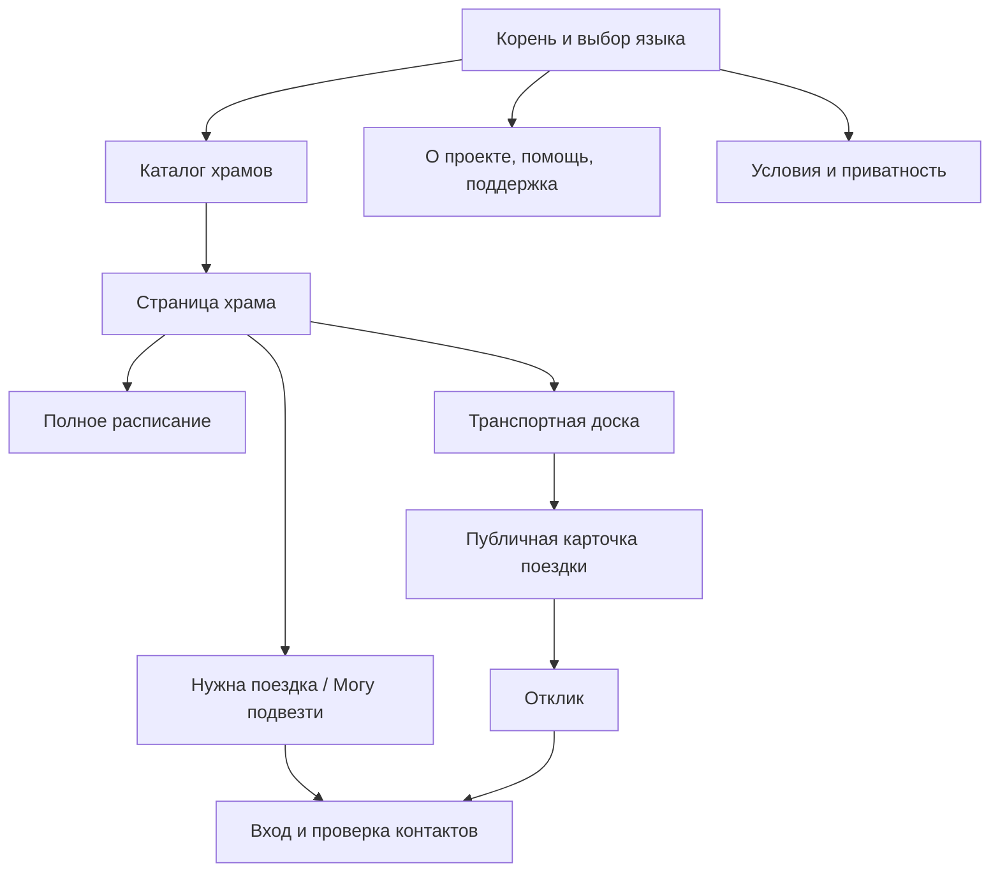

Иерархия:

- каталог является публичной главной страницей;
- страница храма — родитель расписания и транспортной доски;
- публичная карточка поездки всегда сохраняет обратную связь со страницей храма;
- формы просьбы, предложения и отклика являются контекстными дочерними путями, а не пунктами глобального меню;
- вход и проверка контактов являются временным шагом внутри начатого действия;
- «О проекте», помощь, поддержка и юридические документы доступны независимо от выбранного храма.

### 42.2. Личная область

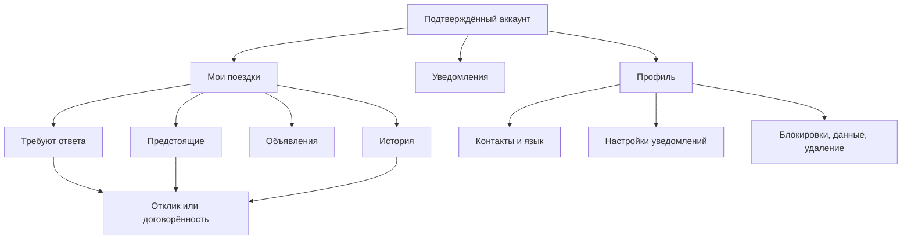

Правила:

- нижняя вкладка **«Поездки»** открывает страницу с заголовком **«Мои поездки»**;
- уведомления — отдельная история событий, а настройки уведомлений являются частью профиля;
- договорённость не дублируется в нескольких сущностях: разные вкладки ведут к одному закрытому экрану;
- профиль не является родителем поездок или управления храмами.

### 42.3. Административная область храма

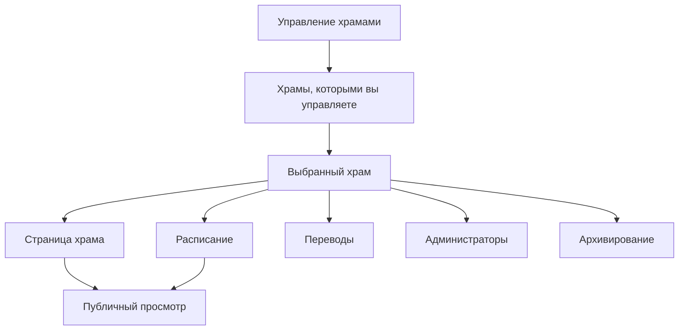

Правила:

- раздел появляется только пользователю, который управляет хотя бы одной страницей;
- административная область относится к странице храма, но не к поездкам её посетителей;
- **«Публичный просмотр»** открывает обычную публичную страницу без скрытых данных пользователей;
- создание нового храма начинается в публичной области и после публикации приводит к административной области.

### 42.4. Внешние переходы

За пределы приложения ведут только:

- внешний платёжный провайдер поддержки;
- почтовое приложение по служебному email;
- системные настройки браузера или телефона, если пользователь сам выбрал инструкцию;
- внешняя карта для построения пути к самому храму, если такая кнопка предусмотрена дизайном.

Возврат от платёжного провайдера ведёт только на специальный результат поддержки и не влияет на авторизацию или поездки.

### 42.5. Что не входит в sitemap

Не являются самостоятельными разделами:

- модальные подтверждения;
- сообщения об ошибках;
- системный выбор адреса;
- SMS-код;
- предложение установить PWA;
- машинный перевод;
- внутренние административные средства владельца платформы.

Они являются состояниями или служебными шагами соответствующего узла.

---

## 43. Модель URL

Раздел 30 перечисляет маршруты. Здесь зафиксированы правила их построения и жизни.

### 43.1. Язык

- Каждый пользовательский адрес начинается с `/{lang}`.
- Допустимые значения: `ru`, `en`, `it`, `ro`, `uk`, `de`.
- Корень `/` выбирает сохранённый язык, затем язык браузера, затем английский и переводит в соответствующий каталог.
- Переключение языка сохраняет тот же объект и действие, меняя только `lang` и локализованный slug, если он есть.
- Публичные переводы имеют отдельные индексируемые адреса и связи `hreflang`.
- Язык из адреса имеет приоритет над настройкой браузера для текущей ссылки; после явного переключения новая настройка сохраняется.

### 43.2. Страница храма

Канонический шаблон:

`/{lang}/churches/{church-public-id}/{slug}`

- `church-public-id` — стабильный непрозрачный идентификатор и истинный ключ маршрута.
- `slug` — читаемая часть из названия и населённого пункта; она не определяет право доступа и может меняться.
- При неверном или старом slug сервер переводит на текущий канонический адрес того же языка.
- Переименование храма и исправление перевода не ломают старые ссылки.
- Одинаковые названия и города не создают конфликтов благодаря идентификатору.

### 43.3. Поездки и закрытые объекты

- Публичная карточка использует непрозрачный `public-id`, не позволяющий перебрать соседние записи.
- Закрытая договорённость использует отдельный непрозрачный `private-id`.
- Публичный и закрытый идентификаторы одного объекта не совпадают.
- Прямая ссылка не является разрешением: сервер каждый раз проверяет аккаунт и отношение к объекту.
- После закрытия публичная ссылка ведёт на безопасную страницу состояния без прежних личных сведений.
- Ссылки из email имеют отдельный одноразовый секрет, который не используется как постоянный идентификатор объекта.

### 43.4. Фильтры и параметры

В URL можно сохранять только безопасные, полезные для возврата параметры:

- страна;
- населённый пункт;
- поисковая строка без личных данных;
- вид `list` или `map`;
- фильтр **«Все / Есть места / Ищут место»**;
- выбранная дата или служба через публичный идентификатор.

В URL запрещены:

- точные координаты пользователя;
- телефон, email и имя;
- точное место встречи и маршрут;
- текст примечания;
- внутренние последовательные идентификаторы;
- секрет входа после его обработки.

Состояние **«Рядом со мной»** не записывает координаты в адрес. Им можно поделиться только как обычным каталогом без своего положения.

### 43.5. Фрагменты страницы

Допустимы стабильные фрагменты:

- `#schedule`;
- `#transport`;
- `#agreed`;
- `#notification-settings`.

Они прокручивают к разделу, не открывают закрытые данные и не меняют состояние объекта.

### 43.6. Индексация и канонизация

- Для страницы храма задаётся один канонический адрес на язык.
- Параметры фильтров не создают самостоятельные индексируемые страницы.
- Публичные карточки поездок и все личные/административные адреса имеют `noindex`.
- Карта сайта содержит только разрешённые публичные страницы и версии языков.
- Закрытые и архивные объекты не попадают в карту сайта.

### 43.7. Ошибки и перенаправления

| Ситуация | Поведение |
| --- | --- |
| Неизвестный язык | Перевод на английскую версию того же безопасного пути |
| Старый slug храма | Постоянный перевод на текущий канонический slug |
| Несуществующий публичный объект | Нейтральная страница 404 без подтверждения чужих данных |
| Закрытая поездка | Безопасная страница закрытого объявления |
| Нет права на закрытый объект | Экран «Нет доступа», а не 404 с утечкой подробностей |
| Истёкшая ссылка входа | Экран запроса новой ссылки с сохранением черновика |
| Удалённый язык перевода | Английская версия объекта с предложением сменить язык |

---

## 44. Иерархия и отношения между сущностями

### 44.1. Иерархия содержимого

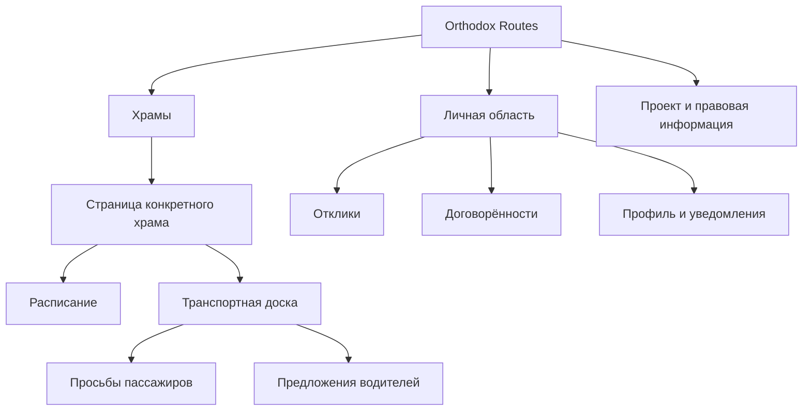

Страница храма является контекстом расписания и поездок, но не владельцем пользовательских аккаунтов и договорённостей.

### 44.2. Храмы, расписание и администраторы

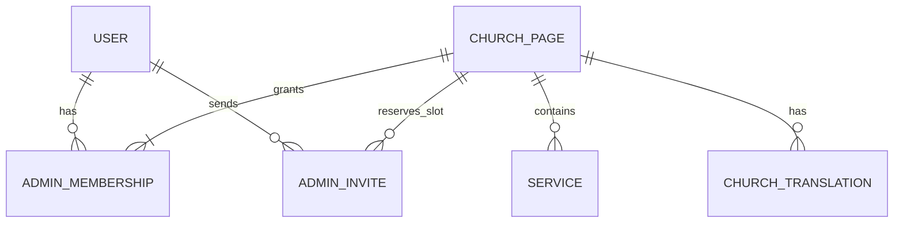

Правила:

- страница имеет от одного до трёх действующих администраторов, пока не архивирована;
- один пользователь может управлять несколькими страницами;
- одна страница содержит много регулярных и разовых служб;
- исключение или отмена конкретной даты относится к одной регулярной службе;
- перевод всегда относится к конкретной версии исходного содержимого;
- приглашение не является членством до принятия, но занимает место в лимите.

### 44.3. Транспорт

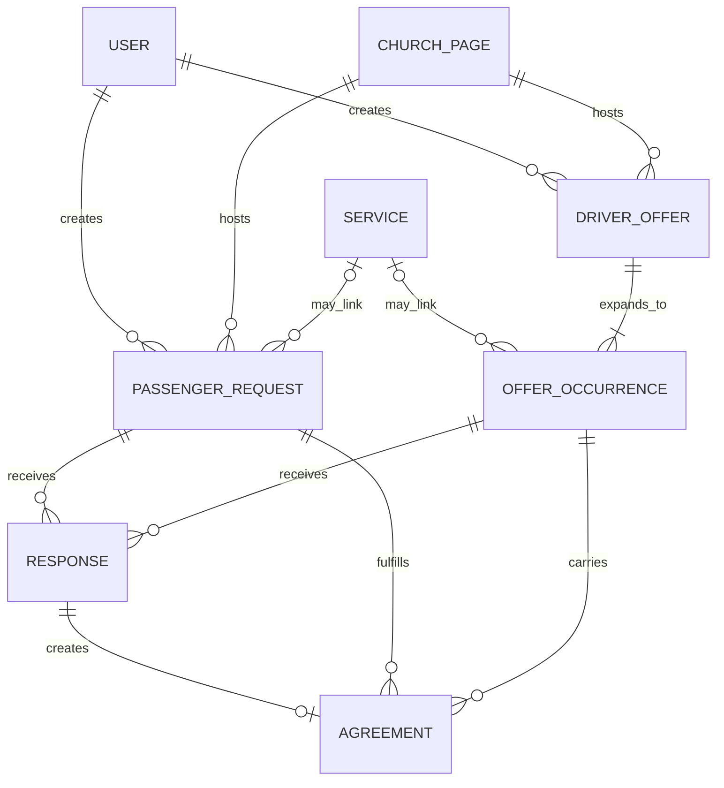

Правила:

- разовое предложение имеет ровно одну дату; регулярное — несколько отдельных дат;
- просьба пассажира относится к одной дате и одной странице храма;
- просьба может быть выполнена несколькими договорённостями, если группа разделена;
- договорённость относится к одной просьбе, одной дате предложения и двум конкретным аккаунтам;
- если одна сторона заполнила сокращённую приватную просьбу или предложение, система сохраняет его как защищённую непубличную просьбу или дату предложения; поэтому подтверждённая договорённость всегда имеет обе исходные стороны, но приватная запись никогда не появляется на доске;
- один отклик создаёт не более одной договорённости;
- отклик не хранит собственную независимую копию точной координаты, если может ссылаться на защищённый вариант встречи;
- сумма занятых и временно зарезервированных мест одной даты не превышает вместимость;
- собственные объявления одного пользователя никогда не соединяются друг с другом.

### 44.4. Доверие и сообщения

| Сущность | Отношение |
| --- | --- |
| Notification | Принадлежит одному получателю и ссылается на один актуальный объект или безопасный результат |
| Report | Имеет одного заявителя или подтверждённый email и одну конкретную цель: храм, объявление, договорённость или материал |
| UserBlock | Соединяет два аккаунта направленным запретом; подбор проверяет блокировку в обе стороны |
| AdminAction | Ссылается на владельца платформы, затронутый объект, причину и время |
| TripOutcome | Принадлежит одному участнику и одной договорённости; два ответа не перезаписывают друг друга |

### 44.5. Неизменные правила связей

1. Удаление публичной карточки не удаляет подтверждённую договорённость раньше срока.
2. Удаление или обезличивание точной координаты не разрушает обезличенную историю.
3. Изменение расписания не изменяет договорённость напрямую.
4. Архивирование храма невозможно, пока не обработаны его будущие поездки.
5. Удаление пользователя разрывает публичные связи и обезличивает допустимую историю, но не присваивает его данные другому аккаунту.
6. Публичная примерная область является производным представлением точного места, а не отдельным пользовательским вводом.
7. Права администратора страницы возникают только через действующее членство, а не через авторство страницы, email храма или знание ссылки.

---

## 45. Taxonomy — система категорий и названий

Taxonomy закрытая: пользователь не создаёт произвольные теги и категории. Все значения имеют стабильный внутренний ключ и локализованное отображаемое название.

### 45.1. Верхние категории

| Категория | Что входит | Что не входит |
| --- | --- | --- |
| Храмы | Каталог, карта, страница, расписание | Управление страницей и личные поездки |
| Поездки | Просьбы, предложения, отклики, договорённости, история | Расписание храма и уведомления как отдельная история |
| Уведомления | События, требующие внимания, и их результаты | Настройки каналов |
| Профиль | Контакты, язык, настройки, блокировки, данные, удаление | Управление храмом |
| Управление храмами | Страница, расписание, переводы, администраторы, архивирование | Поездки посетителей |
| Проект | О проекте, помощь, поддержка | Оплата поездок |
| Правовая информация | Условия, Политика, права на данные | Общая помощь |

### 45.2. Словарь транспортных объектов

| Внутренний смысл | Русское название для пользователя | Не использовать как основной термин |
| --- | --- | --- |
| Passenger request | Просьба пассажира / Нужна поездка | Заказ, заявка на такси |
| Driver offer | Предложение водителя / Могу подвезти | Услуга, тариф |
| Response | Отклик / Предложение | Заявка, ставка |
| Agreement | Договорённость | Заказ, бронирование, сделка |
| Pickup alternative | Возможное место встречи | Остановка маршрута, точная точка |
| Driver origin | Место отправления | Дом водителя |
| Ride occurrence | Поездка на конкретную дату | Экземпляр серии |
| Recurring offer | Регулярная поездка | Подписка на поездку |
| Repeat action | Договориться на следующую поездку | Стать постоянным пассажиром |
| Return availability | Могу подвезти обратно / Нужна поездка обратно | Обратный билет |

### 45.3. Категории расписания

- **Ближайшие службы** — вычисленный список конкретных дат.
- **Регулярное расписание** — повторяющийся недельный шаблон.
- **Регулярная служба** — одна повторяющаяся запись.
- **Разовая служба** — самостоятельная дата.
- **Изменение одной даты** — исключение из шаблона.
- **Отменённая служба** — конкретная дата, явно помеченная отменённой.

Слово **«Правила»** не используется для вкладки регулярного расписания.

### 45.4. Категории «Моих поездок»

| Раздел | Критерий попадания |
| --- | --- |
| Требуют ответа | Есть действие, без которого отклик или изменение не завершится |
| Предстоящие | Есть подтверждённая будущая договорённость или ожидающее изменение её условий |
| Объявления | Активные просьбы, предложения и даты серии автора |
| История | Отклонённые, отозванные, отменённые, завершённые и истёкшие действия |

Один объект может иметь одно основное место в текущем состоянии. Уведомление может ссылаться на него, но не создаёт копию.

Дополнительные неизменные правила:

- во вкладку **«Требуют ответа»** попадают только объекты, ожидающие решения пользователя;
- статус **«Завершено»** невозможен для будущей даты;
- вопрос **«Поездка состоялась?»** появляется только после запланированного времени;
- значение поездки обратно формулируется как **«Нужна»** или **«Не нужна»**.

### 45.5. Категории жалоб

Для страницы храма:

- неверные сведения;
- дубликат;
- это не православный храм или место не существует;
- нарушение прав на фотографию или текст;
- опасное или незаконное содержание;
- другое.

Для объявления или участника поездки:

- контакты или точный адрес опубликованы открыто;
- коммерческая перевозка или обязательная цена;
- спам или обман;
- оскорбление, преследование или опасное поведение;
- ложные сведения о поездке;
- другое.

Для договорённости:

- человек не приехал;
- опасное поведение;
- нежелательный контакт после отмены;
- требование денег или попытка обмана;
- другое.

Категория помогает разобрать письмо, но не определяет решение автоматически.

### 45.6. Пользовательские и внутренние состояния

Внутренние ключи стабильны и не показываются напрямую. Например:

| Внутренний ключ | Русское отображение |
| --- | --- |
| `draft` | Черновик |
| `active` | Активно |
| `awaiting_response` | Ожидает ответа |
| `awaiting_confirmation` | Требует подтверждения |
| `confirmed` | Подтверждено |
| `change_pending` | Ожидает подтверждения изменений |
| `declined` | Отклонено |
| `withdrawn` | Отозвано |
| `cancelled` | Отменено |
| `expired` | Время прошло |
| `completed` | Завершено |
| `hidden_by_owner` | Скрыто после проверки |
| `archived` | В архиве |

### 45.7. Управление словарём

- Один смысл имеет один основной термин в каждом языке.
- Короткая подпись навигации может отличаться от заголовка страницы только явно: **«Поездки»** → **«Мои поездки»**.
- Переводчик не меняет внутренние ключи.
- Новый термин добавляется одновременно во все системные языки или показывает проверенный английский запасной вариант.
- Термины, влияющие на безопасность, проверяются в контексте полного предложения, а не отдельно.
- Изменение терминов фиксируется как изменение IA, если оно меняет понимание раздела или состояния.

---

## 46. Полная матрица ролей и разрешений

Права определяются не только ролью аккаунта, но и отношением к конкретному объекту: автор объявления, участник договорённости или администратор именно этой страницы.

Обозначения:

- **Да** — действие разрешено;
- **Своё** — только объект, созданный пользователем;
- **Участник** — только договорённость, где пользователь является одной из сторон;
- **Своя страница** — только храм с действующим административным членством;
- **Защищённо** — редкая операция владельца с повторной проверкой и журналом;
- **Нет** — действие запрещено.

### 46.1. Публичная часть и транспорт

| Действие | Посетитель | Подтверждённый пользователь | Автор объявления | Участник договорённости | Администратор храма | Владелец платформы |
| --- | --- | --- | --- | --- | --- | --- |
| Смотреть каталог, храм и расписание | Да | Да | Да | Да | Да | Да |
| Смотреть примерные области активных поездок | Да | Да | Да | Да | Да | Да |
| Смотреть точное место пользователя | Нет | Нет | Только своё | Участник | Нет, если не участник | Нет по умолчанию |
| Смотреть телефон и email пользователя | Нет | Нет | Только свои | Участник | Нет, если не участник | Нет по умолчанию |
| Начать форму поездки | Да | Да | Да | Да | Да | Да |
| Завершить публикацию или отклик | Нет | Да | Да | Да | Да как обычный пользователь | Да как обычный пользователь |
| Изменить объявление | Нет | Нет | Своё | Нет | Нет | Только скрыть защищённо |
| Закрыть объявление | Нет | Нет | Своё | Нет | Нет | Защищённо |
| Ответить на отклик | Нет | Нет | Своё | Если требуется ответ | Нет | Нет |
| Изменить договорённость | Нет | Нет | Нет | Участник | Нет | Нет |
| Отменить договорённость | Нет | Нет | Нет | Участник | Нет | Защищённо только при удалении/блокировке аккаунта |
| Сообщить результат поездки | Нет | Нет | Нет | Участник | Нет | Нет |
| Повторить поездку | Нет | Да | Да | Участник | Да как обычный пользователь | Да как обычный пользователь |

Администратор страницы не получает транспортных прав только потому, что поездка относится к его храму.

### 46.2. Храмы и расписание

| Действие | Посетитель | Подтверждённый пользователь | Администратор страницы | Другой администратор той же страницы | Владелец платформы |
| --- | --- | --- | --- | --- | --- |
| Создать новую страницу | Начать | Да | Да | Да | Да |
| Редактировать публичные сведения | Нет | Нет | Своя страница | Своя страница | Защищённо |
| Редактировать расписание | Нет | Нет | Своя страница | Своя страница | Защищённо |
| Исправить перевод | Нет | Нет | Своя страница | Своя страница | Защищённо |
| Пригласить администратора | Нет | Нет | Своя страница при наличии места | Своя страница при наличии места | Защищённо |
| Отменить приглашение | Нет | Нет | Приглашение своей страницы | Приглашение своей страницы | Защищённо |
| Принудительно удалить администратора | Нет | Нет | Нет | Нет | Защищённо |
| Добровольно выйти | Нет | Нет | Да, если кто-то остаётся | Да, если кто-то остаётся | Не применяется |
| Передать собственное место | Нет | Нет | Да | Да | Защищённо |
| Архивировать страницу | Нет | Нет | Только запросить | Только запросить | Защищённо |
| Восстановить страницу | Нет | Нет | Только запросить | Только запросить | Защищённо |
| Видеть поездки посетителей | Только публичное | Только публичное | Только публичное | Только публичное | Только публичное по умолчанию |

### 46.3. Аккаунт, жалобы и данные

| Действие | Посетитель | Подтверждённый пользователь | Владелец платформы |
| --- | --- | --- | --- |
| Подать жалобу | Да, после подтверждения email | Да | Да |
| Видеть содержание чужой жалобы | Нет | Нет | Защищённо |
| Получить подтверждение своей жалобы | По ссылке/email | Да | Да |
| Заблокировать пользователя | Нет | После взаимодействия | Нет от имени пользователя |
| Разблокировать пользователя | Нет | Свою блокировку | Нет от имени пользователя |
| Изменить имя и язык | Нет | Своё | Нет |
| Изменить email | Нет | Своё через SMS и новую email-ссылку | Только аварийное восстановление защищённо |
| Изменить телефон | Нет | Своё после нового SMS | Только аварийное восстановление защищённо |
| Выгрузить данные | Нет | Своё | Выполняет запрос, но не получает произвольный доступ |
| Удалить аккаунт | Нет | Своё | Исполняет защищённую процедуру при необходимости |
| Ограничить или восстановить аккаунт | Нет | Нет | Защищённо |
| Скрыть спорный материал | Нет | Нет | Защищённо |
| Читать точную историю поездок без жалобы | Нет | Только свою в разрешённый срок | Нет |

### 46.4. Ограниченный аккаунт

Если владелец временно ограничил аккаунт, пользователь всё ещё может:

- смотреть публичные страницы;
- открыть существующую договорённость;
- отменить будущую договорённость;
- видеть контакты уже подтверждённой поездки в разрешённый срок, если ограничение не связано с непосредственной угрозой;
- выгрузить данные;
- удалить аккаунт;
- обратиться по служебному email.

Он не может:

- публиковать новые объявления;
- отправлять новые отклики;
- создавать страницы храмов;
- приглашать администраторов;
- обходить ограничение новым аккаунтом с тем же телефоном.

Если ограничение связано с безопасностью конкретного человека, владелец может немедленно закрыть доступ к соответствующим данным; причина и объём меры записываются.

### 46.5. Правила проверки разрешений

1. Проверка выполняется сервером для каждого чтения и изменения закрытого объекта.
2. Ссылка, cookie интерфейса и скрытая кнопка сами по себе не дают права.
3. При смене состава администраторов старое право перестаёт действовать немедленно.
4. При отмене договорённости доступ к точным сведениям отзывается немедленно.
5. Повторный запрос одной операции не создаёт второго результата.
6. Действие владельца требует отдельной административной авторизации и причины.
7. Аварийное открытие точных данных владельцем, если оно когда-либо юридически необходимо, является отдельной защищённой операцией, а не обычным экраном поддержки.

---

## 47. Content model — модель содержимого

Это нормативная логическая модель, а не готовая схема базы данных. Названия технических полей могут отличаться, но обязательность, видимость, связи и жизненный цикл должны сохраняться.

### 47.1. Уровни видимости

| Код | Уровень |
| --- | --- |
| `PUBLIC` | Может быть показано любому посетителю в предусмотренном экране |
| `ACCOUNT` | Только владельцу аккаунта |
| `PARTICIPANTS` | Только участникам конкретной подтверждённой договорённости |
| `CHURCH_ADMINS` | Только администраторам конкретной страницы |
| `PLATFORM_PROTECTED` | Только владельцу через защищённую операцию |
| `SYSTEM_ONLY` | Используется системой и не показывается как содержимое |

Публичная карточка создаётся из разрешённых полей отдельно. Закрытые поля не загружаются с последующим визуальным скрытием.

### 47.2. Аккаунт пользователя

| Поле | Обязательно | Источник | Видимость | Правило |
| --- | --- | --- | --- | --- |
| Внутренний идентификатор | Да | Система | `SYSTEM_ONLY` | Непредсказуемый, неизменный |
| Имя | Да | Пользователь | `PUBLIC` в карточке; `PARTICIPANTS` | Только имя, без обязательной фамилии |
| Email | Да | Пользователь | `ACCOUNT`, затем `PARTICIPANTS` | Нормализован, имеет дату подтверждения |
| Телефон | Да для действий | Пользователь | `ACCOUNT`, затем `PARTICIPANTS` | Международный формат, уникален, имеет дату подтверждения |
| Язык | Да | Браузер/пользователь | `ACCOUNT` | Один из шести кодов |
| Заявление 18+ | Да для действий | Пользователь | `ACCOUNT`, `SYSTEM_ONLY` для проверки | Хранится дата подтверждения; дата рождения не собирается |
| Принятые Условия | Да для действий | Система | `ACCOUNT`, `PLATFORM_PROTECTED` | Версия, дата, время |
| Настройки уведомлений | Да | Пользователь/система | `ACCOUNT` | Внешний канал нельзя полностью отключить при активной поездке |
| Состояние аккаунта | Да | Система/владелец | `ACCOUNT`, `PLATFORM_PROTECTED` | Активен, ограничен, удаляется, удалён |
| Даты создания/изменения | Да | Система | `SYSTEM_ONLY` | UTC |

Не собираются без нового утверждения IA: фамилия, фотография, дата рождения, пол, паспорт, права, автомобиль, приход и география постоянного проживания.

### 47.3. Страница храма

| Поле | Обязательно | Источник | Видимость | Правило |
| --- | --- | --- | --- | --- |
| Публичный идентификатор | Да | Система | `PUBLIC` | Стабильный, не последовательный |
| Официальное название | Да | Создатель/администратор | `PUBLIC` | Сохраняется отдельно от переводов |
| Исходный язык | Да | Создатель | `PUBLIC` | Определяет источник переводов |
| Адрес и координата храма | Да | Создатель/карта | `PUBLIC` | В отличие от места пользователя, адрес храма публичен |
| Страна, населённый пункт | Да | Геокодирование с проверкой | `PUBLIC` | Используются в поиске и slug |
| Часовой пояс | Да | Карта/проверка администратора | `PUBLIC` | IANA-зона, не только UTC-смещение |
| Описание | Нет | Администратор | `PUBLIC` | Переводится и версионируется |
| Контакты храма | Нет | Администратор | `PUBLIC` | Отдельны от контактов создателя страницы |
| Фотография и сведения об авторстве | Нет | Администратор | `PUBLIC` | Имеет источник и состояние обработки жалобы |
| Дата обновления расписания | Да | Система | `PUBLIC` | Вычисляется из последнего изменения расписания |
| Состояние | Да | Система/владелец | `PUBLIC` или безопасная заглушка | Опубликована, скрыта, архивирована |
| Административные связи | Да | Система | `CHURCH_ADMINS` | От одного до трёх действующих мест |

### 47.4. Служба

| Поле | Обязательно | Видимость | Правило |
| --- | --- | --- | --- |
| Идентификатор и храм | Да | `PUBLIC` | Стабильная связь со страницей |
| Тип | Да | `PUBLIC` | Регулярная или разовая |
| Название | Да | `PUBLIC` | Системное или собственное |
| Описание | Нет | `PUBLIC` | Переводится |
| Локальные дата и время | Да | `PUBLIC` | Вводятся в зоне храма |
| Часовой пояс | Да | `PUBLIC` | Наследуется от храма, но хранится в конкретной дате |
| Правило повторения | Для регулярной | `PUBLIC` | Дни недели и границы действия |
| Исключение | Нет | `PUBLIC` | Изменение или отмена одной даты |
| Состояние | Да | `PUBLIC` | Запланирована, изменена, отменена, прошла |
| Версия | Да | `SYSTEM_ONLY` | Позволяет определить связанные изменения |

### 47.5. Защищённое место пользователя

| Поле | Обязательно | Видимость | Правило |
| --- | --- | --- | --- |
| Точная координата | Да | Автор, затем `PARTICIPANTS` | Никогда не включается в публичное представление |
| Нормализованный адрес | Если найден | Автор, затем `PARTICIPANTS` | Не обязателен, если точка выбрана вручную |
| Подпись места | Нет | Автор, затем `PARTICIPANTS` | Например, общественное место; проверяется на контакты |
| Публичная область | Да | `PUBLIC` | Производная окружность радиусом 1 км |
| Версия защитного алгоритма | Да | `SYSTEM_ONLY` | Нужна для повторяемости и миграций |
| Срок удаления | Да после договорённости | `SYSTEM_ONLY` | Рассчитывается по отмене или дате поездки |

Одна просьба содержит от одного до трёх таких мест. Публичная область не может быть отредактирована независимо от точного места.

### 47.6. Просьба пассажира

| Поле | Обязательно | Видимость до договорённости | Правило |
| --- | --- | --- | --- |
| Публичный идентификатор | Да | `PUBLIC` | Только для активной карточки |
| Автор и храм | Да | Имя — `PUBLIC`; связь аккаунта закрыта | Одна страница храма |
| Служба | Нет | `PUBLIC` | Иначе собственные дата и время |
| Желаемое прибытие и зона | Да | `PUBLIC` | Не позже 8 недель |
| Варианты встречи | 1–3 | Только примерные области `PUBLIC` | Точные записи защищены |
| Общее число пассажиров | Да | `PUBLIC` | Положительное целое |
| Число детей | Да, может быть 0 | `PUBLIC` | Не больше общего числа |
| Нужно детское кресло | Да при детях | `PUBLIC` | Отдельное поле |
| Нужна поездка обратно | Да | `PUBLIC` | Да/нет |
| Примечание | Нет | `PUBLIC` | Без контактов, ссылок и точного адреса |
| Оставшееся число людей | Да | `PUBLIC` | Вычисляется из подтверждённых договорённостей |
| Состояние и время закрытия | Да | `PUBLIC` пока активно | Закрывается по времени или действию |

### 47.7. Предложение водителя и дата серии

| Поле | Обязательно | Видимость до договорённости | Правило |
| --- | --- | --- | --- |
| Публичный идентификатор | Да | `PUBLIC` | Стабилен для предложения; дата имеет собственный ключ |
| Автор и храм | Да | Имя — `PUBLIC` | Автор — подтверждённый пользователь |
| Разовая/регулярная | Да | `PUBLIC` | Серия не длиннее 8 недель |
| Служба | Нет | `PUBLIC` | Иначе собственное прибытие |
| Прибытие и зона | Да | `PUBLIC` | Для каждой даты |
| Точное отправление | Да | Закрыто | Имеет производную примерную область |
| Точный маршрут | Да | Закрыто | Публично только защитный коридор |
| Допустимое отклонение | Да | `PUBLIC` | В километрах |
| Свободные места | Да | `PUBLIC` | Отдельно для каждой даты |
| Перевозка детей | Да | `PUBLIC` | Может/не может |
| Кресло водителя | Да, может быть нет | `PUBLIC` | Не заменяет обязанность соблюдать закон |
| Поездка обратно | Да | `PUBLIC` | Да/нет |
| Примечание | Нет | `PUBLIC` | Без цены, контактов, ссылок и точного адреса |
| Состояние серии и даты | Да | `PUBLIC` пока активно | Дата закрывается независимо |

### 47.8. Отклик

| Поле | Обязательно | Видимость | Правило |
| --- | --- | --- | --- |
| Идентификатор | Да | Стороны | Непрозрачный |
| Отправитель и получатель | Да | Стороны | Конкретные аккаунты |
| Исходная просьба и/или дата предложения | Да | Стороны | Не менее одной исходной связи |
| Предложенное число мест | Да | Стороны | Не превышает доступное |
| Выбранный вариант встречи | После ответа водителя | Стороны видят примерную область | Точная координата закрыта до договорённости |
| Снимок условий | Да | Стороны | Защищает от молчаливого изменения исходной карточки |
| Состояние | Да | Стороны | По диаграмме раздела 48 |
| Даты отправки/ответа/истечения | Да | Стороны | UTC плюс локальное отображение |

Сокращённая приватная просьба или предложение после отправки становится защищённой исходной записью отклика. Она подчиняется тем же правилам вместимости, времени и удаления, что и публичная, но не получает публичной карточки и не участвует в общем подборе.

### 47.9. Договорённость

| Поле | Обязательно | Видимость | Правило |
| --- | --- | --- | --- |
| Закрытый идентификатор | Да | `PARTICIPANTS` | Не совпадает с публичным ID |
| Водитель и пассажир | Да | `PARTICIPANTS` | Ровно два аккаунта, группа находится на стороне пассажира |
| Просьба и дата предложения | Да | `PARTICIPANTS`, `SYSTEM_ONLY` | Обеспечивают вместимость и историю |
| Подтверждённый снимок условий | Да | `PARTICIPANTS` | Дата, время, место, маршрут, люди, дети, возврат |
| Выбранное точное место | Да | `PARTICIPANTS` | Открывается после подтверждения |
| Контактный снимок | Да | `PARTICIPANTS` до срока | Использует подтверждённые контакты на момент договорённости |
| Состояние | Да | `PARTICIPANTS` | По диаграмме раздела 48 |
| Предложение изменения | Нет | `PARTICIPANTS` | Хранится отдельно от действующих условий |
| Отмена | Нет | `PARTICIPANTS` | Автор отмены, время; причина необязательна |
| Ответ о результате | По одному на участника | `ACCOUNT`, агрегат `SYSTEM_ONLY` | Ответы не перезаписываются |
| Срок доступа к точным данным | Да | `SYSTEM_ONLY` | Не более 30 дней после времени поездки |

### 47.10. Переводы

Каждый перевод динамического содержимого содержит:

- объект и поле источника;
- язык источника;
- язык перевода;
- версию исходного текста;
- переведённый текст;
- источник: машинный или исправленный администратором;
- состояние: ожидает, готов, ошибка, устарел;
- даты создания и изменения.

Устаревший перевод не выдаётся как актуальный без пометки; при отсутствии готового текста показывается оригинал.

### 47.11. Уведомление

Обязательные поля:

- получатель;
- тип события;
- безопасная ссылка на объект;
- локализуемые структурированные параметры без точных контактов;
- время;
- прочитано/не прочитано;
- результаты доставки email и push;
- актуальный итог события.

Текст уведомления не является единственным источником истины: экран объекта всегда проверяет его текущее состояние.

### 47.12. Жалоба

Обязательные поля:

- цель и её тип;
- аккаунт заявителя или подтверждённый email;
- категория;
- описание;
- время;
- состояние: получена, рассматривается, нужны сведения, решена, закрыта;
- решение и причина;
- срок удаления или правового удержания.

Точная поездка не копируется целиком в письмо. Внутренняя ссылка позволяет защищённо найти необходимый объект, если он ещё законно хранится.

### 47.13. Членство, приглашение и блокировка

| Объект | Обязательные сведения |
| --- | --- |
| AdminMembership | Пользователь, храм, состояние, дата принятия, способ получения доступа |
| AdminInvite | Храм, email, отправитель, срок, состояние, зарезервированное место |
| UserBlock | Кто заблокировал, кого, дата, состояние; причина не обязательна |
| AdminAction | Административный аккаунт, объект, действие, причина, время, результат |

### 47.14. Правила качества содержимого

- Обязательное поле не заменяется свободным примечанием.
- Число детей, кресло, обратная поездка и вместимость всегда структурированы.
- Текстовые ограничения отображаются до ошибки и одинаковы на всех языках.
- Значения количества являются целыми и проходят разумную верхнюю проверку, утверждённую технической архитектурой.
- Все даты хранят абсолютный момент и исходную IANA-зону.
- Удалённый объект не оставляет открытой копии в поисковом индексе, кеше или аналитике.
- Снимок договорённости неизменяем; изменение создаёт новую версию, а не переписывает согласованную историю.

---

## 48. State diagrams — модели состояний

Диаграммы нормативны. Названия экранов могут меняться при редактуре, но переходы, проверки и побочные действия не меняются без обновления IA.

### 48.1. Просьба пассажира

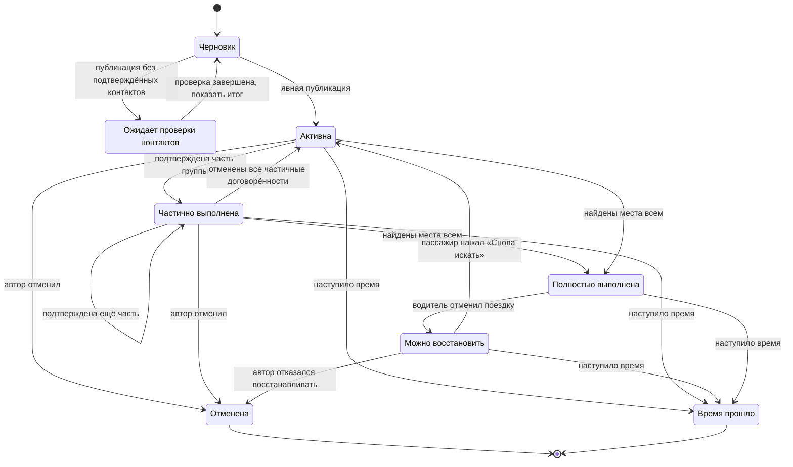

Побочные действия:

- переход в `Partial` уменьшает публичное число людей;
- переход в `Fulfilled` закрывает публичную карточку;
- отмена частичной договорённости увеличивает оставшееся число автоматически, пока просьба ещё публично активна;
- из `Fulfilled` просьба не возвращается в `Active` автоматически;
- `Restore` не показывается публично и требует проверки прежних данных перед публикацией.

### 48.2. Дата предложения водителя

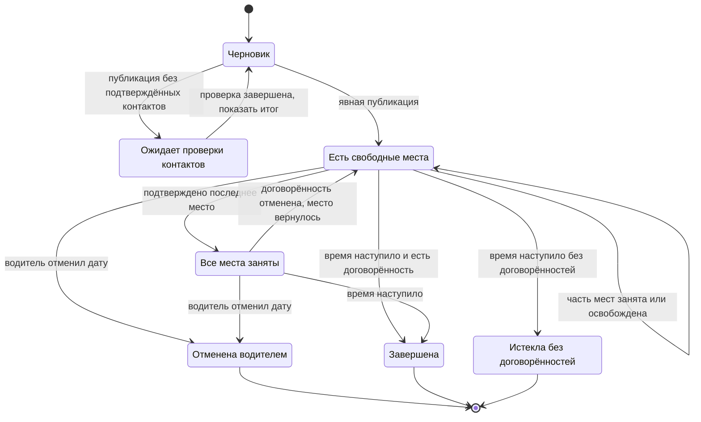

`Full` закрывает новые отклики, но сохраняет договорённости. Возврат места снова делает дату доступной без повторной публикации водителем, пока время не наступило и дата не отменена.

### 48.3. Регулярная серия водителя

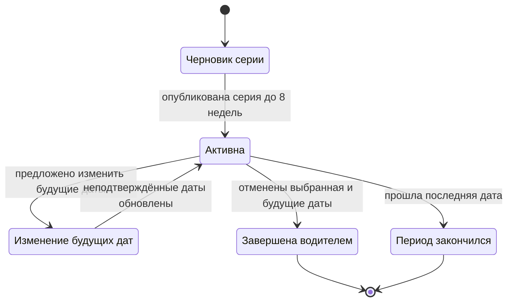

Серия управляет созданием дат, но не объединяет их вместимость и договорённости. Изменение серии применяется автоматически только к датам без подтверждённых договорённостей. Для каждой существующей договорённости важные изменения отправляются как отдельное предложение по разделам 13 и 48.5; если водитель не может сохранить прежние условия, он явно отменяет соответствующую поездку. Продление после `Ended` создаёт новый ограниченный период и не бронирует прежних пассажиров.

### 48.4. Отклик

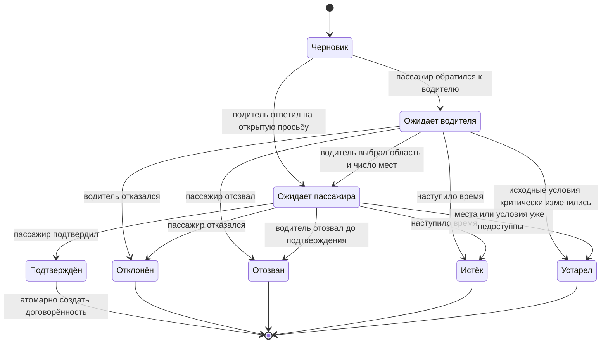

Перед `Accepted` сервер повторно проверяет вместимость, блокировки, состояние обеих карточек и выбранный вариант встречи. Если проверка не пройдена, используется `Stale`, а договорённость не создаётся.

### 48.5. Договорённость

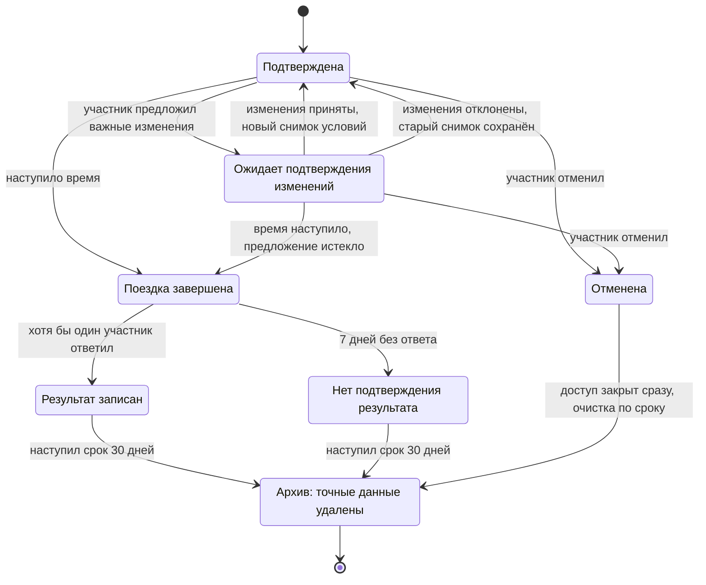

Побочные действия:

- при `Confirmed` открываются контакты и точное место только участникам;
- при `ChangePending` прежние условия остаются действующими, а новые показаны отдельно;
- непринятое изменение истекает при наступлении времени;
- при `Cancelled` доступ к точным сведениям закрывается немедленно и отправляются уведомления;
- при `Archived` точные геоданные недоступны и удалены или необратимо обезличены.

### 48.6. Страница храма

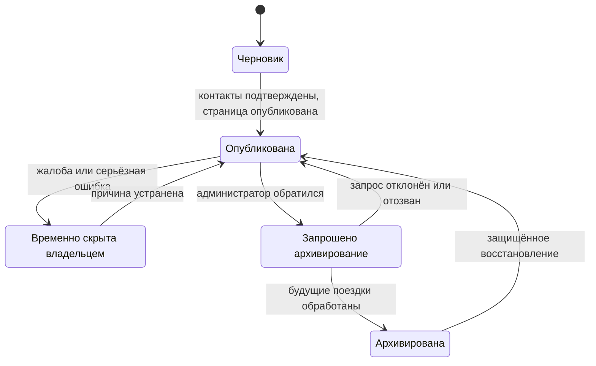

`Hidden` применяется как срочная мера и записывается. `Archived` — штатное долгосрочное состояние. Ни одно из них не удаляет историю административных действий.

### 48.7. Приглашение администратора

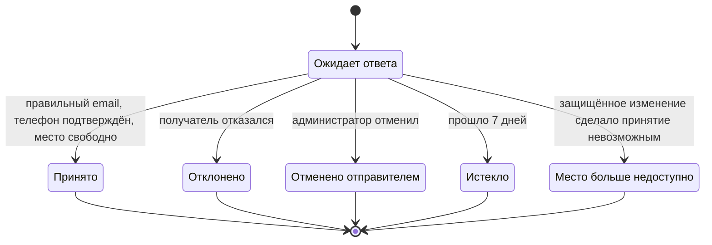

Ожидающее приглашение резервирует место. Принятие и передача собственного места выполняются одной неделимой операцией.

### 48.8. Аккаунт

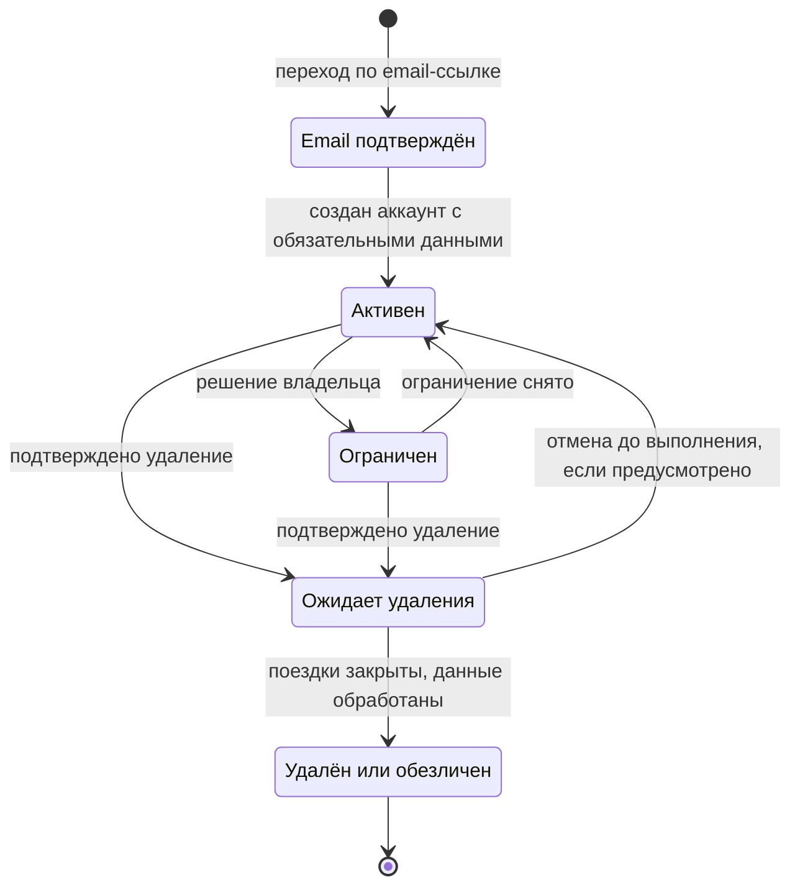

`Active` описывает нормальное состояние самого аккаунта, а не готовность ко всем действиям. Email-проверка и создание активного аккаунта сами по себе не дают права публиковать: перед каждым защищённым действием сервер отдельно проверяет подтверждённый телефон, заявление 18+ и принятие действующей версии Условий. Ограничение не отнимает возможность отменить поездку, получить данные и удалить аккаунт.

### 48.9. Общие требования к переходам

Каждый переход содержит:

- инициатора: пользователь, время или защищённая операция;
- предварительные условия;
- одну неделимую запись результата;
- изменение вместимости, если оно требуется;
- уведомления затронутым людям;
- запись истории;
- безопасное поведение при повторе того же запроса.

Недопустимы промежуточные состояния, при которых контакты уже открыты, а договорённость ещё не создана, либо место занято без существующего отклика или договорённости.

---

## 49. Переходы между публичным, личным и административным контекстом

### 49.1. Контексты

| Контекст | Назначение | Нужен аккаунт | Может содержать точные данные пользователя |
| --- | --- | --- | --- |
| Публичный | Поиск храма, расписание, примерные поездки, информация | Нет | Нет |
| Контекстное действие | Черновик просьбы, предложения, отклика или храма | Нет до завершения | Только собственный ввод в защищённом черновике |
| Проверка контактов | Вход, email-ссылка, SMS | Частично | Нет чужих данных |
| Личный | Мои поездки, договорённости, уведомления, профиль | Да | Да, только по отношению к объекту |
| Административный храмовый | Редактирование страницы и расписания | Да и членство | Нет данных поездок посетителей |
| Защищённый владельца | Жалобы и редкие операции | Отдельная административная проверка | Не по умолчанию |
| Внешний | Платёжный провайдер или системные настройки | Зависит от поставщика | Orthodox Routes не передаёт данные поездок |

### 49.2. Основная схема

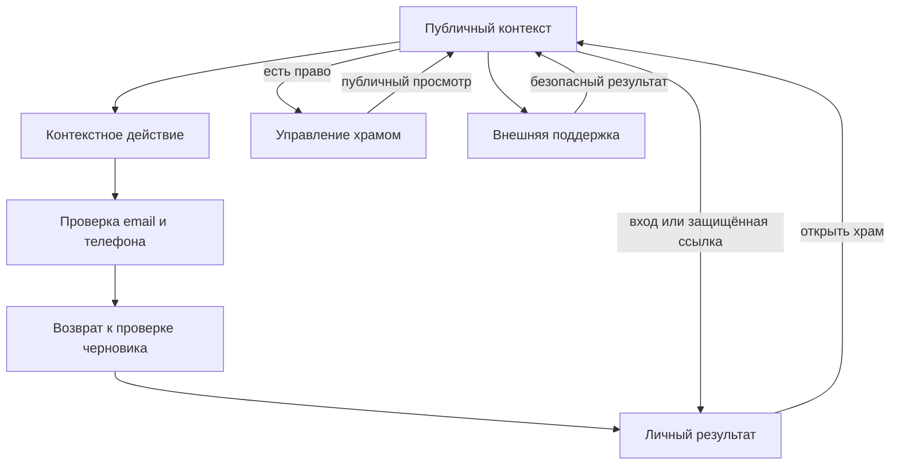

### 49.3. Матрица переходов

| Откуда | Действие | Куда | Проверка | Куда возвращается пользователь |
| --- | --- | --- | --- | --- |
| Каталог | Открыть храм | Публичная страница | Нет | Назад к тем же фильтрам и позиции списка |
| Страница храма | Нужна поездка / Могу подвезти | Контекстная форма | Нет до завершения | На страницу храма при отмене |
| Публичная поездка | Откликнуться | Контекстная форма отклика | Нет до завершения | На ту же поездку при отмене |
| Форма | Завершить действие | Проверка контактов | Email, SMS, 18+, Условия | К экрану проверки заполненной формы |
| Проверенная форма | Опубликовать/отправить | Личный результат | Повторная серверная проверка | В нужную вкладку «Моих поездок» |
| Глобальная навигация | Поездки/Уведомления/Профиль | Личный контекст | Вход | На первоначально выбранный экран |
| Прямая закрытая ссылка | Открыть договорённость | Личный контекст | Вход и участие | На договорённость, не на общую главную |
| Страница храма | Управлять | Административный контекст | Членство именно этой страницы | На выбранный административный раздел |
| Административный экран | Публичный просмотр | Публичная страница | Нет дополнительных прав | Назад в тот же административный раздел |
| Публичная область | Создать храм | Контекстная форма | Проверка при публикации | После публикации — первые шаги управления |
| Юридическая ссылка из формы | Открыть документ | Публичный юридический экран | Нет | Форма и введённые данные сохраняются |
| Жалоба | Подтвердить email | Результат жалобы | Одноразовая ссылка | К безопасному подтверждению, без открытия цели |
| Поддержка проекта | Перейти к оплате | Внешний провайдер | По правилам провайдера | На успешный или неуспешный результат |

### 49.4. Возврат после входа

После входа система использует безопасный сохранённый адрес возврата. Разрешены только внутренние известные маршруты. Внешний URL не принимается, чтобы не создавать перенаправление на мошеннический сайт.

Приоритет возврата:

1. защищённая ссылка, которую человек намеренно открыл;
2. сохранённый черновик действия;
3. выбранный личный раздел;
4. каталог текущего языка.

Если объект за время входа закрылся, показывается его безопасное актуальное состояние и подходящая альтернатива, а не пустая главная.

### 49.5. Сохранение состояния

При безопасном переходе сохраняются:

- язык;
- фильтры и вид каталога;
- прокрутка списка при возврате;
- шаг и данные черновика;
- выбранный храм;
- вкладка «Моих поездок»;
- адрес назначения после входа.

Не сохраняются в открытом URL или незащищённом локальном кеше:

- точные координаты;
- контакты второй стороны;
- SMS-код и секрет email-ссылки;
- полное содержание жалобы;
- закрытый административный ответ.

### 49.6. Назад, обновление и несколько устройств

- Кнопка браузера **«Назад»** не публикует и не отменяет действие.
- Обновление страницы восстанавливает безопасный шаг или текущее состояние объекта.
- Завершение на другом устройстве переводит первый экран в **«Действие уже выполнено»**.
- Повторное открытие старой вкладки не возвращает отменённые контакты из кеша.
- После потери административного права открытая вкладка при следующем запросе получает **«Нет доступа»**.

### 49.7. Разделение контекстов

- Публичная страница не показывает административные элементы человеку без права.
- Административный интерфейс не встраивает личные поездки пользователей.
- Личный экран договорённости не предоставляет редактирование страницы храма.
- Уведомление ведёт к объекту в его настоящем контексте, а не показывает копию с устаревшими действиями.
- Переход к юридическому документу и помощи никогда не требует входа.
- Язык меняется без потери текущего безопасного контекста.

### 49.8. Ошибочные переходы

| Попытка | Результат |
| --- | --- |
| Гость открывает личный экран | Вход с возвратом на этот экран |
| Другой аккаунт открывает договорённость | «Нет доступа» и смена аккаунта |
| Администратор открывает чужой храм по административному адресу | «Нет доступа», публичная страница доступна отдельно |
| Ограниченный аккаунт начинает новое действие | Объяснение ограничения и доступные безопасные действия |
| Удалённый аккаунт использует старую ссылку | Новый вход или помощь; старые данные не восстанавливаются автоматически |
| Закрытая поездка открыта из уведомления | Актуальный безопасный итог и переход к храму |

---

## 50. Card sorting и tree testing

### 50.1. Текущий статус

Структура подготовлена к проверке, но результаты исследований отсутствуют, потому что тесты с реальными людьми ещё не проводились. Результаты нельзя заменять мнением автора документа, разработчика или искусственного интеллекта.

До тестов утверждены:

- проверяемая структура;
- набор карточек;
- задания;
- целевые группы;
- показатели успеха;
- правила принятия решений;
- форма отчёта.

После тестов этот раздел дополняется фактическими результатами без удаления исходного протокола.

### 50.2. Вопросы исследования

Нужно проверить:

1. понимают ли люди разницу между **«Храмы»**, **«Поездки»** и **«Управление храмами»**;
2. находят ли они просьбу и предложение поездки на странице конкретного храма;
3. понимают ли разницу между уведомлениями и их настройками;
4. находят ли ожидающий ответ, подтверждённую поездку, активное объявление и историю;
5. находят ли отмену, жалобу, блокировку и удаление аккаунта;
6. не воспринимают ли поддержку проекта как оплату поездки;
7. понимают ли разницу между регулярным расписанием храма и регулярной поездкой водителя;
8. находят ли администраторы расписание, переводы и приглашение помощника;
9. сохраняется ли понятность на всех шести языках;
10. не заставляет ли структура человека раскрывать точные данные раньше договорённости.

### 50.3. Участники

Минимум для качественного card sorting:

- 15–18 обычных пользователей;
- не менее двух носителей или уверенных пользователей каждого из шести языков;
- среди них люди, готовые быть пассажирами, и люди, готовые быть водителями;
- не менее трети людей с невысокой уверенностью в цифровых сервисах;
- не менее трети старше 55 лет, если эта группа ожидается среди прихожан.

Дополнительно для административной части:

- 4–6 священнослужителей или людей, реально ведущих приходское расписание;
- по возможности представители нескольких стран и разных размеров прихода.

Tree testing проводится двумя отдельными шагами:

1. модерируемый пилот на 5–8 обычных пользователях проверяет понятность заданий и повторяющиеся причины ошибок;
2. количественная проверка — не менее 40 новых обычных пользователей, в том числе не менее пяти пользователей каждого языка.

Административное дерево отдельно проверяют 5–8 священнослужителей или людей, реально ведущих приходское расписание. Для этой малой специальной группы выводы остаются качественными и не превращаются в проценты.

Участник количественной проверки не должен до этого видеть карточки, дерево или текущую структуру в исследовании. Один и тот же человек не участвует и в card sorting, и в итоговом tree testing: знание структуры исказит результат.

### 50.4. Card sorting: метод

Используется гибридная сортировка:

1. участник получает карточки без показа текущего меню;
2. может создавать свои группы и названия;
3. затем видит предложенные верхние группы и повторно размещает спорные карточки;
4. отдельно отвечает, какие названия непонятны или похожи друг на друга.

Тест проводится без визуального дизайна, чтобы оценивать структуру, а не привлекательность макета.

### 50.5. Набор карточек

Карточки формулируются как понятные действия, а не внутренние названия:

| № | Карточка |
| ---: | --- |
| 1 | Найти православный храм |
| 2 | Найти храм рядом со мной |
| 3 | Посмотреть расписание служб |
| 4 | Попросить подвезти меня в храм |
| 5 | Предложить свободные места в машине |
| 6 | Ответить человеку, которому нужна поездка |
| 7 | Посмотреть, кто ждёт моего ответа |
| 8 | Посмотреть предстоящую договорённость |
| 9 | Изменить или отменить поездку |
| 10 | Посмотреть своё активное объявление |
| 11 | Посмотреть завершённые и отменённые поездки |
| 12 | Договориться с тем же человеком на следующую дату |
| 13 | Посмотреть новые уведомления |
| 14 | Настроить email и push |
| 15 | Изменить имя, email или телефон |
| 16 | Заблокировать человека |
| 17 | Скачать или удалить свои данные |
| 18 | Добавить новый храм |
| 19 | Изменить страницу храма |
| 20 | Добавить или отменить службу |
| 21 | Исправить перевод страницы храма |
| 22 | Пригласить администратора храма |
| 23 | Попросить архивировать страницу |
| 24 | Пожаловаться на храм или поездку |
| 25 | Найти помощь |
| 26 | Прочитать Условия и Политику конфиденциальности |
| 27 | Узнать, что это за проект |
| 28 | Поддержать проект деньгами |
| 29 | Сменить язык |
| 30 | Выйти из аккаунта |

Слова **«профиль»**, **«личный кабинет»**, **«административная панель»** и внутренние статусы не подсказываются до того, как участник предложит свою группировку.

### 50.6. Анализ card sorting

Для каждой карточки фиксируются:

- группы, куда её положили;
- название группы участника;
- уверенность по шкале 1–5;
- комментарий о непонятных словах;
- совпадение с текущим расположением.

Решения:

- если не менее 80% участников помещают критическое действие в текущую верхнюю область, расположение считается подтверждённым;
- для некритических действий ориентир — 70%;
- если не менее 25% независимо создают одинаковую альтернативную группу, она обязательно рассматривается;
- если участники стабильно смешивают уведомления и настройки, меняются названия или расположение;
- если обычные пользователи помещают управление храмом в личные поездки, разделение контекстов объясняется и проверяется заново;
- решение не принимается только по среднему проценту: отдельно анализируются языки, возраст и цифровая уверенность.

Пороговые значения являются внутренними правилами проекта, а не универсальной научной нормой.

### 50.7. Tree testing: дерево

Для теста используется текстовое дерево без иконок и визуального оформления:

- Храмы
  - Каталог
  - Страница храма
    - Расписание
    - Транспортная доска
    - Нужна поездка
    - Могу подвезти
- Поездки
  - Требуют ответа
  - Предстоящие
  - Объявления
  - История
- Уведомления
- Профиль
  - Имя и контакты
  - Настройки уведомлений
  - Язык
  - Заблокированные пользователи
  - Документы и данные
  - Удаление аккаунта
- Управление храмами
  - Страница храма
  - Расписание
  - Переводы
  - Администраторы
  - Архивирование
- Проект
  - О проекте
  - Поддержать проект
  - Помощь
- Правовая информация
  - Условия использования
  - Политика конфиденциальности

Контекстное действие **«Пожаловаться»** не прячется в дереве: тестируется как действие на странице объекта и дополнительно через помощь.

### 50.8. Задания tree testing

| № | Задание без подсказки термина | Правильная конечная область | Критическое |
| ---: | --- | --- | --- |
| 1 | Вы впервые приехали в город и хотите найти ближайший православный храм | Храмы → Каталог → Рядом со мной | Да |
| 2 | Вы хотите узнать, во сколько служба в выбранном храме в воскресенье | Храмы → Страница храма → Расписание | Да |
| 3 | Вам нужна машина до конкретного храма | Храмы → Страница храма → Нужна поездка | Да |
| 4 | Вы едете в храм и можете взять двух человек | Храмы → Страница храма → Могу подвезти | Да |
| 5 | Вам пришло предложение, которое нужно принять или отклонить | Поездки → Требуют ответа | Да |
| 6 | Вы уже договорились и хотите увидеть телефон водителя | Поездки → Предстоящие → Договорённость | Да |
| 7 | Вы больше не можете ехать и должны предупредить другого человека | Поездки → Предстоящие → Договорённость → Отменить | Да |
| 8 | Вы хотите снова поехать с тем же водителем на следующей неделе | Поездки → История/Предстоящие → Договориться на следующую поездку | Нет |
| 9 | Вы не хотите получать push, но готовы получать письма | Профиль → Настройки уведомлений | Да |
| 10 | После неприятной поездки вы не хотите больше видеть этого человека | Профиль → Заблокированные или договорённость → Заблокировать | Да |
| 11 | На странице храма указано неправильное расписание, и вы хотите сообщить об этом | Страница храма → Пожаловаться | Да |
| 12 | Вы управляете страницей и хотите отменить одну службу | Управление храмами → Расписание | Да |
| 13 | Вы хотите добавить помощника для ведения страницы | Управление храмами → Администраторы | Да |
| 14 | Вы потеряли доступ к прежнему email | Профиль → Имя и контакты → Изменить email | Да |
| 15 | Вы хотите узнать, какие данные о вас хранятся | Профиль → Документы и данные | Да |
| 16 | Вы хотите навсегда удалить аккаунт | Профиль → Удаление аккаунта | Да |
| 17 | Вы хотите поддержать разработку, но не платить водителю | Проект → Поддержать проект | Нет |
| 18 | Вы хотите прочитать, кому открывается точное место встречи | Правовая информация → Политика конфиденциальности | Да |

### 50.9. Показатели tree testing

Для каждого задания фиксируются:

- успешное или неуспешное завершение;
- первый выбранный раздел;
- прямой или обходной путь;
- возвраты назад;
- время;
- уверенность 1–5;
- причина ошибки словами участника.

Процентные условия ниже применяются только к итоговой количественной проверке обычных пользователей с выборкой не менее 40 человек:

- не менее 90% успешного завершения критических задач отмены, жалобы, раскрытия контактов и удаления аккаунта;
- не менее 85% для остальных критических задач;
- не менее 80% для некритических задач;
- не менее 80% правильных первых переходов для верхних разделов;
- отсутствие повторяющейся ошибки, которая может раскрыть точные данные или оставить человека без возможности отменить поездку;
- ни один язык не должен иметь критическую задачу ниже 75% без исправления и повторной проверки.

Результат каждого языка при пяти–семи участниках является сигналом о локализации, а не точной статистической оценкой. Две одинаковые критические ошибки в одном языке требуют исправления независимо от общего процента.

Для административной части и любой выборки меньше 40 результат описывается числом людей, путями и наблюдаемой проблемой, без процентов и ложной статистической уверенности. Такая проверка помогает улучшить структуру, но не подтверждает числовые пороги.

### 50.10. Модерируемый пилот и проверка причин

До количественного теста проводится модерируемый пилот на 5–8 людях с демонстрацией текстовой структуры. Если числовой тест затем показывает повторяющуюся ошибку, ещё 3–5 коротких разговоров с новыми людьми проверяют её причину на исправленной структуре или простом кликабельном прототипе.

Проверяются вопросы:

- что человек ожидает увидеть внутри выбранного раздела;
- что означает **«договорённость»**;
- где он ожидает увидеть точное место;
- считает ли он страницу храма официально проверенной;
- понимает ли, что поддержка проекта не является оплатой водителю;
- различает ли отмену одного пассажира, всей поездки и даты серии;
- понимает ли, что повторная поездка требует нового подтверждения.

### 50.11. Предварительная экспертная проверка

До пользовательских тестов документ уже устраняет следующие очевидные проблемы:

- уведомления и их настройки имеют разные названия и места;
- поездки отделены от управления храмами;
- просьба и предложение находятся в контексте конкретного храма;
- нижняя вкладка **«Поездки»** ведёт к заголовку **«Мои поездки»**;
- отмена и жалоба доступны рядом с затронутым объектом;
- поддержка проекта отделена от транспортных действий;
- административные действия не дают доступа к поездкам посетителей.

Остаются гипотезами до проверки:

- достаточно ли заметно **«Управление храмами»** в меню;
- понимают ли люди слово **«договорённость»** без пояснения;
- находят ли блокировку на экране договорённости или ожидают её только в профиле;
- понятно ли различие **«Объявления»** и **«Предстоящие»**;
- не воспринимается ли **«Документы и данные»** как только юридические тексты;
- достаточно ли заметна маленькая иконка жалобы.

### 50.12. Формат отчёта

После исследования добавляется отдельное приложение или связанный файл со структурой:

1. дата и версия проверяемой IA;
2. способ набора участников;
3. языки, роли, возрастные группы и цифровая уверенность;
4. точный набор карточек и дерево;
5. результаты каждого задания;
6. повторяющиеся ошибки и цитаты без личных данных;
7. различия между языками и группами;
8. принятые изменения;
9. отклонённые предложения с причиной;
10. повторный тест изменённых критических путей;
11. итог: подтверждено, подтверждено с изменениями или не подтверждено.

Сырые результаты не содержат имён, телефонов, точных мест и иных данных реальных поездок.

### 50.13. Когда повторять тест

Повторная проверка обязательна, если:

- меняются верхние разделы или нижняя навигация;
- переименовываются «Поездки», «Уведомления», «Профиль» или «Управление храмами»;
- жалоба, отмена или удаление перемещаются в другое место;
- добавляется новая роль;
- меняется модель страницы храма;
- появляется постоянное бронирование, чат, оплата поездок или рейтинги;
- новый язык показывает заметно иные результаты.

---

## 51. Полнота IA и управление готовностью

### 51.1. Покрытие обязательных компонентов

| Компонент профессиональной IA | Где находится | Состояние |
| --- | --- | --- |
| Sitemap | Раздел 42 | Полностью определён |
| Модель URL | Разделы 30 и 43 | Полностью определена на уровне продукта |
| Иерархия и отношения сущностей | Раздел 44 | Определены с кардинальностью и неизменными правилами |
| Taxonomy | Раздел 45 | Определена; переводы должны следовать стабильным ключам |
| Матрица ролей и разрешений | Разделы 5 и 46 | Определена для объекта и контекста |
| State diagrams | Раздел 48 | Определены для просьбы, предложения, серии, отклика, договорённости, храма, приглашения и аккаунта |
| Content model | Раздел 47 | Определены обязательность, видимость, источник и жизненный цикл |
| Переходы между контекстами | Раздел 49 | Определены, включая возврат после входа и ошибочные переходы |
| Card sorting | Раздел 50 | Протокол готов; фактические результаты появятся после теста |
| Tree testing | Раздел 50 | Дерево, задания и критерии готовы; фактические результаты появятся после теста |

### 51.2. Что означает «100% возможной готовности»

На уровне документа устранены структурные пробелы, которые можно устранить без реальных пользователей. Документ содержит достаточно сведений, чтобы:

- проектировать экраны и навигацию;
- составить техническую модель данных и прав;
- реализовать состояния и переходы;
- писать критерии приёмки и автоматические проверки;
- подготовить кликабельный прототип;
- провести card sorting и tree testing без дополнительного придумывания методики.

Отсутствие фактических результатов пользовательских тестов — не недописанный раздел, а ещё не выполненная внешняя проверка. Документ не может честно получить статус **«проверено пользователями»** до участия реальных людей.

### 51.3. Что можно начинать

Можно начинать:

- техническую архитектуру;
- модель данных и серверные права;
- проектирование карт и приватных представлений;
- дизайн-систему;
- прототипирование всех основных путей;
- автоматические проверки состояний;
- подготовку юридических экранов и переводов.

До результатов tree testing верхнюю навигацию и названия следует реализовывать так, чтобы их можно было изменить без перестройки данных и прав.

### 51.4. Что нельзя объявлять завершённым до тестов

Нельзя считать окончательно подтверждёнными:

- названия верхних разделов;
- расположение второстепенных пунктов меню;
- обнаружимость маленькой жалобы;
- понимание «договорённости», «объявления» и «управления храмами»;
- одинаковую понятность всех шести языков.

Это не блокирует разработку основной логики, но блокирует окончательную фиксацию навигации перед публичным запуском.

Card sorting и tree testing проверяют IA V2 и не являются условием утверждения или канонического статуса Design System V2.

### 51.5. Управление изменениями

Любое изменение IA указывает:

- затронутый раздел и объект;
- причину: тест, юридическое требование, техническое ограничение или новый продуктовый выбор;
- влияние на URL, права, состояния, данные, переводы и аналитику;
- необходимость миграции и повторного теста;
- дату и автора решения.

Нельзя менять только экран, если из-за него меняются состояние объекта, право доступа или срок хранения. Такие изменения одновременно обновляют все соответствующие разделы и проверки.

**Утверждённое изменение от 13 августа 2026 года.** По решению владельца продукта в основной текст включены ранее утверждённые поправки к мобильному каталогу (§8.5 и §29.1), представлению карты на странице храма (§9 и §29.2), терминологии и desktop-компоновке транспортной доски (§9.2), строкам и состояниям «Моих поездок» (§16 и §45.4), а также уточнение об отсутствии изображений в каталожных карточках (§8.3). Изменение не затрагивает URL, роли, права, сущности, правила приватности, сроки хранения, backend architecture или target data model; миграция данных не требуется. Card sorting и tree testing остаются будущей эмпирической проверкой IA V2.

### 51.6. Следующее доказательство готовности

Следующий формальный статус документа после проведения исследований:

**«IA подтверждена card sorting и tree testing для публичной первой версии»**.

Он присваивается только после приложения фактического отчёта, исправления критических проблем и повторной проверки затронутых задач.
