# Orthodox Routes — Product Map

This document visualizes the current product concept.

It must stay synchronized with the product concept. Any change that affects screens, buttons, user journeys, public/private visibility, status logic, or entity relationships must update this file in the same task.

## Product Principle

Orthodox Routes is not an Orthodox Uber.

It is a church transport board where drivers and passengers coordinate rides to a specific church service.

The central screen is the church page. The church page works as a transport board for that church.

## 1. Product Overview

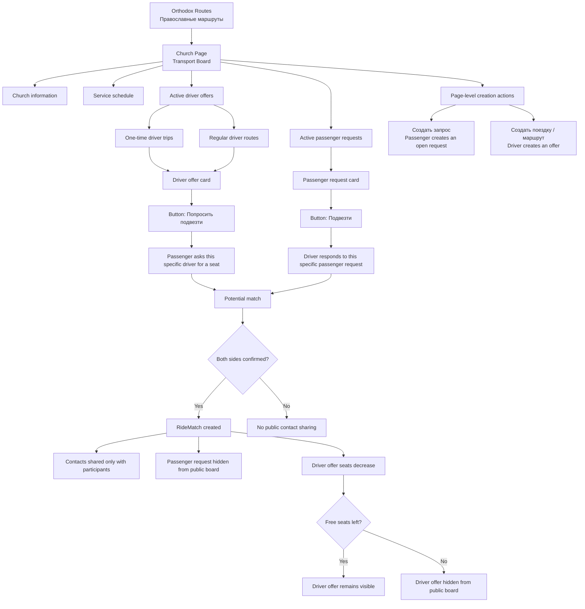

## 2. Church Page Public Board

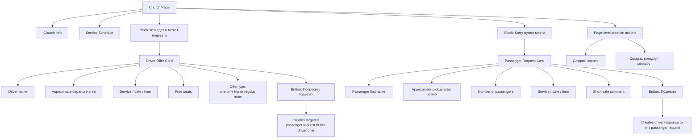

## 3. Passenger Journey

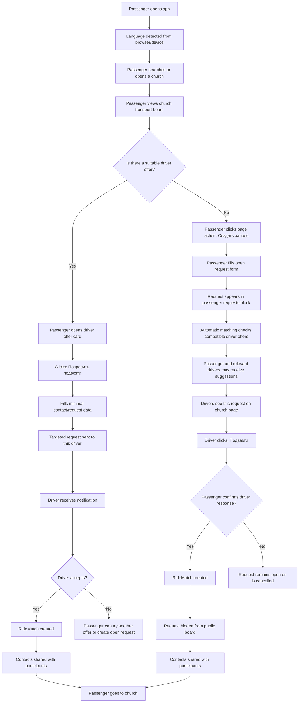

## 4. Driver Journey

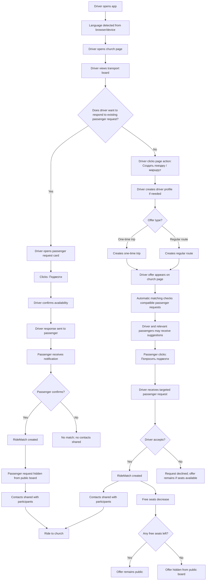

## 5. Entity Relationships

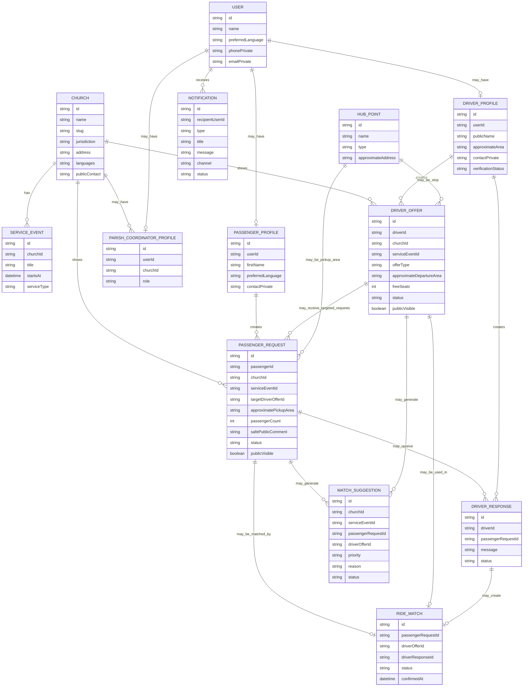

## 6. Passenger Request States

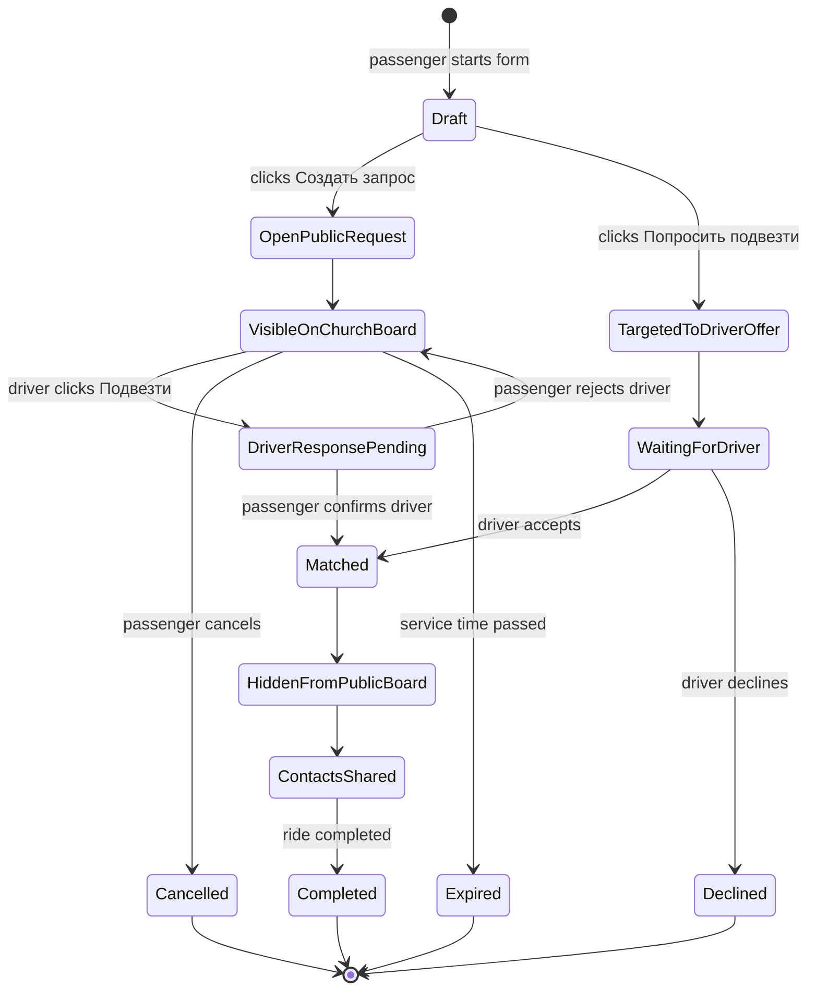

## 7. Driver Offer States

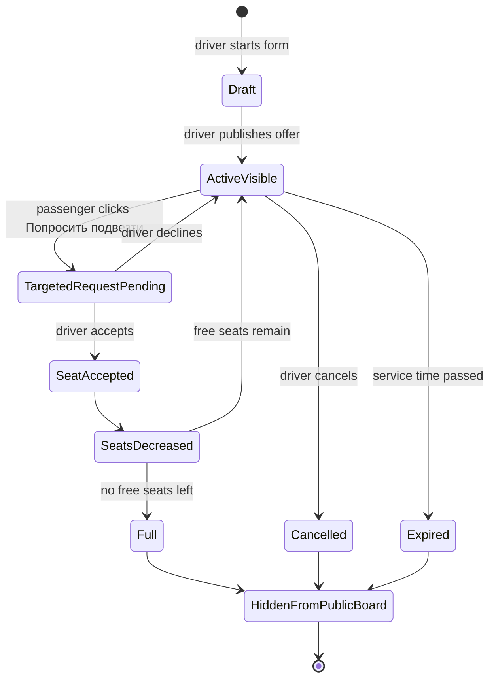

## 8. Public Visibility Rules

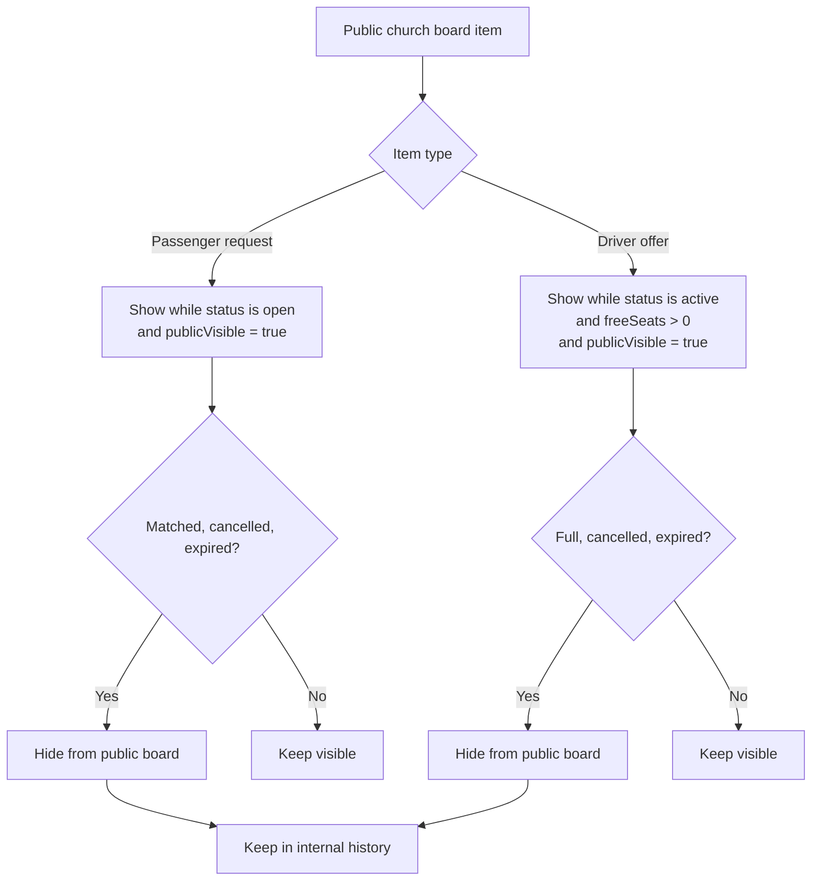

## 9. Button Placement Rules

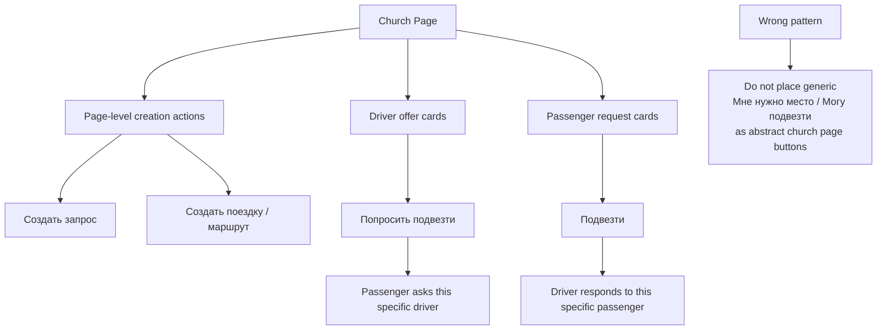

## 10. Matching & Notifications

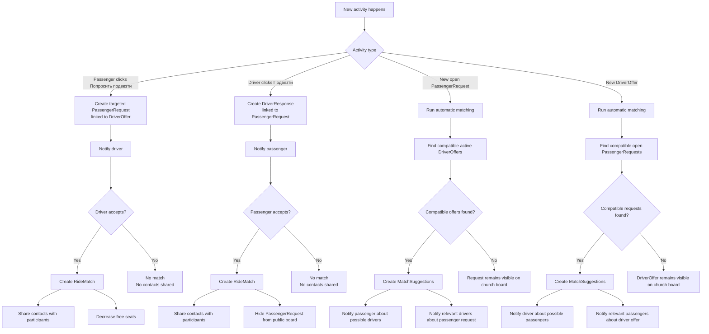

## 11. Automatic Matching Rules

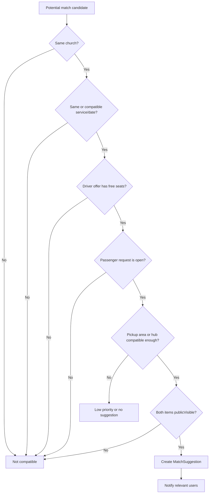
