# Orthodox Routes — Product Map

Sections 1–12 visualize only the current mock-only product. Orthodox Routes is a church transport board, not a taxi marketplace. The church page remains the central screen. The approved target sitemap, URL model, logical relationships, taxonomy, permissions, content model, state diagrams, and transitions are defined in [ORTHODOX_ROUTES_INFORMATION_ARCHITECTURE_V2.md](ORTHODOX_ROUTES_INFORMATION_ARCHITECTURE_V2.md), sections 42–49. Section 13 is a clearly labelled target-production architecture map derived from the approved [Backend and Integration Architecture V1](ORTHODOX_ROUTES_BACKEND_INTEGRATION_ARCHITECTURE_V1.md) and [Target Data Model V1](ORTHODOX_ROUTES_TARGET_DATA_MODEL_V1.md); it does not describe implemented behavior.

## 1. Church transport board

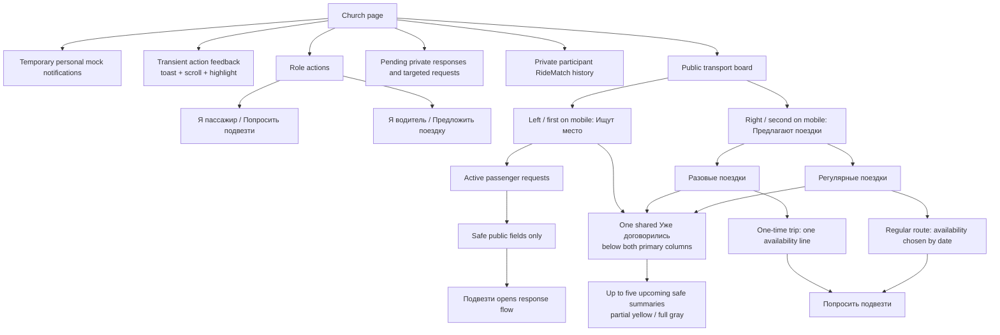
```mermaid
flowchart TD
    CP["Church page"] --> N["Temporary personal mock notifications"]
    CP --> F["Transient action feedback<br/>toast + scroll + highlight"]
    CP --> A["Role actions"]
    CP --> DR["Pending private responses and targeted requests"]
    CP --> PM["Private participant RideMatch history"]
    CP --> B["Public transport board"]

    A --> A1["Я пассажир / Попросить подвезти"]
    A --> A2["Я водитель / Предложить поездку"]

    B --> L["Left / first on mobile: Ищут место"]
    B --> R["Right / second on mobile: Предлагают поездки"]
    R --> RR["Регулярные поездки"]
    R --> OT["Разовые поездки"]

    L --> PR1["Active passenger requests"]
    PR1 --> PR2["Safe public fields only"]
    PR2 --> PR3["Подвезти opens response flow"]

    OT --> O1["One-time trip: one availability line"]
    RR --> O2["Regular route: availability chosen by date"]
    O1 --> O3["Попросить подвезти"]
    O2 --> O3

    L --> C["One shared Уже договорились<br/>below both primary columns"]
    OT --> C
    RR --> C
    C --> SAFE["Up to five upcoming safe summaries<br/>partial yellow / full gray"]
```

Active content is first and actionable. Every meaningful state has a text label; color is supplementary. Completed summaries are static and visually non-clickable; partial route occurrences are yellow and full summaries are gray.

### Church-list counters

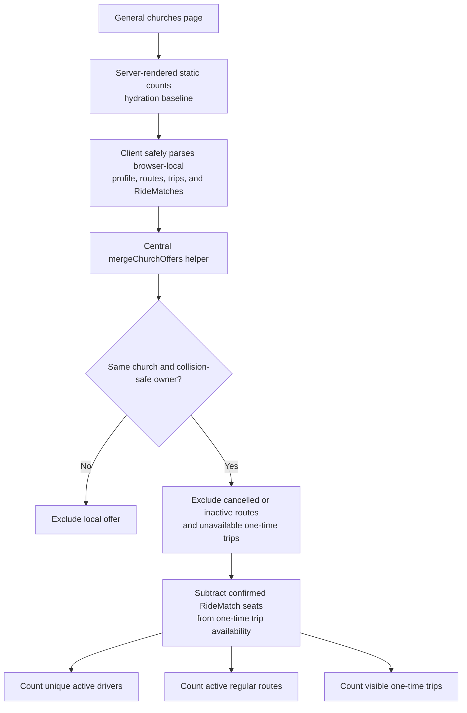
```mermaid
flowchart TD
    A["General churches page"] --> B["Server-rendered static counts<br/>hydration baseline"]
    B --> C["Client safely parses browser-local<br/>profile, routes, trips, and RideMatches"]
    C --> D["Central mergeChurchOffers helper"]
    D --> E{"Same church and collision-safe owner?"}
    E -->|"No"| X["Exclude local offer"]
    E -->|"Yes"| F["Exclude cancelled or inactive routes<br/>and unavailable one-time trips"]
    F --> G["Subtract confirmed RideMatch seats<br/>from one-time trip availability"]
    G --> H["Count unique active drivers"]
    G --> I["Count active regular routes"]
    G --> J["Count visible one-time trips"]
```

### Public visibility rules

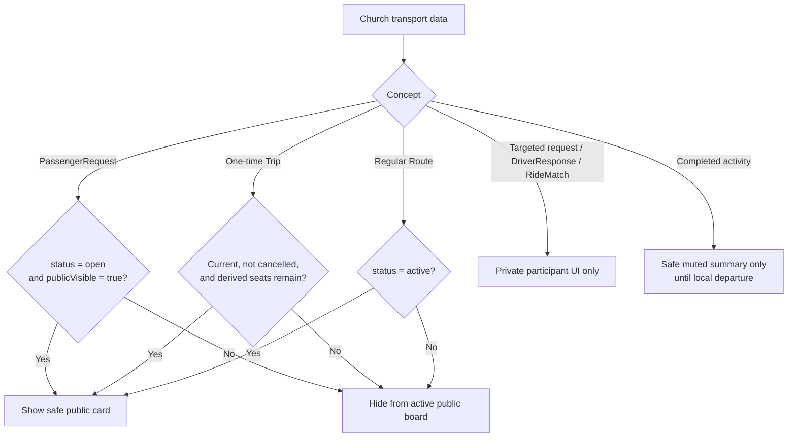
```mermaid
flowchart TD
    A["Church transport data"] --> T{"Concept"}
    T -->|"PassengerRequest"| PR{"status = open<br/>and publicVisible = true?"}
    PR -->|"Yes"| PUB["Show safe public card"]
    PR -->|"No"| HIDE["Hide from active public board"]
    T -->|"One-time Trip"| OT{"Current, not cancelled,<br/>and derived seats remain?"}
    OT -->|"Yes"| PUB
    OT -->|"No"| HIDE
    T -->|"Regular Route"| RR{"status = active?"}
    RR -->|"Yes"| PUB
    RR -->|"No"| HIDE
    T -->|"Targeted request / DriverResponse / RideMatch"| PRIVATE["Private participant UI only"]
    T -->|"Completed activity"| DONE["Safe muted summary only<br/>until local departure"]
```

## 2. Confirmation directions

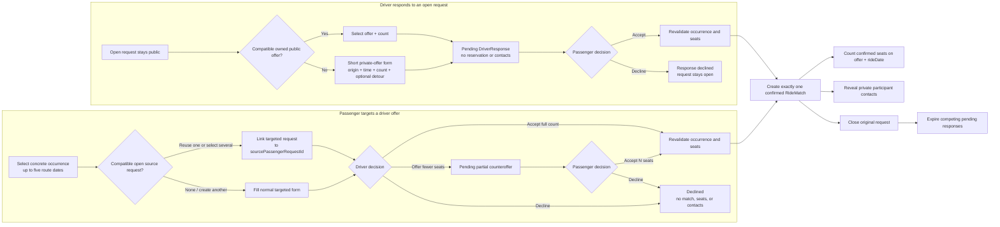
```mermaid
flowchart LR
    subgraph Targeted["Passenger targets a driver offer"]
      T0["Select concrete occurrence<br/>up to five route dates"] --> T1{"Compatible open source request?"}
      T1 -->|"Reuse one or select several"| TL["Link targeted request<br/>to sourcePassengerRequestId"]
      T1 -->|"None / create another"| TN["Fill normal targeted form"]
      TL --> T2{"Driver decision"}
      TN --> T2
      T2 -->|"Accept full count"| TC["Revalidate occurrence and seats"]
      T2 -->|"Offer fewer seats"| TP["Pending partial counteroffer"]
      T2 -->|"Decline"| TD["Declined<br/>no match, seats, or contacts"]
      TP --> T3{"Passenger decision"}
      T3 -->|"Accept N seats"| TC
      T3 -->|"Decline"| TD
    end

    subgraph Open["Driver responds to an open request"]
      O1["Open request stays public"] --> O2{"Compatible owned public offer?"}
      O2 -->|"Yes"| OP["Select offer + count"]
      O2 -->|"No"| OV["Short private-offer form<br/>origin + time + count + optional detour"]
      OP --> O3["Pending DriverResponse<br/>no reservation or contacts"]
      OV --> O3
      O3 --> O4{"Passenger decision"}
      O4 -->|"Accept"| OC["Revalidate occurrence and seats"]
      O4 -->|"Decline"| OD["Response declined<br/>request stays open"]
    end

    TC --> RM["Create exactly one confirmed RideMatch"]
    OC --> RM
    RM --> S["Count confirmed seats on offer + rideDate"]
    RM --> P["Reveal private participant contacts"]
    RM --> H["Close original request"]
    H --> X["Expire competing pending responses"]
```

The required final acceptance differs by direction: the driver is final for a full targeted request; the passenger is final for a DriverResponse or partial targeted counteroffer.

## 3. Concrete-date capacity

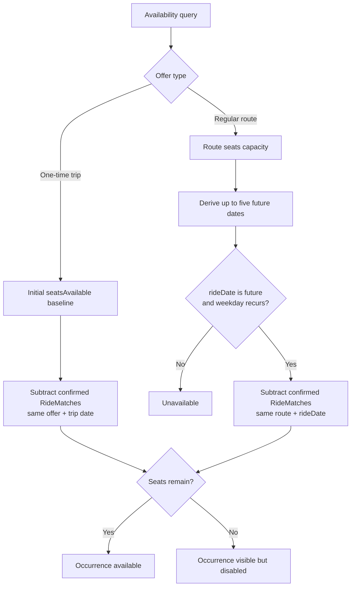
```mermaid
flowchart TD
    Q["Availability query"] --> K{"Offer type"}
    K -->|"One-time trip"| T["Initial seatsAvailable baseline"]
    T --> TM["Subtract confirmed RideMatches<br/>same offer + trip date"]
    K -->|"Regular route"| R["Route seats capacity"]
    R --> D["Derive up to five future dates"]
    D --> RW{"rideDate is future<br/>and weekday recurs?"}
    RW -->|"No"| U["Unavailable"]
    RW -->|"Yes"| RM["Subtract confirmed RideMatches<br/>same route + rideDate"]
    TM --> F{"Seats remain?"}
    RM --> F
    F -->|"Yes"| V["Occurrence available"]
    F -->|"No"| FULL["Occurrence visible but disabled"]
```

Pending requests, responses, counteroffers, notifications, and suggestions never reserve seats. Every confirmation recomputes availability. A full regular-route occurrence does not affect another date.

## 4. Partial match and republication

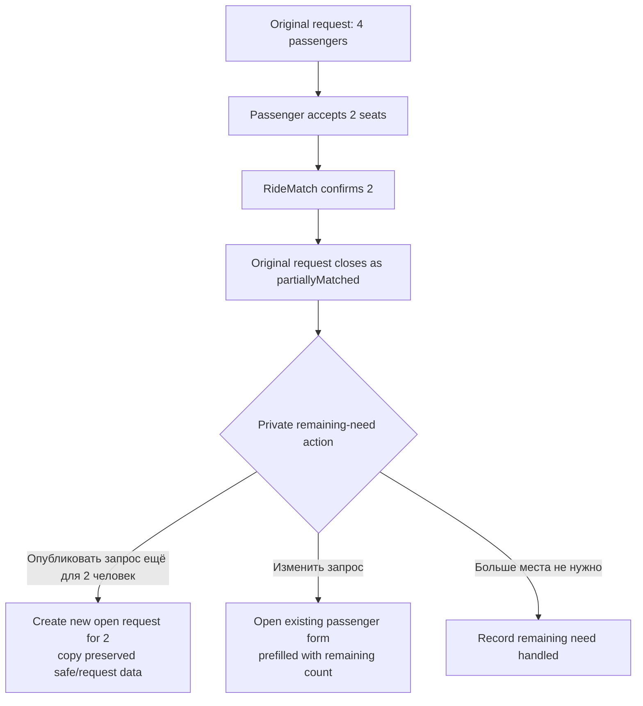
```mermaid
flowchart TD
    A["Original request: 4 passengers"] --> B["Passenger accepts 2 seats"]
    B --> C["RideMatch confirms 2"]
    C --> D["Original request closes as partiallyMatched"]
    D --> E{"Private remaining-need action"}
    E -->|"Опубликовать запрос ещё для 2 человек"| F["Create new open request for 2<br/>copy preserved safe/request data"]
    E -->|"Изменить запрос"| G["Open existing passenger form<br/>prefilled with remaining count"]
    E -->|"Больше места не нужно"| H["Record remaining need handled"]
```

Only one RideMatch may use the original request. Remaining demand is represented by a new linked request; the implementation trace is not public UI.

## 5. Cancellation

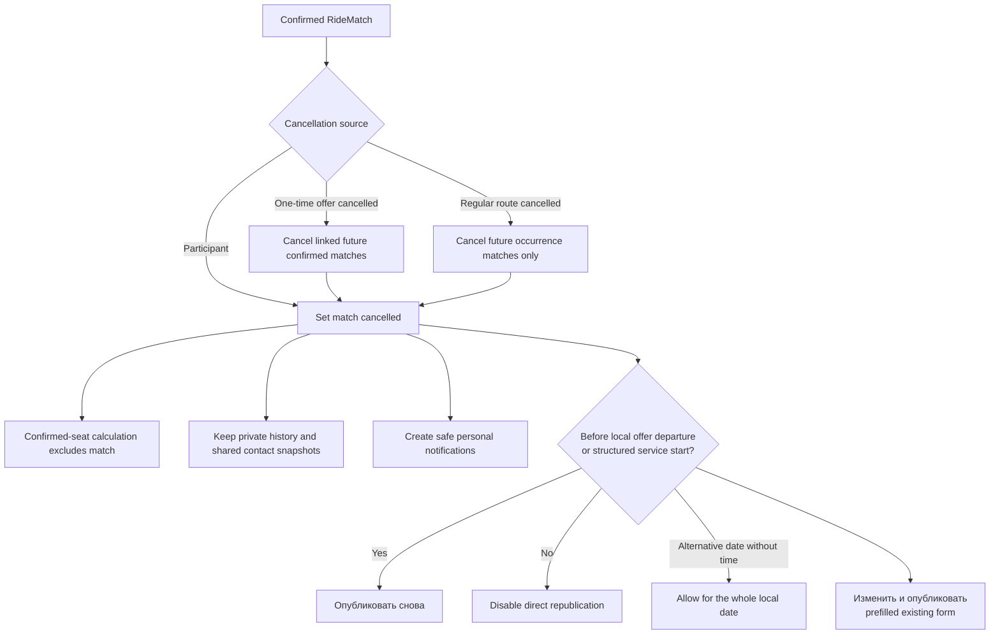
```mermaid
flowchart TD
    M["Confirmed RideMatch"] --> C{"Cancellation source"}
    C -->|"Participant"| CM["Set match cancelled"]
    C -->|"One-time offer cancelled"| OT["Cancel linked future confirmed matches"]
    C -->|"Regular route cancelled"| RR["Cancel future occurrence matches only"]
    OT --> CM
    RR --> CM
    CM --> S["Confirmed-seat calculation excludes match"]
    CM --> H["Keep private history and shared contact snapshots"]
    CM --> N["Create safe personal notifications"]
    CM --> P{"Before local offer departure<br/>or structured service start?"}
    P -->|"Yes"| RP["Опубликовать снова"]
    P -->|"No"| DIS["Disable direct republication"]
    P -->|"Alternative date without time"| DAY["Allow for the whole local date"]
    P --> ED["Изменить и опубликовать<br/>prefilled existing form"]
```

Cancellation never republishes automatically and remains separate from cancelling the complete driver offer.

## 6. Driver-offer creation journey

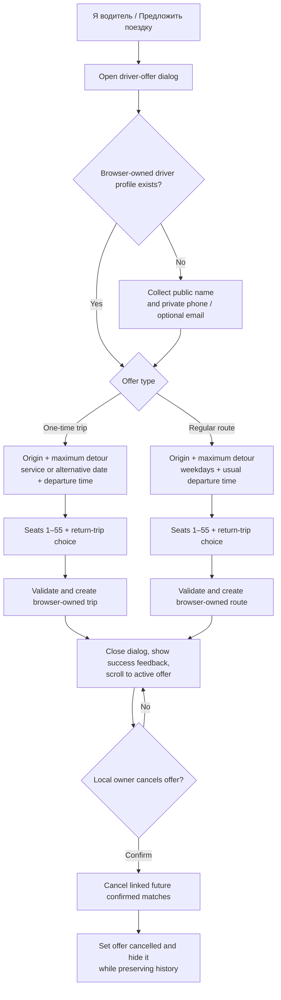
```mermaid
flowchart TD
    A["Я водитель / Предложить поездку"] --> B["Open driver-offer dialog"]
    B --> C{"Browser-owned driver profile exists?"}
    C -->|"No"| D["Collect public name<br/>and private phone / optional email"]
    C -->|"Yes"| E{"Offer type"}
    D --> E
    E -->|"One-time trip"| T1["Origin + maximum detour<br/>service or alternative date + departure time"]
    T1 --> T2["Seats 1–55 + return-trip choice"]
    T2 --> T3["Validate and create browser-owned trip"]
    T3 --> V["Close dialog, show success feedback,<br/>scroll to active offer"]
    E -->|"Regular route"| R1A["Origin + maximum detour<br/>weekdays + usual departure time"]
    R1A --> R2["Seats 1–55 + return-trip choice"]
    R2 --> R3["Validate and create browser-owned route"]
    R3 --> V
    V --> CXL{"Local owner cancels offer?"}
    CXL -->|"Confirm"| FUT["Cancel linked future confirmed matches"]
    FUT --> HIDE["Set offer cancelled and hide it<br/>while preserving history"]
    CXL -->|"No"| V
```

No profile-level departure area is collected. Origin and maximum detour belong to each offer. A one-time trip has an independent local date and departure time; a regular route keeps its weekday recurrence and usual departure time.

## 7. Entity overview

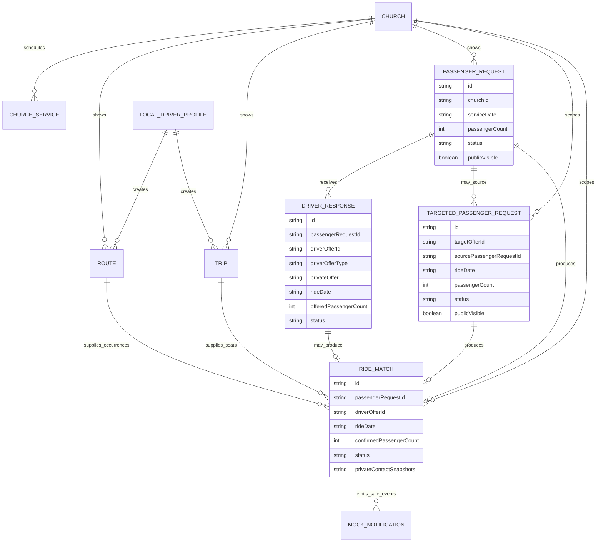
```mermaid
erDiagram
    CHURCH ||--o{ CHURCH_SERVICE : schedules
    CHURCH ||--o{ ROUTE : shows
    CHURCH ||--o{ TRIP : shows
    CHURCH ||--o{ PASSENGER_REQUEST : shows
    CHURCH ||--o{ TARGETED_PASSENGER_REQUEST : scopes
    CHURCH ||--o{ RIDE_MATCH : scopes

    LOCAL_DRIVER_PROFILE ||--o{ ROUTE : creates
    LOCAL_DRIVER_PROFILE ||--o{ TRIP : creates
    PASSENGER_REQUEST ||--o{ DRIVER_RESPONSE : receives
    PASSENGER_REQUEST ||--o{ TARGETED_PASSENGER_REQUEST : may_source
    PASSENGER_REQUEST ||--o| RIDE_MATCH : produces
    TARGETED_PASSENGER_REQUEST ||--o| RIDE_MATCH : produces
    DRIVER_RESPONSE ||--o| RIDE_MATCH : may_produce
    ROUTE ||--o{ RIDE_MATCH : supplies_occurrences
    TRIP ||--o{ RIDE_MATCH : supplies_seats
    RIDE_MATCH ||--o{ MOCK_NOTIFICATION : emits_safe_events

    PASSENGER_REQUEST {
        string id
        string churchId
        string serviceDate
        int passengerCount
        string status
        boolean publicVisible
    }
    TARGETED_PASSENGER_REQUEST {
        string id
        string targetOfferId
        string sourcePassengerRequestId
        string rideDate
        int passengerCount
        string status
        boolean publicVisible
    }
    DRIVER_RESPONSE {
        string id
        string passengerRequestId
        string driverOfferId
        string driverOfferType
        string privateOffer
        string rideDate
        int offeredPassengerCount
        string status
    }
    RIDE_MATCH {
        string id
        string passengerRequestId
        string driverOfferId
        string rideDate
        int confirmedPassengerCount
        string status
        string privateContactSnapshots
    }
```

`RideMatch` is the only confirmed agreement. A private targeted driver offer exists only inside its DriverResponse and never becomes a public Route or Trip. RideMatch private contact snapshots do not flow into public cards, counters, completed summaries, or notification text.

## 8. Button placement rules

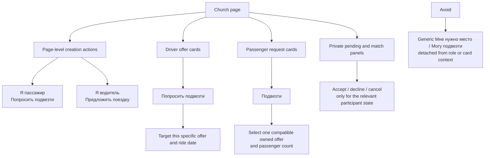
```mermaid
flowchart TD
    A["Church page"] --> B["Page-level creation actions"]
    A --> C["Driver offer cards"]
    A --> D["Passenger request cards"]
    A --> E["Private pending and match panels"]

    B --> B1["Я пассажир<br/>Попросить подвезти"]
    B --> B2["Я водитель<br/>Предложить поездку"]
    C --> C1["Попросить подвезти"]
    C1 --> C2["Target this specific offer and ride date"]
    D --> D1["Подвезти"]
    D1 --> D2["Select one compatible owned offer<br/>and passenger count"]
    E --> E1["Accept / decline / cancel<br/>only for the relevant participant state"]

    X["Avoid"] --> X1["Generic Мне нужно место / Могу подвезти<br/>detached from role or card context"]
```

### Open passenger-request creation

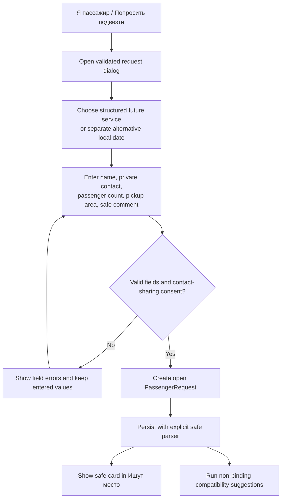
```mermaid
flowchart TD
    A["Я пассажир / Попросить подвезти"] --> B["Open validated request dialog"]
    B --> C["Choose structured future service<br/>or separate alternative local date"]
    C --> D["Enter name, private contact,<br/>passenger count, pickup area, safe comment"]
    D --> E{"Valid fields and contact-sharing consent?"}
    E -->|"No"| F["Show field errors and keep entered values"]
    F --> D
    E -->|"Yes"| G["Create open PassengerRequest"]
    G --> H["Persist with explicit safe parser"]
    H --> I["Show safe card in Ищут место"]
    H --> J["Run non-binding compatibility suggestions"]
```

## 9. Privacy boundary

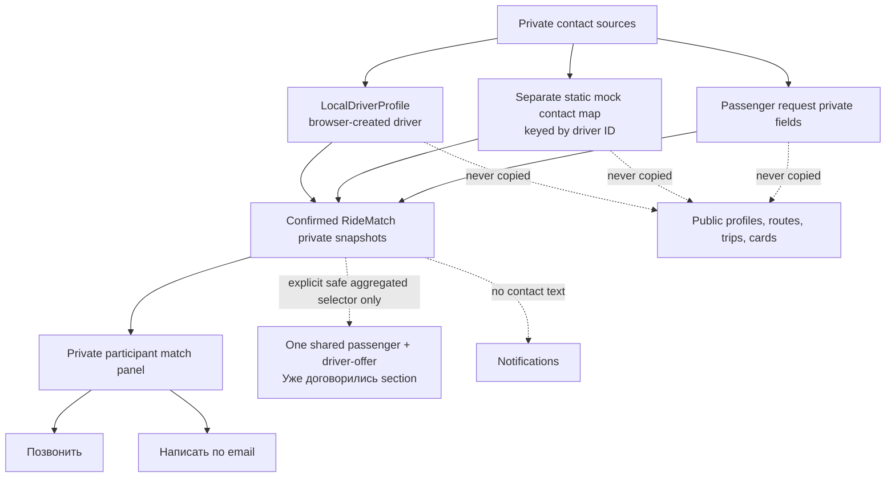
```mermaid
flowchart TD
    SRC["Private contact sources"] --> LP["LocalDriverProfile<br/>browser-created driver"]
    SRC --> SP["Separate static mock contact map<br/>keyed by driver ID"]
    SRC --> PP["Passenger request private fields"]

    LP --> RM["Confirmed RideMatch private snapshots"]
    SP --> RM
    PP --> RM

    RM --> PC["Private participant match panel"]
    PC --> CALL["Позвонить"]
    PC --> EMAIL["Написать по email"]

    LP -. "never copied" .-> PUBLIC["Public profiles, routes, trips, cards"]
    SP -. "never copied" .-> PUBLIC
    PP -. "never copied" .-> PUBLIC
    RM -. "explicit safe aggregated selector only" .-> SUMMARY["One shared passenger + driver-offer<br/>Уже договорились section"]
    RM -. "no contact text" .-> NOTIFY["Notifications"]
```

Cancelled matches retain participant contacts already shared. The current single-browser UI demonstrates the visibility boundary but is not real authorization or user isolation.

## 10. Core state machines

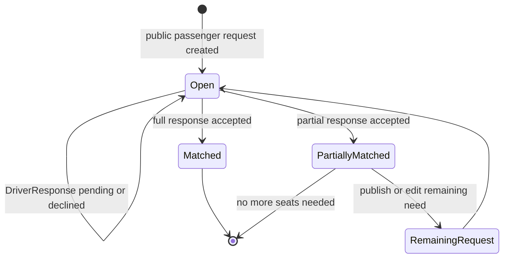
```mermaid
stateDiagram-v2
    [*] --> Open: public passenger request created
    Open --> Open: DriverResponse pending or declined
    Open --> Matched: full response accepted
    Open --> PartiallyMatched: partial response accepted
    Matched --> [*]
    PartiallyMatched --> RemainingRequest: publish or edit remaining need
    PartiallyMatched --> [*]: no more seats needed
    RemainingRequest --> Open
```

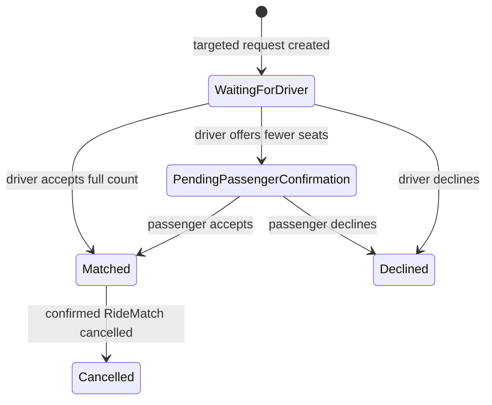
```mermaid
stateDiagram-v2
    [*] --> WaitingForDriver: targeted request created
    WaitingForDriver --> Matched: driver accepts full count
    WaitingForDriver --> PendingPassengerConfirmation: driver offers fewer seats
    WaitingForDriver --> Declined: driver declines
    PendingPassengerConfirmation --> Matched: passenger accepts
    PendingPassengerConfirmation --> Declined: passenger declines
    Matched --> Cancelled: confirmed RideMatch cancelled
```

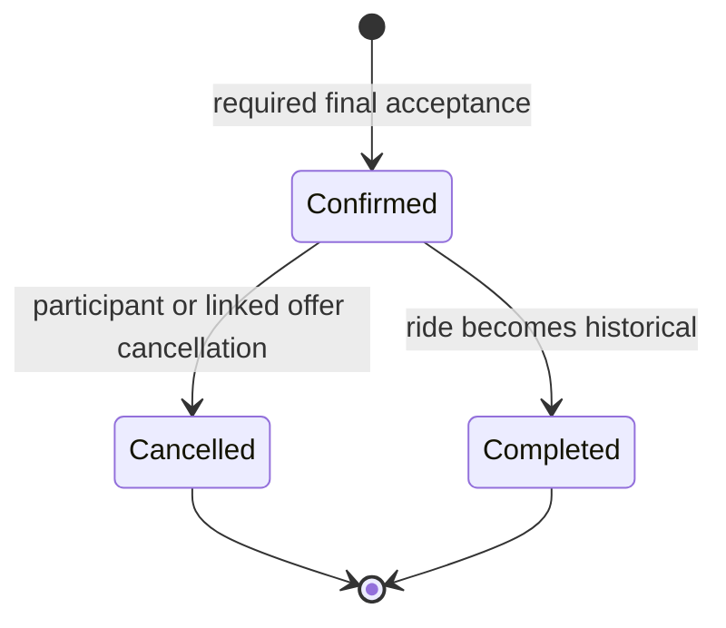
```mermaid
stateDiagram-v2
    [*] --> Confirmed: required final acceptance
    Confirmed --> Cancelled: participant or linked offer cancellation
    Confirmed --> Completed: ride becomes historical
    Cancelled --> [*]
    Completed --> [*]
```

## 11. Matching suggestions and notification delivery

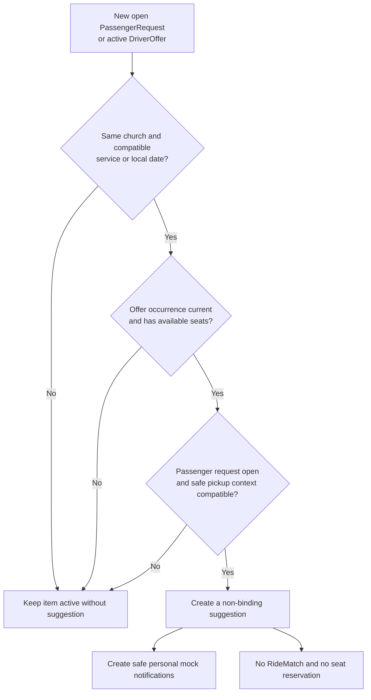
```mermaid
flowchart TD
    A["New open PassengerRequest<br/>or active DriverOffer"] --> B{"Same church and compatible<br/>service or local date?"}
    B -->|"No"| NONE["Keep item active without suggestion"]
    B -->|"Yes"| C{"Offer occurrence current<br/>and has available seats?"}
    C -->|"No"| NONE
    C -->|"Yes"| D{"Passenger request open<br/>and safe pickup context compatible?"}
    D -->|"No"| NONE
    D -->|"Yes"| S["Create a non-binding suggestion"]
    S --> N["Create safe personal mock notifications"]
    S --> Z["No RideMatch and no seat reservation"]
```

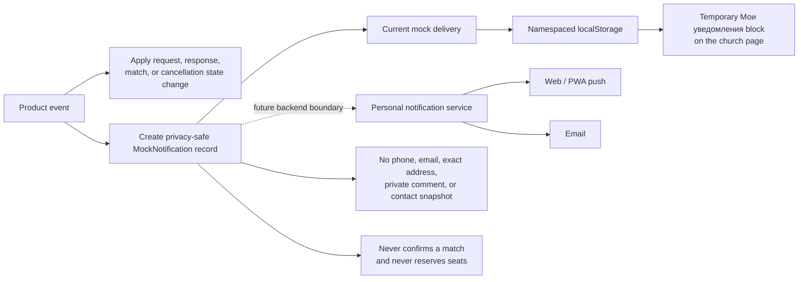
```mermaid
flowchart LR
    E["Product event"] --> STATE["Apply request, response,<br/>match, or cancellation state change"]
    E --> RECORD["Create privacy-safe MockNotification record"]

    RECORD --> CURRENT["Current mock delivery"]
    CURRENT --> LS["Namespaced localStorage"]
    LS --> UI["Temporary Мои уведомления block<br/>on the church page"]

    RECORD -. "future backend boundary" .-> PROD["Personal notification service"]
    PROD --> PUSH["Web / PWA push"]
    PROD --> EMAIL["Email"]

    RECORD --> SAFE["No phone, email, exact address,<br/>private comment, or contact snapshot"]
    RECORD --> EFFECT["Never confirms a match<br/>and never reserves seats"]
```

Notification creation is a product-state side effect; delivery is a separate concern. The current browser-only block is a test surface, not multi-user authorization or a production delivery channel.

## 12. Persistence and compatibility

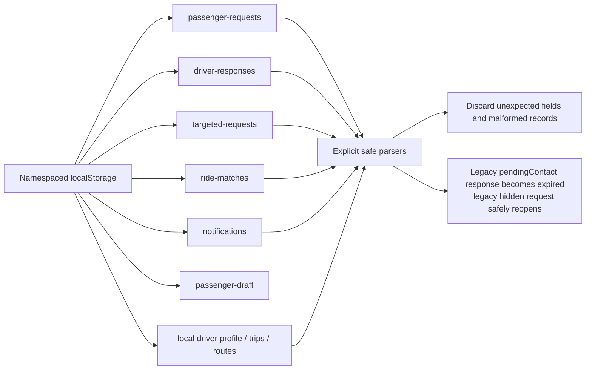
```mermaid
flowchart LR
    LS["Namespaced localStorage"] --> PR["passenger-requests"]
    LS --> DR["driver-responses"]
    LS --> TR["targeted-requests"]
    LS --> RM["ride-matches"]
    LS --> N["notifications"]
    LS --> DP["passenger-draft"]
    LS --> LO["local driver profile / trips / routes"]

    PR --> PARSE["Explicit safe parsers"]
    DR --> PARSE
    TR --> PARSE
    RM --> PARSE
    N --> PARSE
    LO --> PARSE
    PARSE --> SAFE["Discard unexpected fields and malformed records"]
    PARSE --> LEGACY["Legacy pendingContact response becomes expired<br/>legacy hidden request safely reopens"]
```

This persistence diagram describes only the explicitly unconfigured demo. The configured Core church board does not mount this state and instead uses session-derived RPC authorization and PostgreSQL persistence. Neither mode includes maps, route geometry, real delivery channels, payments, or ratings.

## 13. Target production architecture and implemented Core slice

This section visualizes the approved target selected in the architecture documents. The local account, eligibility, contextual-registration, Core transport, response/agreement, and application-cutover subset is implemented; later providers and domains remain target-only. It does not replace or reinterpret the unconfigured-demo diagrams above. Across the diagrams:

- **Current mock** means the isolated single-browser `localStorage` demo used only when backend configuration is absent.
- **Target production** means Next.js, PostgreSQL/Supabase, and protected integrations; the Core subset is implemented locally.
- **Public data** may cross the anonymous boundary only through deliberate safe projections.
- **Participant/user-private data** crosses only authenticated protected operations.
- **Operationally restricted data** remains behind separate owner/worker boundaries.
- **External provider** means a processor outside the application-owned trust boundary.
- A dashed edge is delivery, validation, or migration input rather than an authoritative state store.

### 13.1 System context and providers

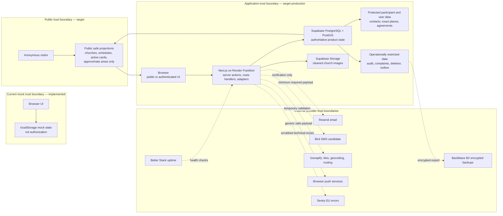
```mermaid
flowchart LR
    subgraph CURRENT["Current mock trust boundary — implemented"]
        CB["Browser UI"]
        CLS["localStorage mock state<br/>not authorization"]
        CB --> CLS
    end

    subgraph PUBLIC["Public trust boundary — target"]
        VISITOR["Anonymous visitor"]
        PUB["Public safe projections<br/>churches, schedules, active cards,<br/>approximate areas only"]
    end

    subgraph TARGET["Application trust boundary — target production"]
        BROWSER["Browser<br/>public or authenticated UI"]
        NEXT["Next.js on Render Frankfurt<br/>server actions, route handlers, adapters"]
        DB["Supabase PostgreSQL + PostGIS<br/>authoritative product state"]
        PRIV["Protected participant and user data<br/>contacts, exact places, agreements"]
        OPS["Operationally restricted data<br/>audit, complaints, deletion, outbox"]
        STORAGE["Supabase Storage<br/>cleaned church images"]
        NEXT --> DB
        DB --> PUB
        DB --> PRIV
        DB --> OPS
        NEXT --> STORAGE
    end

    subgraph EXTERNAL["External provider trust boundaries"]
        RESEND["Resend email"]
        BIRD["Bird SMS candidate"]
        GEO["Geoapify: tiles, geocoding, routing"]
        PUSH["Browser push services"]
        SENTRY["Sentry EU errors"]
        B2["Backblaze B2 encrypted backups"]
        UPTIME["Better Stack uptime"]
    end

    VISITOR --> PUB
    PUB --> BROWSER
    BROWSER --> NEXT
    NEXT -. "minimum required payload" .-> RESEND
    NEXT -. "verification only" .-> BIRD
    NEXT -. "temporary validation" .-> GEO
    NEXT -. "generic safe payload" .-> PUSH
    NEXT -. "scrubbed technical errors" .-> SENTRY
    OPS -. "encrypted export" .-> B2
    UPTIME -. "health checks" .-> NEXT
```

Privileged Supabase credentials and provider secrets remain server-side. Church administrators never receive participant data, and Codex is outside every production secret/data boundary.

### 13.2 Deployment environments

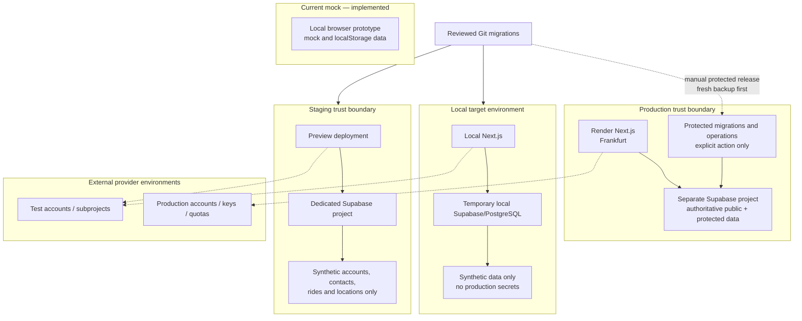
```mermaid
flowchart TD
    subgraph CURRENT["Current mock — implemented"]
        LOCALMOCK["Local browser prototype<br/>mock and localStorage data"]
    end

    subgraph LOCAL["Local target environment"]
        LAPP["Local Next.js"]
        LDB["Temporary local Supabase/PostgreSQL"]
        LDATA["Synthetic data only<br/>no production secrets"]
        LAPP --> LDB --> LDATA
    end

    subgraph STAGING["Staging trust boundary"]
        PREVIEW["Preview deployment"]
        SDB["Dedicated Supabase project"]
        SDATA["Synthetic accounts, contacts,<br/>rides and locations only"]
        PREVIEW --> SDB --> SDATA
    end

    subgraph PROD["Production trust boundary"]
        RENDER["Render Next.js<br/>Frankfurt"]
        PDB["Separate Supabase project<br/>authoritative public + protected data"]
        POPS["Protected migrations and operations<br/>explicit action only"]
        RENDER --> PDB
        POPS --> PDB
    end

    subgraph PROVIDERS["External provider environments"]
        TESTP["Test accounts / subprojects"]
        PRODP["Production accounts / keys / quotas"]
    end

    LAPP -.-> TESTP
    PREVIEW -.-> TESTP
    RENDER -.-> PRODP
    GIT["Reviewed Git migrations"] --> LOCAL
    GIT --> STAGING
    GIT -. "manual protected release<br/>fresh backup first" .-> POPS
```

Production is never a development database. A push to `main` does not automatically run a production migration.

### 13.3 Authentication and verification

```mermaid
flowchart TD
    subgraph CURRENT["Current mock — implemented"]
        FORM0["Browser form"] --> OWNER0["Browser-local identity assumption<br/>no real verification"]
    end

    subgraph PUBLIC["Public target boundary"]
        FORM["Useful contextual action draft<br/>public-safe fields only"]
    end

    subgraph AUTH["Protected target authentication boundary"]
        EMAIL["Supabase Auth<br/>verified email identity"]
        CONFIRM["Intermediate confirmation page<br/>explicit user action"]
        SESSION["Remembered authenticated session"]
        PHONE["Application phone-verification adapter"]
        ELIGIBLE["Eligibility check<br/>email + phone + 18+ + current Terms"]
        REVIEW["Return to final review<br/>never auto-publish"]
    end

    subgraph EXTERNAL["External providers"]
        RESEND["Resend auth email<br/>tracking disabled"]
        BIRD["Bird or validated fallback<br/>SMS OTP only"]
        TURN["Cloudflare Turnstile"]
    end

    FORM --> TURN
    TURN -.-> EMAIL
    EMAIL -.-> RESEND
    RESEND -. "one-time link" .-> CONFIRM
    CONFIRM --> SESSION
    SESSION --> PHONE
    PHONE -. "minimum phone delivery data" .-> BIRD
    BIRD -. "safe result/reference" .-> PHONE
    PHONE --> ELIGIBLE --> REVIEW
```

The phone is protected contact and participation verification, not a second Supabase login identity. Recovery and contact changes use separate protected, audited operations.

### 13.4 Atomic confirmation and contact disclosure

```mermaid
flowchart TD
    subgraph CURRENT["Current mock — implemented"]
        CLICK0["Single-browser acceptance"] --> LS0["localStorage RideMatch and seat calculation"]
    end

    subgraph CLIENT["Authenticated participant boundary — target"]
        CLICK["Final participant confirmation<br/>idempotency key"]
        RESULT["Agreement result without unrelated private data"]
        CONTACT["Separate protected contact request"]
    end

    subgraph DB["PostgreSQL transaction boundary — target"]
        FN["Protected confirmation function"]
        CHECK["Verify actor, response, church/date,<br/>conditions, eligibility, blocks"]
        LOCK["Lock or atomic conditional update<br/>of occurrence capacity"]
        AGREEMENT["Insert one confirmed agreement<br/>immutable conditions snapshot"]
        CAPACITY["Constraint: confirmed seats<br/>do not exceed total seats"]
        EVENTS["Insert notification, outbox and audit rows"]
        DISCLOSE["Authorize participant disclosure<br/>until cancellation or max 30d after ride"]
        FN --> CHECK --> LOCK --> AGREEMENT --> CAPACITY --> EVENTS --> DISCLOSE
    end

    subgraph RESTRICTED["Operationally restricted boundary"]
        AUDIT["Safe audit metadata<br/>no full contacts or coordinates"]
    end

    CLICK --> FN
    DISCLOSE --> RESULT
    EVENTS --> AUDIT
    RESULT --> CONTACT
    CONTACT --> DISCLOSE
    DISCLOSE --> PRIVATE["Counterparty contact + exact agreed place<br/>participants only; no church-admin access"]
```

All steps commit or roll back together. Duplicate retries return the original agreement. Cancellation closes access immediately; otherwise participant access expires no later than 30 days after the scheduled ride time. A previously viewed contact cannot be erased from a participant's saved device or memory.

### 13.5 Notification outbox and delivery

```mermaid
flowchart LR
    subgraph CURRENT["Current mock — implemented"]
        MEVENT["Mock event"] --> MLS["localStorage notification"] --> MUI["Temporary browser panel"]
    end

    subgraph TX["Target business transaction boundary"]
        EVENT["Authoritative product event"]
        NOTE["Notification row<br/>safe structured parameters"]
        OUTBOX["Durable outbox jobs"]
        EVENT --> NOTE --> OUTBOX
    end

    subgraph PRIVATE["Account-private notification boundary"]
        ACCOUNT["Authenticated account"]
        PREF["One notification preference<br/>ride email + Web Push"]
        SUBS["0..* valid device<br/>push subscriptions"]
        EELIG["Email eligible<br/>enabled + usable verified email"]
        PELIG["Web Push eligible<br/>enabled + valid subscription"]
        ACCOUNT --> PREF
        ACCOUNT --> SUBS
        PREF --> EELIG
        PREF --> PELIG
        SUBS --> PELIG
    end

    subgraph WORKER["Protected worker trust boundary"]
        CRON["Supabase Cron schedule"]
        CLAIM["Next.js worker endpoint<br/>claim, idempotency, bounded retry"]
        CRON --> CLAIM
        OUTBOX --> CLAIM
    end

    subgraph EXTERNAL["External delivery providers"]
        EMAIL["Resend email"]
        PUSH["Standard Web Push services"]
        WEBHOOK["Signed duplicate/out-of-order webhooks"]
    end

    CLAIM -. "eligible delivery" .-> EELIG
    CLAIM -. "eligible delivery" .-> PELIG
    EELIG -. "no private ride payload" .-> EMAIL
    PELIG -. "generic type + notification ID + safe route" .-> PUSH
    EMAIL -.-> WEBHOOK
    PUSH -.-> WEBHOOK
    WEBHOOK --> DELIVERY["Delivery state<br/>provider reference + safe error"]
    NOTE --> UI["Authoritative in-app history"]
    REALTIME["Supabase Realtime<br/>optional refresh only"] -.-> UI
```

Realtime is not a notification store. In-app history is always enabled. The server rejects preference or voluntary subscription changes that would leave an account with relevant active transport commitments and no effective external channel. Email and push failures do not remove the in-app record or roll back the ride event.

### 13.6 Backup and restore

```mermaid
flowchart TD
    subgraph CURRENT["Current mock — implemented"]
        NOBACKUP["Browser-local records<br/>no production backup or restore"]
    end

    subgraph PROD["Production data trust boundary"]
        DB["Supabase PostgreSQL<br/>public + protected + restricted rows"]
        STORAGE["Supabase Storage<br/>cleaned church images"]
        LEDGER["Separately protected deletion ledger"]
    end

    subgraph BACKUP["Backup process boundary"]
        EXPORT["Daily logical database export"]
        OBJECTS["Storage object export + manifest"]
        ENCRYPT["Encrypt before upload<br/>checksums + migration version"]
        DB --> EXPORT --> ENCRYPT
        STORAGE --> OBJECTS --> ENCRYPT
    end

    subgraph EXTERNAL["External backup provider"]
        B2["Backblaze B2 EU bucket<br/>daily 30d / monthly 12m / pre-migration 30d"]
    end

    ENCRYPT -.-> B2
    B2 -. "isolated restore" .-> RESTORE["Restore rehearsal environment"]
    RESTORE --> VERIFY["Integrity, schema, Storage and privacy checks"]
    LEDGER --> REAPPLY["Reapply deletions"]
    VERIFY --> REAPPLY --> OPEN["Owner-approved reopen only"]
    HEART["Better Stack heartbeat"] -. "success/failure only" .-> ENCRYPT
    NOBACKUP -. "not a backup source" .-> RESTORE
```

Database backups do not contain Storage objects. The initial target accepts up to approximately 24 hours of data loss and does not promise zero downtime.

### 13.7 Migration from `localStorage`

```mermaid
flowchart LR
    subgraph CURRENT["Unconfigured demo — isolated, untrusted for import"]
        LS["localStorage offers, requests,<br/>responses, RideMatches, notifications"]
        RULES["Reusable domain rules,<br/>validators, state machines and tests"]
    end

    subgraph STAGING["Core migration and cutover boundary — implemented locally"]
        SEEDS["Canonical schema + synthetic seeds"]
        AUTH["Authentication + eligibility"]
        REQUESTS["Passenger requests"]
        OFFERS["One-time offers, then series + occurrences"]
        AGREEMENTS["Responses, atomic confirmation,<br/>capacity, disclosure, cancellation"]
        CUTOVER["Configured Core board cutover"]
        SEEDS --> AUTH --> REQUESTS --> OFFERS --> AGREEMENTS --> CUTOVER
    end

    subgraph PROD["Target production trust boundary"]
        SERVER["Server-owned authoritative entities"]
        PREFS["Browser-only harmless preferences<br/>and unsubmitted drafts"]
    end

    RULES -. "migrate behavior and tests" .-> SEEDS
    LS -. "do not import browser records" .-> STOP["Discard mock identity, contacts,<br/>IDs, capacity and ownership"]
    CUTOVER --> SERVER
    CUTOVER --> PREFS
    CLEANUP["One-time obsolete-key cleanup"] --> PREFS
```

The configured Core board never dual-writes the same entity to PostgreSQL and `localStorage`; the latter board is mounted only when backend configuration is absent. Existing mock records have no trustworthy cross-device identity or provenance and are not imported.
